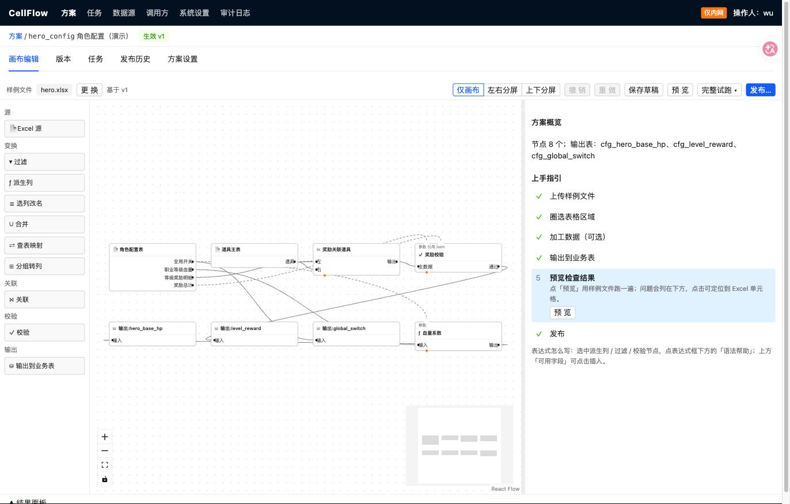
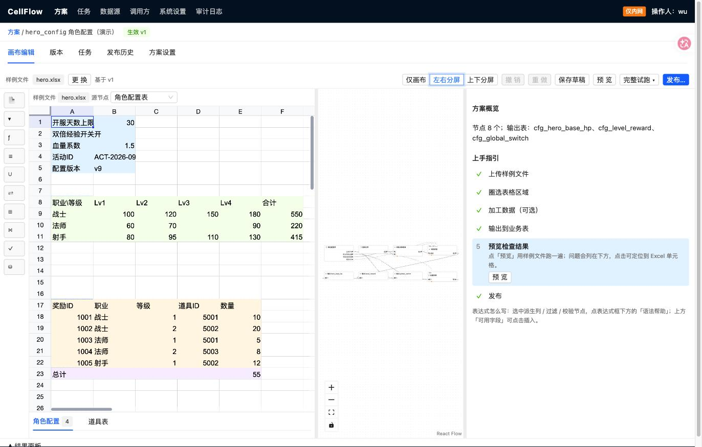

<div align="center">

# CellFlow · 单元格流

**为不规则 Excel 可视化配置一次解析方案，之后由 API 自动解析、校验、写入 MySQL，可一键回滚。**

[[](LICENSE)
[](https://github.com/wuzhendong123/CellFlow/actions/workflows/ci.yml)


**简体中文** · [English](README.en.md)

[快速开始](#快速开始) · [工作原理](#工作原理) · [Open API](#open-api) · [文档](#文档) · [参与贡献](#参与贡献)

</div>

---



<details>
<summary>同一个 Sheet 里的键值区、交叉矩阵、明细表和合计行，可以分别圈选</summary>



</details>

## 为什么需要 CellFlow

策划、运营、财务常在 Excel 里维护业务数据，但这些表往往不是规整的二维表：上方是全局开关，中间是交叉矩阵，下方是明细，底部还有合计行。把它们变成系统可用的数据，通常要么为每张表写一份解析代码，要么靠人工整理，于是出现三个老问题：

| 问题 | CellFlow 的做法 |
|---|---|
| 插一列、挪一块区域，解析就坏 | 按**表头、标记文字、相对位置**定位区域，而不是写死坐标 |
| 错误上线后才被发现 | 写表前逐单元格校验，错误能**定位回原始单元格**；再过一道**安全闸** |
| 出了问题难以回退 | 每次写入都有发布记录，支持**回滚**（整表）或**撤销**（按分区） |

新接入一类 Excel **不需要写代码**：在控制台配置一次，之后业务服务只管提交文件。

## 特性

- **可视化画布编排**：拉线连接节点，数据集在节点间流动，随时预览。
- **多形态区域圈选**：键值区、交叉矩阵、明细表、多 Sheet 合并；区域可在画布页内分屏圈选。
- **丰富的节点**：数据源、过滤、派生列（CEL 表达式）、选列改名、合并（UNION）、查表映射、关联（JOIN）、校验、分组转列（PIVOT）、输出。
- **清洗与校验**：类型转换、空值写法、枚举映射、必填、范围、正则、唯一、外键、表达式、明细与合计对账。
- **安全写入**：校验与安全闸（删除比例、行数波动、清空保护）全部通过才写入；写入在事务内完成，失败业务表不变。
- **两种写入方式**：
  - **整表替换**：影子表加原子互换，适合每份文件都是全量。
  - **按分区替换**：先删除本批分区（如某一天、某个批次号）的数据，再插入本批数据，其他分区不动；适合每天一个文件写同一张表。
- **回滚与撤销**：整表替换可回滚到任一历史版本；按分区替换可撤销某一次写入。
- **方案版本与试跑**：发布前可用历史文件回归对比；任意文件都能试跑，不写业务表。
- **Open API**：签名鉴权、幂等、只校验模式、任务查询、问题列表、结果回调。

## 工作原理

```
                 控制台（配置一次）                          运行期（每次提交文件）
 ┌──────────────────────────────────────────┐      ┌──────────────────────────────────────────┐
 │ 1 圈选区域   Locator × Shape × Columns    │      │ 业务服务 ──签名提交文件──▶ Open API       │
 │ 2 画布编排   清洗 / 关联 / 校验 / 转换      │      │                              │            │
 │ 3 绑定业务表 字段映射、写入方式              │      │                              ▼            │
 │ 4 试跑、回归对比、发布方案版本              │      │        任务队列（Redis / arq）── Worker    │
 └──────────────────────────────────────────┘      │                              │            │
                                                    │   解析 ▶ 校验 ▶ 安全闸 ▶ 事务写入 MySQL     │
                                                    │                              │            │
                                                    │          发布记录 · 变更明细 · 回调 / 回滚   │
                                                    └──────────────────────────────────────────┘
```

**写入流程**

| 写入方式 | 流程 |
|---|---|
| 整表替换 | 建影子表 → 写入新数据 → 校验 → 原子互换，旧表保留作回滚依据 |
| 按分区替换 | 事务内：锁定并保存本批分区旧数据（供撤销）→ `DELETE … WHERE 分区字段 = ?`（一条语句）→ 分批 `INSERT` → 核对行数；任一步失败整体回滚 |

同一方案同一时刻只执行一个任务。整表替换的方案，短时间多次提交只执行最新一份；按分区替换的方案，一个文件就是一批，**每次提交都会执行**，按提交顺序串行。

## 快速开始

需要 Docker Desktop（macOS / Linux），包含 `docker compose` v2。

```bash
git clone https://github.com/wuzhendong123/CellFlow.git && cd CellFlow
./cellflow.sh up                       # 构建并启动 MySQL、Redis、API + 控制台、Worker，首次约 3~5 分钟
./cellflow.sh demo                     # 可选：写入演示方案，并在 ./demo 生成演示 Excel
./cellflow.sh submit demo/hero.xlsx    # 像业务服务一样带签名提交文件，等待结果
./cellflow.sh open                     # 打开控制台 http://localhost:8000
```

| 命令 | 说明 |
|---|---|
| `./cellflow.sh status` / `logs [api\|worker]` | 查看服务状态 / 日志 |
| `./cellflow.sh mysql` | 进入 MySQL，查看业务库 `cellflow_biz` 的写入结果 |
| `./cellflow.sh test` | 在容器内运行后端测试 |
| `./cellflow.sh restart` | 更新代码后重新构建并重启 |
| `./cellflow.sh down` / `reset` | 停止服务 / 停止并清空全部数据 |

高危操作（发布、放行、回滚、改设置等）需要操作口令，本地默认值为 `local-op-token`，可用环境变量 `CF_OP_TOKEN` 修改。端口冲突时可设置 `CF_PORT`、`CF_MYSQL_PORT`、`CF_REDIS_PORT`。所有默认口令仅用于本机，**生产环境务必替换**。

### 配置数据源

控制台「数据源 → 新建」有两种方式：

- **直接填写**：主机、端口、账号、口令、库名。口令加密保存，不回显。连接 Docker 内的 MySQL，主机填 `mysql`、端口 `3306`；连接宿主机上的 MySQL，主机填 `host.docker.internal`。
- **环境变量引用**：只在配置中保存引用名，连接串通过环境变量提供（如 `CF_REF_BIZ_MYSQL`），适合不想在控制台出现口令的部署。

## Open API

业务服务只需提交文件并查询结果。请求使用 AppKey 与签名鉴权，具体签名规则见 [TECH_DESIGN.md](TECH_DESIGN.md)。

| 接口 | 说明 |
|---|---|
| `POST /open/v1/jobs` | 提交文件，创建任务（`EXECUTE` 写表 / `VALIDATE_ONLY` 只校验），支持幂等键与回调地址 |
| `GET /open/v1/jobs/{jobId}` | 查询任务状态与结果 |
| `GET /open/v1/jobs/{jobId}/issues` | 分页获取问题列表，含 Sheet、单元格、字段、原值 |
| `GET /open/v1/pipelines/{code}` | 查询方案信息 |
| `GET /open/v1/pipelines/{code}/live` | 查询当前线上版本 |

任务状态：`PUBLISHED` 已写入 · `NO_CHANGE` 与线上一致 · `VALIDATED` 仅校验通过 · `FAILED_VALIDATION` 校验未过 · `FAILED_GUARD` 被安全闸拦截 · `FAILED_WRITE` 写入失败（业务表未改动）· `SUPERSEDED` 被更新的任务替代 · `FAILED` 系统异常。

## 技术栈

| 层 | 选型 |
|---|---|
| 后端 | Python 3.11、FastAPI、SQLAlchemy 2、openpyxl / pandas、[CEL](https://github.com/google/cel-spec)（cel-python）表达式 |
| 任务队列 | Redis、arq |
| 存储 | MySQL 8.0（元数据与业务库）；文件与快照支持本地目录或 S3 兼容存储 |
| 前端 | React 18、Ant Design、React Flow（画布）、Univer（在线表格视图）、Vite |
| 部署 | Docker Compose |

## 项目结构

```
backend/cellflow/
  engine/      解析引擎：区域定位、形态识别、列清洗、节点与 DAG 执行
  runtime/     写入运行时：整表 / 分区写入、执行器、任务队列
  services/    方案、发布、任务、数据源、回调等业务逻辑
  api/         控制台接口与 Open API
frontend/src/  控制台：画布、区域圈选、目标表绑定、任务与发布历史
deploy/        MySQL 初始化脚本
demo/          演示 Excel
```

## 本地开发

```bash
make test      # 后端测试
make lint      # ruff 与前端 lint
make e2e       # 端到端测试（Playwright）
make perf      # 性能测试
```

后端依赖 Python 3.11+，前端依赖 Node.js。CI 会执行后端 lint 与测试、前端 lint、构建与测试，见 [`.github/workflows/ci.yml`](.github/workflows/ci.yml)。

## 文档

| 文档 | 内容 |
|---|---|
| [PRD.md](PRD.md) | 需求、功能清单与验收标准 |
| [TECH_DESIGN.md](TECH_DESIGN.md) | 技术方案、数据模型、接口契约、写入与回滚设计 |
| [WIREFRAME.md](WIREFRAME.md) | 页面原型与交互说明 |
| [TODO.md](TODO.md) · [PROGRESS.md](PROGRESS.md) | 任务看板与开发进度 |

## 路线图

v1 已覆盖：多形态区域、画布编排、清洗校验、安全闸、整表与按分区写入、回滚与撤销、Open API。

计划中：xls / csv 支持、更多变换节点、增量写入、告警与通知、统一登录与角色权限、灰度版本。完整范围见 [PRD.md](PRD.md) 第 3 节。

## 参与贡献

欢迎提交 Issue 与 Pull Request。

1. Fork 并从主分支创建功能分支。
2. 修改代码时补充测试，提交前运行 `make lint` 与 `make test`。
3. 涉及接口契约或表结构的改动，请先在 Issue 中说明动机与影响，并同步更新 [TECH_DESIGN.md](TECH_DESIGN.md)。
4. 不要提交真实密钥、口令或连接串，示例值请使用明显的占位符。

## 安全

如果你发现安全漏洞，请不要公开提 Issue，请阅读 [SECURITY.md](SECURITY.md) 并通过 GitHub 私密安全报告联系维护者。

## 许可证

基于 [Apache License 2.0](LICENSE) 开源。
