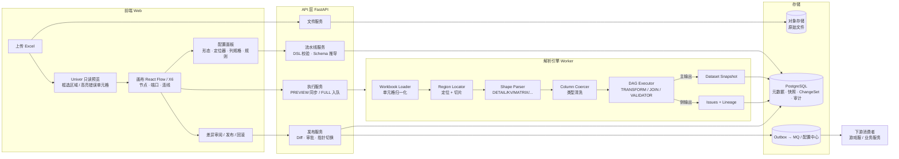

# CellFlow 自动化解析配置平台 · 详细设计方案（TECH_DESIGN.md）

| 项 | 内容 |
|---|---|
| 文档版本 | v0.2 草案（待评审，**未定稿**） |
| 对应阶段 | KICKOFF 第 3 步「技术方案与数据模型」 |
| 前置文档 | `PRD.md`、`WIREFRAME.md` 尚未产出，本文部分产品假设已在 §14 列为待确认项 |
| 本版主要变化 | 见 §0.2（相对原始需求的调整）与 §0.3（对你提出的三个问题的影响面分析） |

---

## 0. 导读

### 0.1 一句话定位

CellFlow 是一个**「把人看得懂的不规则 Excel，变成机器用得了的规整配置数据」**的低代码平台：
策划/运营在画布上**一次性**圈选区域、连线编排清洗/关联/校验流程，此后每次上传同一模板的新版本 Excel，系统自动重跑流水线、生成差异、审批发布，并支持一键回滚。

### 0.2 相对原始需求的关键调整（结论先行）

| # | 原始设计 | 调整后 | 理由 |
|---|---|---|---|
| 1 | 运行期每行封装为 CDC `GenericRecord{op, before, after}` | **运行期只流转「快照行 Row」**；`op/before/after` 只在**发布时的 Diff（ChangeSet）**中产生 | Excel 本质是**全量快照**而不是变更日志，解析时根本没有 "before"。见 §0.3-C |
| 2 | 区域 = 坐标 + 类型 | 区域 = **定位器 Locator（在哪）× 形态 Shape（怎么读）× 列规格 Columns（读成什么类型）** | 固定坐标在策划插入一行后就会错位，这是此类系统上线后的第一大故障源 |
| 3 | 4 种区域流类型 | 扩展为 **8 种形态 + 1 种屏蔽区 + 1 种多 Sheet 源**，并分期交付 | 见 §0.3-A、§4 |
| 4 | 清洗打平隐含在各节点中 | 显式的**四层清洗模型**：单元格归一化 → 形态解析 → 列级类型清洗 → 结构变换节点 | 见 §0.3-B、§5 |
| 5 | 「上传 → 圈选 → 解析」是一次性动作 | 拆分为 **Pipeline（模板，设计一次）/ Run（每次上传执行）/ Release（发布版本）** 三个生命周期 | 真实场景是同一张表每周改几十次，圈选只做一次 |
| 6 | 影子表 RENAME 切换 + 按 before 反向恢复 | 默认 **版本化快照 + 在线指针切换**（发布/回滚都是 O(1) 改指针）；影子表 RENAME 作为「写入外部既有业务表」的兼容模式 | 回滚不依赖逐条回放 before，能抵抗多版本回滚和线上被手工改动（漂移） |
| 7 | 校验失败「不阻塞整批处理」 | 明确为：**不阻塞执行（一次收集全部错误）、但阻塞发布（ERROR 级存在则禁止发布）** | 配置数据部分发布通常比不发布更危险 |
| 8 | 错误高亮到画布节点 | 高亮到**节点 + Excel 原始单元格**（全链路 Lineage 血缘） | 策划要改的是 Excel 单元格，而不是画布节点 |

### 0.3 影响面分析（按 KICKOFF §3.1 约定）

> 项目尚未进入开发，以下三项调整**不产生返工**；「进度影响」主要体现为 MVP 范围变化。

#### A. 「区域流类型还有其他的吗？」—— 有，而且更关键的是「定位方式」

| 维度 | 分析 |
|---|---|
| 进度影响 | 新增形态若全部进 MVP 约 +2~3 周；建议 MVP 只做 DETAIL/KV/MATRIX/SUMMARY/IGNORE + 3 种定位器，其余进 v2（§15） |
| 技术方案影响 | Region 数据结构从 `{坐标, regionType}` 变为 `{locator, shape, columns}`，属于协议层变化，需在定稿前确认 |
| 界面/交互影响 | 侧边栏由「选类型」变为「选形态 + 选定位方式 + 列配置」三段式；需新增「定位预览（在新文件上重新定位的结果）」 |
| 合规/安全 | 无新增 |
| 替代方案 | 也可只支持固定坐标 + 「模板结构变化检测」强制人工重圈，实现简单但每次改表都要重配，**不推荐** |

新增形态清单（详见 §4）：`DETAIL` 支持**多级表头 + 横向明细（转置）**、`MATRIX` 支持**多级维度 + 指标层**、新增 `GROUPED_DETAIL`（分组标题行/缩进层级）、`FORM`（卡片/表单型散点单元格）、`REPEATING_BLOCK`（重复块）、`IGNORE`（备注/说明屏蔽区）、`SHEET_SET`（多 Sheet 同构合并）。

#### B. 「数据打平/清洗」—— 原方案缺失的最大一块

| 维度 | 分析 |
|---|---|
| 进度影响 | 单元格归一化 + 列级类型清洗是**必须项**（否则 ID 精度丢失、日期错乱会直接进线上），约 +2 周；结构变换节点按需分期 |
| 技术方案影响 | 新增 `ColumnSpec` 列规格模型、`TRANSFORM` 类节点族、受限表达式语言（不能用 Python `eval`） |
| 界面/交互影响 | 新增「列配置表格」（类型/是否主键/空值处理/枚举映射）和变换节点配置面板 |
| 合规/安全 | 表达式必须沙箱化，否则等同于给策划开放服务器代码执行权限 |
| 替代方案 | 让用户在 Excel 里自己清洗好（公式、辅助列）——把问题推回给用户，且公式缓存值不可靠（见 §11），**不推荐** |

#### C. 「只是借用 CDC 的解析思想，可能不需要 CDC」—— 同意，建议去掉运行期 CDC 模型

| CDC 概念 | 在 CellFlow 中是否需要 | 结论 |
|---|---|---|
| 动态 Schema（不预定义 POJO，Schema-on-read） | **需要** | 这其实不是 CDC 独有的，是通用的「动态 Schema / 无模型记录」思想，保留 |
| 行级 `op`（c/u/d） | 解析时**不存在**：一次 Excel 上传是全量快照，没有"这一行被更新了"的语义 | 运行期去掉 |
| `before` / `after` 快照 | 解析时**拿不到 before**；before 只能来自「当前线上版本」 | 只在发布时由 **Diff(线上快照, 新快照)** 生成 |
| Binlog 回放式回滚 | 依赖事件严格有序、中间不被手工改动；多版本回滚要链式逆放，脆弱 | 改为**快照指针回滚**（§10） |
| 增量事件分发 | 如果下游（如游戏服热更新）只想要变化行，**有价值** | 保留为**发布的输出格式**（CDC-style 输出），而不是处理模型 |

| 维度 | 分析 |
|---|---|
| 进度影响 | **减少**工作量：节点实现不必处理 op 语义，内存占用约减半 |
| 技术方案影响 | `GenericRecord` → `Row`（运行期）+ `ChangeRecord`（发布期），见 §6.3、§6.4 |
| 界面/交互影响 | 发布前新增「差异审阅」页（新增/修改/删除 行级对比），这是审计价值所在 |
| 合规/安全 | 审计能力不降反升：每次发布都有完整 ChangeSet + 全量快照 |
| 前提条件 | **每个输出数据集必须声明业务主键**（如 `职业+等级`），否则只能整表替换、无法做行级 Diff。这是新增的产品约束，需确认（§14-Q3） |

---

## 1. 核心概念与生命周期

```
            设计期（低频）                    执行期（每次上传）                 发布期（受控）
   ┌───────────────────────────┐   ┌───────────────────────────────┐   ┌──────────────────────────┐
   │ Pipeline（流水线模板）       │   │ Run（一次执行）                  │   │ Release（发布版本）         │
   │  - DSL：nodes + edges       │──▶│  - 绑定 PipelineRevision + 文件  │──▶│  - 快照 + ChangeSet         │
   │  - 有修订版本 Revision        │   │  - PREVIEW（采样）/ FULL         │   │  - 审批 → 切指针 → 分发      │
   │  - 区域定位器 / 列规格        │   │  - 产出：数据集 + 问题清单 Issue  │   │  - 回滚 = 指向旧快照的新发布  │
   └───────────────────────────┘   └───────────────────────────────┘   └──────────────────────────┘
```

| 概念 | 说明 |
|---|---|
| **Pipeline** | 一张 Excel 模板对应的解析流水线，包含画布 DSL。修改后产生新的 `PipelineRevision`（不可变） |
| **SourceFile** | 上传的原始文件（对象存储，按 sha256 去重），记录每个 Sheet 的结构指纹 |
| **Run** | `PipelineRevision × SourceFile` 的一次执行；PREVIEW 同步、采样；FULL 异步、全量 |
| **Dataset** | 流水线的一个输出（一个 SINK 节点），有 Schema 与业务主键 |
| **Snapshot** | 某个 Dataset 在某次 Run 中的全量结果（不可变） |
| **Release** | 一组 Snapshot 的原子发布单元（一张 Excel 产出多个 Dataset，必须一起生效） |
| **OnlinePointer** | 每个命名空间当前生效的 Release，发布/回滚只改它 |

---

## 2. 系统总体架构与数据流向

### 2.1 架构图



### 2.2 端到端数据流（文本时序）

```
①上传      用户上传 xlsx → 计算 sha256 → 存对象存储 → Loader 解析出 Sheet 列表、结构指纹
             → 服务端把网格转换成 Univer 快照 JSON 返回（值、合并单元格、基础样式，不含公式执行）
②圈选      用户在 Univer 中框选 → 侧边栏选择 形态/定位器/列规格 → 绑定到 EXCEL_SOURCE 节点的输出端口
③编排      用户拉线：端口 → TRANSFORM / JOIN / VALIDATOR → SINK；每改一次，服务端做 Schema 推导，
             前端即时得到每个端口的列清单（用于下游字段下拉、重名冲突提示）
④预览      PREVIEW Run：每个区域最多取 N 行（默认 200），同步返回每个节点每个端口的数据样本 + 问题
⑤全量执行  FULL Run（异步 Worker）：
             Loader 归一化 → Locator 在"本次文件"上重新定位 → 切片 → 形态解析（打平）
             → 列级类型清洗 → DAG 按拓扑序执行 → 主输出落 Snapshot（暂存，不可见）
             → 侧输出 Issue（带单元格血缘）落库
⑥差异      发布准备：Snapshot 与"线上指针所指 Release"的同名 Dataset 按业务主键 Diff → ChangeSet
⑦审批      ERROR 级 Issue 为 0 → 进入审批；审批人看 ChangeSet（新增/修改/删除）与 WARN 列表
⑧发布      单事务：校验基线版本未变（乐观锁）→ 切换 OnlinePointer → 写 Outbox
⑨分发      Outbox 投递 MQ/配置中心：{releaseId, 每个数据集的变更摘要}；消费者按 releaseId 拉全量或增量
⑩回滚      选择历史 Release → 生成一个 kind=ROLLBACK 的新 Release（复用旧快照，零拷贝）→ 同⑧⑨
```

### 2.3 为什么 Excel 由服务端转成 Univer JSON，而不是前端直接打开

1. **所见即所解析**：前端显示的网格和后端解析用的网格来自同一个 Loader，合并单元格、隐藏行、日期显示保持一致，框选坐标不会出现"前端第 8 行 ≠ 后端第 8 行"。
2. **许可风险**：Univer 开源版的 xlsx 导入/导出能力需确认许可范围（其 Exchange 导入导出服务历史上属于 Pro 能力），服务端自转 JSON 可规避（§13 风险 R1）。
3. 大文件可以按 Sheet、按视口分页加载。

---

## 3. 数据库表结构（PostgreSQL，草案）

```sql
-- ========== 设计期 ==========
CREATE TABLE pipeline (
  id              BIGSERIAL PRIMARY KEY,
  namespace       VARCHAR(64)  NOT NULL,          -- 发布命名空间，如 game.hero
  name            VARCHAR(128) NOT NULL,
  current_rev_id  BIGINT,
  owner           VARCHAR(64)  NOT NULL,
  created_at      TIMESTAMPTZ  NOT NULL DEFAULT now(),
  UNIQUE (namespace)
);

CREATE TABLE pipeline_revision (                   -- 不可变，每次保存 +1
  id              BIGSERIAL PRIMARY KEY,
  pipeline_id     BIGINT NOT NULL REFERENCES pipeline(id),
  rev             INT    NOT NULL,
  dsl             JSONB  NOT NULL,                 -- §6.1 画布拓扑 JSON
  dsl_schema_ver  VARCHAR(16) NOT NULL,            -- DSL 协议版本，用于未来迁移
  created_by      VARCHAR(64) NOT NULL,
  created_at      TIMESTAMPTZ NOT NULL DEFAULT now(),
  UNIQUE (pipeline_id, rev)
);

-- ========== 执行期 ==========
CREATE TABLE source_file (
  id              BIGSERIAL PRIMARY KEY,
  sha256          CHAR(64) NOT NULL,
  storage_uri     TEXT     NOT NULL,
  file_name       VARCHAR(255) NOT NULL,
  size_bytes      BIGINT   NOT NULL,
  sheet_meta      JSONB    NOT NULL,               -- [{name, maxRow, maxCol, fingerprint, hasUncachedFormula}]
  uploaded_by     VARCHAR(64) NOT NULL,
  uploaded_at     TIMESTAMPTZ NOT NULL DEFAULT now()
);

CREATE TABLE run (
  id              BIGSERIAL PRIMARY KEY,
  pipeline_rev_id BIGINT NOT NULL REFERENCES pipeline_revision(id),
  file_id         BIGINT NOT NULL REFERENCES source_file(id),
  mode            VARCHAR(8)  NOT NULL,            -- PREVIEW | FULL
  status          VARCHAR(16) NOT NULL,            -- QUEUED|RUNNING|SUCCEEDED|FAILED|CANCELLED
  metrics         JSONB,                           -- 每节点每端口行数、耗时
  error_summary   JSONB,                           -- {error: n, warn: n}
  started_at      TIMESTAMPTZ,
  finished_at     TIMESTAMPTZ
);

CREATE TABLE run_issue (
  id              BIGSERIAL PRIMARY KEY,
  run_id          BIGINT NOT NULL REFERENCES run(id),
  node_id         VARCHAR(64) NOT NULL,
  rule_id         VARCHAR(64),
  severity        VARCHAR(8)  NOT NULL,            -- ERROR | WARN | INFO
  code            VARCHAR(32) NOT NULL,            -- 见 §6.6 错误码
  row_id          VARCHAR(64),
  sheet           VARCHAR(128),
  cell            VARCHAR(16),                     -- 如 D12，用于 Univer 高亮
  field           VARCHAR(128),
  value_text      TEXT,
  message         TEXT NOT NULL
);
CREATE INDEX ON run_issue (run_id, node_id);

-- ========== 数据与发布 ==========
CREATE TABLE dataset (
  id              BIGSERIAL PRIMARY KEY,
  pipeline_id     BIGINT NOT NULL REFERENCES pipeline(id),
  sink_node_id    VARCHAR(64) NOT NULL,
  name            VARCHAR(128) NOT NULL,           -- 如 hero_base_hp
  key_fields      JSONB NOT NULL,                  -- ["job","level"]，为空则只能整表替换
  target          JSONB NOT NULL,                  -- {mode: MANAGED | EXTERNAL_TABLE, ...}
  UNIQUE (pipeline_id, name)
);

CREATE TABLE snapshot (
  id              BIGSERIAL PRIMARY KEY,
  dataset_id      BIGINT NOT NULL REFERENCES dataset(id),
  run_id          BIGINT NOT NULL REFERENCES run(id),
  schema          JSONB  NOT NULL,
  row_count       INT    NOT NULL,
  checksum        CHAR(64) NOT NULL                -- 按主键排序后的行哈希汇总
);

CREATE TABLE row_blob (                            -- 按内容去重：多个版本未变化的行只存一份
  row_hash        CHAR(64) PRIMARY KEY,
  data            JSONB NOT NULL
);

CREATE TABLE snapshot_row (
  snapshot_id     BIGINT NOT NULL REFERENCES snapshot(id),
  row_key         TEXT   NOT NULL,                 -- 主键规范化拼接，如 ["战士",1] 的 JSON
  row_hash        CHAR(64) NOT NULL REFERENCES row_blob(row_hash),
  PRIMARY KEY (snapshot_id, row_key)
);

CREATE TABLE release (
  id              BIGSERIAL PRIMARY KEY,
  pipeline_id     BIGINT NOT NULL REFERENCES pipeline(id),
  run_id          BIGINT REFERENCES run(id),       -- ROLLBACK 类型可为空
  kind            VARCHAR(16) NOT NULL,            -- NORMAL | ROLLBACK
  rollback_to     BIGINT REFERENCES release(id),
  base_release_id BIGINT REFERENCES release(id),   -- 生成 Diff 时的线上基线
  status          VARCHAR(16) NOT NULL,            -- DRAFT|PENDING_APPROVAL|APPROVED|PUBLISHED|REJECTED|STALE
  created_by      VARCHAR(64) NOT NULL,
  approved_by     VARCHAR(64),
  published_at    TIMESTAMPTZ,
  note            TEXT
);

CREATE TABLE release_dataset (
  release_id      BIGINT NOT NULL REFERENCES release(id),
  dataset_id      BIGINT NOT NULL REFERENCES dataset(id),
  snapshot_id     BIGINT NOT NULL REFERENCES snapshot(id),
  PRIMARY KEY (release_id, dataset_id)
);

CREATE TABLE change_record (                       -- 发布期 ChangeSet（审计/增量分发）
  id              BIGSERIAL PRIMARY KEY,
  release_id      BIGINT NOT NULL REFERENCES release(id),
  dataset_id      BIGINT NOT NULL REFERENCES dataset(id),
  row_key         TEXT   NOT NULL,
  op              CHAR(1) NOT NULL,                -- c | u | d
  before          JSONB,
  after           JSONB,
  changed_fields  JSONB
);
CREATE INDEX ON change_record (release_id, dataset_id);

CREATE TABLE online_pointer (
  pipeline_id     BIGINT PRIMARY KEY REFERENCES pipeline(id),
  release_id      BIGINT NOT NULL REFERENCES release(id),
  version         BIGINT NOT NULL,                 -- 乐观锁
  updated_at      TIMESTAMPTZ NOT NULL DEFAULT now()
);

CREATE TABLE outbox (
  id              BIGSERIAL PRIMARY KEY,
  release_id      BIGINT NOT NULL,
  topic           VARCHAR(128) NOT NULL,
  payload         JSONB NOT NULL,
  status          VARCHAR(16) NOT NULL DEFAULT 'PENDING',
  attempts        INT NOT NULL DEFAULT 0,
  created_at      TIMESTAMPTZ NOT NULL DEFAULT now()
);
```

> 设计要点：`snapshot_row + row_blob` 让「每次发布存全量快照」的存储成本接近「只存变化行」，这是能用快照指针代替 Binlog 回放的前提。

---

## 4. 区域模型：Locator × Shape × Columns

### 4.1 为什么要把「在哪」和「怎么读」拆开

策划最常见的改表动作是**在中间插几行、在右边加一列、把下方明细多填 20 行**。如果区域只存 `A17:E40`，下一次上传时：明细被截断（只读到 40 行）、或下方 SUMMARY 行被当成明细读入。因此：

- **Locator**：每次 Run 在**新文件**上重新计算出本次的物理矩形；
- **Shape**：决定这块矩形如何被打平成行；
- **Columns**：按**表头名**（而非列序号）绑定字段与类型，插列不影响已有字段。

### 4.2 定位器 Locator

| 类型 | 说明 | 适用 | 分期 |
|---|---|---|---|
| `FIXED` | 固定坐标 `startRow..endRow, startCol..endCol` | 结构永不变化的小块（如 KV 开关区） | MVP |
| `ANCHOR` | 按锚点文本（精确/正则）找到起点，加偏移；终点可为 `UNTIL_BLANK_ROWS(n)` / `UNTIL_ANCHOR(文本)` / `FIXED_SIZE` / `SHEET_END` | 「下方明细」「底部总计行」 | MVP |
| `AUTO_EXPAND` | 从表头起点向右扩展到空表头，向下扩展到连续 n 个空行 | 标准明细表 | MVP |
| `NAMED_RANGE` | Excel 定义名称 | 规范化程度高的模板 | v2 |
| `EXCEL_TABLE` | Excel「表格（ListObject）」对象 | 同上 | v2 |

**用户交互**：用户框选时，前端自动给出推荐定位器（框选区域上方/左侧有醒目文本→推荐 ANCHOR；框选区域下方紧邻空行→推荐 AUTO_EXPAND），并保留 `designRange` 作为设计时快照，用于"本次定位结果与设计时相比偏移了多少"的提示。

### 4.3 形态 Shape（区域流类型，完整清单）

| 形态 | 原始样子 | 打平结果 | 关键参数 | 分期 |
|---|---|---|---|---|
| `DETAIL` 明细 | 首行（或前 k 行）为表头，每行一条记录 | 每行 → 1 Row | `headerRows`（多级表头）、`headerJoiner`（如 `.`）、`orientation: ROW\|COLUMN`（**横向明细**：表头在第一列、每列一条记录，游戏配置常见） | MVP |
| `KEY_VALUE` 键值 | A 列 Key、B 列 Value（可有 C 列类型/备注） | 整块 → 1 Row（转置） | `keyCol`、`valueCol`、`typeCol?`、`orientation`、`duplicateKey: ERROR\|LAST\|ARRAY` | MVP |
| `MATRIX` 矩阵 | 行头 × 列头，交叉点为值 | 每个非空交叉点 → 1 Row（逆透视） | `rowHeaderCols(n)`、`colHeaderRows(m)`（**多级维度**）、`rowDims[]`、`colDims[]`、`valueName`、`metricLevel?`（某一级列头是指标名时，逆透视后再横向展开）、`totalMarkers`（排除"合计"行列）、`dimParsers`（`"Lv.1"→1`） | MVP |
| `SUMMARY` 汇总 | 底部"总计"行或 KV 式汇总块 | 1 Row（供对账） | `layout: ROW\|KV`、`labelMatch` | MVP |
| `IGNORE` 屏蔽区 | 说明文字、备注、示例行 | 不产出；并从其他区域中**挖掉** | — | MVP |
| `GROUPED_DETAIL` 分组明细 | 明细中穿插"【武器类】"分组标题行、小计行，或用**缩进/大纲级别**表示层级 | 每条明细 Row 附带分组字段（向下填充） | `groupRowDetector`（仅首格有值 / 样式加粗 / 正则）、`groupField`、`outlineAsLevel`、`subtotalDetector` | v2 |
| `FORM` 表单/卡片 | 单元格散落在固定相对位置（如"名称：C3，品质：F3"） | 1 Row | `fields: {字段名: 相对锚点偏移}` | v2 |
| `REPEATING_BLOCK` 重复块 | 同一布局的块重复 N 次（每个英雄一个 6×4 的卡片） | 每块 → 1 Row（块内按 FORM 或 KV 解析） | `blockAnchor`（正则，找所有块起点）或 `stride{dRow,dCol}`、`innerShape` | v2 |

**源级扩展 `SHEET_SET`（v2）**：多个 Sheet 结构相同（如每个服/每个章节一个 Sheet），一次配置，按 `sheetPattern` 正则匹配，自动 UNION 并追加 `_sheet` 维度列。

**不作为区域形态、而放在清洗层处理的**：单元格内多值（`1001|1002`）、单元格内结构（`1001:5,1002:3`）、单元格内 JSON —— 这些是**列级**问题（§5.3），与区域形态正交。

### 4.4 区域之间的约束

- 同一 Sheet 内区域**默认不允许重叠**；需要重叠时（如 SUMMARY 位于 DETAIL 定位范围内）必须显式声明 `excludeFrom: [regionId]`，被排除的区域从宿主区域中挖掉。
- `IGNORE` 区域自动从所有区域中挖掉。
- 每次 Run 输出「定位报告」：每个区域本次矩形、与设计时的偏移、是否与其他区域冲突。偏移超过阈值（默认行 ±50%）产生 WARN。

---

## 5. 清洗与打平：四层模型

```
L1 单元格归一化（Loader，所有区域共享，无需用户配置或全局开关）
   合并单元格 · 公式取值 · 错误值 · 隐藏行列 · 删除线行 · 日期系统 · 富文本
        ↓
L2 形态解析（Shape Parser，由区域形态决定）
   表头构建 · 逆透视 · 转置 · 分组填充 · 块提取  → 打平成「行」
        ↓
L3 列级清洗（Column Coercer，按 ColumnSpec 逐列）
   空值识别 · 去空白/全半角 · 类型转换 · 枚举映射 · 单元格内拆分 · 默认值
        ↓
L4 结构变换（画布 TRANSFORM 节点，用户按需拖入）
   过滤 · 派生列 · 重命名/选列 · 行展开 · 分组嵌套 · 聚合 · 合并 UNION · 去重 · 查找映射
```

### 5.1 L1 单元格归一化（策略项）

| 问题 | 默认策略 | 可选策略 |
|---|---|---|
| 合并单元格 | 纵向合并 → 向下填充；横向合并（表头）→ 向右填充 | `TOP_LEFT_ONLY`（其余视为空） |
| 公式 | 取**缓存值**（`data_only=True`） | 缓存值缺失（WPS/程序生成文件常见）→ 该单元格标记 `F_NOCACHE`，触发 ERROR；可选服务端重算（LibreOffice headless，v2） |
| 错误值 `#N/A #REF! #DIV/0!` | 标记为错误单元格，进入 Issue（ERROR） | 视为空 |
| 隐藏行/列 | **保留**并 WARN（隐藏≠删除，策划常用来临时屏蔽） | 跳过 |
| 删除线/特定底色行 | 不处理 | 按样式规则跳过（团队约定"删除线=废弃"时开启） |
| 日期 | 按工作簿的 1900/1904 日期系统换算 | — |
| 富文本 | 拼接纯文本 | — |
| 批注 | 丢弃 | 作为 `_comment` 元字段 |

### 5.2 L2 形态解析

见 §7 伪代码。所有形态解析器遵守统一契约：**输入 `Block`（切片后的网格 + 原点坐标）→ 输出 `DataFrame` + 每行的单元格血缘**。

### 5.3 L3 列级规格 ColumnSpec

```jsonc
{
  "source": "奖励道具",               // 表头文本（支持正则 /^奖励.*$/ ，支持多级表头 "奖励.道具"）
  "field": "rewardItems",            // 输出字段名（英文标识，符合 ^[a-zA-Z_][a-zA-Z0-9_]*$）
  "type": "list<struct<itemId:long,count:int>>",
  "required": true,
  "isKey": false,
  "nullTokens": ["", "-", "N/A", "无"],
  "default": null,
  "trim": true,
  "normalizeWidth": true,            // 全角数字/符号 → 半角
  "split": {"item": "|", "kv": ":"}, // "1001:5|1002:3" → [{itemId:1001,count:5},...]
  "enumMap": null,                   // {"普通":1,"稀有":2,"史诗":3}
  "boolTokens": null                 // {"true":["是","√","TRUE","1"],"false":["否","×","FALSE","0"]}
}
```

支持的类型：`string | int | long | decimal(p,s) | float | bool | date | datetime | enum | json | list<T> | struct<...>`。

**必须内建的防坑规则**：

| 坑 | 处理 |
|---|---|
| 长 ID 被 Excel 存成浮点（>15 位精度丢失、科学计数法 `1.23E+17`） | 目标类型为 `long`/`string` 且源是浮点且绝对值 ≥ 2^53 → ERROR「请将该列设为文本格式」 |
| `1.0` 写入 int 列 | 允许（无损），`1.5` → ERROR |
| 百分比 `15%` | Excel 存为 0.15，按单元格数字格式判断，默认保留 0.15 |
| 数字带千分位 `"1,000"` 文本 | 去千分位后转换 |
| 不可见字符（NBSP、零宽空格、BOM） | `trim` 时一并清除 |
| 表头有前后空格/换行 | 表头匹配前统一归一化 |
| 同名表头 | 自动 `name`, `name_2`，并 WARN，要求用户在 ColumnSpec 中消歧 |

**列绑定策略**：按表头名绑定。本次文件中 ① 缺少 `required` 列 → ERROR；② 出现未配置的新列 → WARN（默认丢弃，可选"自动带出为 string"）；③ 列顺序变化 → 无影响。

### 5.4 L4 结构变换节点（TRANSFORM 族）

| 节点 | 作用 | 分期 |
|---|---|---|
| `FILTER` | 按表达式过滤行 | MVP |
| `DERIVE` | 新增/覆盖列（表达式） | MVP |
| `SELECT_RENAME` | 选列、改名、排序 | MVP |
| `UNION` | 多流上下合并（按列名对齐，缺列补空） | MVP |
| `LOOKUP` | 维表映射（小表字典查找，比 JOIN 轻，保证不膨胀） | MVP |
| `EXPLODE` | 列表列展开成多行 | v2 |
| `NEST` | 按键分组，把子行收拢为数组字段（输出嵌套 JSON，游戏配置常用） | v2 |
| `AGGREGATE` | 分组聚合 | v2 |
| `DEDUP` | 按键去重（保留首/尾/报错） | v2 |
| `PIVOT` | 逆透视的反向操作 | v2 |

**表达式语言**：禁止 Python `eval/exec`。采用受限表达式，推荐 **CEL（Common Expression Language）**：无副作用、非图灵完备、可静态类型检查、有 Python/Java/Go/JS 多端实现（前端可做实时语法校验）。示例：`count > 0 && itemId != 0`、`level * 10 + 5`、`has(row.icon) ? row.icon : "default.png"`。

---

## 6. 前后端通信协议与元数据模型

### 6.1 画布拓扑 JSON（PipelineRevision.dsl）

示例场景：Sheet「角色配置」上方是全局开关 KV，中间是「职业×等级→基础血量」矩阵，下方是奖励明细，底部是总计行；另一个 Sheet「道具表」是道具主表。

> 坐标约定：**1-based、闭区间**，与 Excel 行号/列号一致（A=1）；`a1` 仅用于展示，以数值字段为准。

```json
{
  "dslVersion": "1.0",
  "pipelineId": 1001,
  "baseRev": 7,
  "nodes": [
    {
      "id": "src_hero",
      "type": "EXCEL_SOURCE",
      "label": "角色配置表",
      "position": {"x": 80, "y": 120},
      "config": {
        "sheet": {"match": "EXACT", "value": "角色配置"},
        "loaderOptions": {
          "mergePolicy": "FILL",
          "hiddenRows": "KEEP_WARN",
          "strikethroughRows": "KEEP"
        },
        "regions": [
          {
            "regionId": "rg_global",
            "name": "全局开关",
            "shape": "KEY_VALUE",
            "outputPortId": "out_global",
            "designRange": {"startRow": 1, "startCol": 1, "endRow": 5, "endCol": 2, "a1": "A1:B5"},
            "locator": {"type": "FIXED"},
            "shapeOptions": {"keyCol": 1, "valueCol": 2, "orientation": "VERTICAL", "duplicateKey": "ERROR"},
            "columns": [
              {"source": "开服天数上限", "field": "maxOpenDays", "type": "int", "required": true},
              {"source": "双倍经验开关", "field": "doubleExp", "type": "bool",
               "boolTokens": {"true": ["开", "是", "1"], "false": ["关", "否", "0"]}}
            ]
          },
          {
            "regionId": "rg_hp",
            "name": "职业等级血量",
            "shape": "MATRIX",
            "outputPortId": "out_hp",
            "designRange": {"startRow": 8, "startCol": 1, "endRow": 14, "endCol": 6, "a1": "A8:F14"},
            "locator": {
              "type": "ANCHOR",
              "start": {"text": "职业\\等级", "match": "EXACT", "offset": {"row": 0, "col": 0}},
              "end": {"rows": {"mode": "UNTIL_BLANK_ROWS", "n": 1},
                      "cols": {"mode": "UNTIL_BLANK_HEADER"}}
            },
            "shapeOptions": {
              "rowHeaderCols": 1,
              "colHeaderRows": 1,
              "rowDims": ["job"],
              "colDims": ["level"],
              "valueName": "baseHp",
              "dropEmpty": true,
              "totalMarkers": ["合计", "总计"],
              "dimParsers": {"level": {"regex": "^(?:Lv\\.?)?(\\d+)$", "type": "int"}}
            },
            "columns": [
              {"source": "job", "field": "job", "type": "string", "isKey": true, "required": true},
              {"source": "level", "field": "level", "type": "int", "isKey": true, "required": true},
              {"source": "baseHp", "field": "baseHp", "type": "int", "required": true}
            ]
          },
          {
            "regionId": "rg_reward",
            "name": "等级奖励明细",
            "shape": "DETAIL",
            "outputPortId": "out_reward",
            "designRange": {"startRow": 17, "startCol": 1, "endRow": 40, "endCol": 5, "a1": "A17:E40"},
            "locator": {
              "type": "ANCHOR",
              "start": {"text": "奖励ID", "match": "EXACT", "offset": {"row": 0, "col": 0}},
              "end": {"rows": {"mode": "UNTIL_ANCHOR", "text": "总计", "inclusive": false},
                      "cols": {"mode": "UNTIL_BLANK_HEADER"}}
            },
            "shapeOptions": {"headerRows": 1, "orientation": "ROW",
                             "skipRows": {"blank": true, "commentPrefix": "#"}},
            "columns": [
              {"source": "奖励ID", "field": "rewardId", "type": "long", "isKey": true, "required": true},
              {"source": "职业", "field": "job", "type": "string", "required": true},
              {"source": "等级", "field": "level", "type": "int", "required": true},
              {"source": "道具ID", "field": "itemId", "type": "long", "required": true},
              {"source": "数量", "field": "count", "type": "int", "required": true}
            ]
          },
          {
            "regionId": "rg_total",
            "name": "奖励总计",
            "shape": "SUMMARY",
            "outputPortId": "out_total",
            "designRange": {"startRow": 41, "startCol": 1, "endRow": 41, "endCol": 5, "a1": "A41:E41"},
            "locator": {
              "type": "ANCHOR",
              "start": {"text": "总计", "match": "EXACT", "offset": {"row": 0, "col": 0}},
              "end": {"rows": {"mode": "FIXED_SIZE", "n": 1}, "cols": {"mode": "FIXED_SIZE", "n": 5}}
            },
            "shapeOptions": {"layout": "ROW", "alignWith": "rg_reward"},
            "columns": [
              {"source": "数量", "field": "totalCount", "type": "int", "required": true}
            ]
          },
          {
            "regionId": "rg_note",
            "name": "填表说明",
            "shape": "IGNORE",
            "designRange": {"startRow": 1, "startCol": 8, "endRow": 30, "endCol": 12, "a1": "H1:L30"},
            "locator": {"type": "FIXED"}
          }
        ]
      },
      "ports": {
        "inputs": [],
        "outputs": [
          {"portId": "out_global", "regionId": "rg_global"},
          {"portId": "out_hp", "regionId": "rg_hp"},
          {"portId": "out_reward", "regionId": "rg_reward"},
          {"portId": "out_total", "regionId": "rg_total"}
        ]
      }
    },
    {
      "id": "src_item",
      "type": "EXCEL_SOURCE",
      "label": "道具主表",
      "config": {
        "sheet": {"match": "EXACT", "value": "道具表"},
        "regions": [
          {
            "regionId": "rg_item", "name": "道具", "shape": "DETAIL", "outputPortId": "out_item",
            "designRange": {"startRow": 1, "startCol": 1, "endRow": 500, "endCol": 4, "a1": "A1:D500"},
            "locator": {"type": "AUTO_EXPAND", "blankRowsToStop": 2},
            "shapeOptions": {"headerRows": 1},
            "columns": [
              {"source": "道具ID", "field": "itemId", "type": "long", "isKey": true, "required": true},
              {"source": "名称", "field": "name", "type": "string", "required": true},
              {"source": "品质", "field": "quality", "type": "enum",
               "enumMap": {"普通": 1, "稀有": 2, "史诗": 3}}
            ]
          }
        ]
      },
      "ports": {"inputs": [], "outputs": [{"portId": "out_item", "regionId": "rg_item"}]}
    },
    {
      "id": "join_reward_item",
      "type": "JOIN",
      "label": "奖励关联道具",
      "config": {
        "joinType": "LEFT",
        "leftAlias": "reward",
        "rightAlias": "item",
        "on": [{"left": "itemId", "right": "itemId"}],
        "expectedCardinality": "MANY_TO_ONE",
        "conflictPolicy": {
          "mode": "EXPLICIT_THEN_PREFIX",
          "aliases": {"item.name": "itemName"},
          "keyColumns": "MERGE"
        },
        "select": ["reward.*", "item.name", "item.quality"],
        "explosionGuard": {"maxOutputRows": 1000000, "maxAmplification": 1.0},
        "unmatchedPolicy": "SIDE_OUTPUT"
      },
      "ports": {
        "inputs": [{"portId": "in_left"}, {"portId": "in_right"}],
        "outputs": [{"portId": "out_main"}, {"portId": "out_unmatched", "side": true}]
      }
    },
    {
      "id": "val_reward",
      "type": "VALIDATOR",
      "label": "奖励校验",
      "config": {
        "rules": [
          {"ruleId": "r1", "type": "NOT_NULL", "fields": ["itemId", "count"], "severity": "ERROR"},
          {"ruleId": "r2", "type": "EXPR", "expr": "count > 0", "severity": "ERROR",
           "message": "奖励数量必须大于 0"},
          {"ruleId": "r3", "type": "FOREIGN_KEY", "field": "itemId",
           "ref": {"kind": "PORT", "nodeId": "src_item", "portId": "out_item", "field": "itemId"},
           "severity": "ERROR"},
          {"ruleId": "r4", "type": "UNIQUE", "fields": ["job", "level", "itemId"], "severity": "WARN"},
          {"ruleId": "r5", "type": "RECONCILE",
           "detailAgg": "sum(count)", "summaryField": "totalCount",
           "summaryPort": "in_summary", "tolerance": 0, "severity": "ERROR"}
        ]
      },
      "ports": {
        "inputs": [{"portId": "in_main"}, {"portId": "in_summary", "optional": true}],
        "outputs": [{"portId": "out_pass"}, {"portId": "out_reject", "side": true}]
      }
    },
    {
      "id": "sink_hp", "type": "SINK", "label": "输出:基础血量",
      "config": {"dataset": "hero_base_hp", "keyFields": ["job", "level"], "target": {"mode": "MANAGED"}},
      "ports": {"inputs": [{"portId": "in"}], "outputs": []}
    },
    {
      "id": "sink_reward", "type": "SINK", "label": "输出:等级奖励",
      "config": {"dataset": "level_reward", "keyFields": ["rewardId"], "target": {"mode": "MANAGED"}},
      "ports": {"inputs": [{"portId": "in"}], "outputs": []}
    },
    {
      "id": "sink_global", "type": "SINK", "label": "输出:全局开关",
      "config": {"dataset": "global_switch", "keyFields": [], "target": {"mode": "MANAGED"}},
      "ports": {"inputs": [{"portId": "in"}], "outputs": []}
    }
  ],
  "edges": [
    {"id": "e1", "source": {"nodeId": "src_hero", "portId": "out_hp"},     "target": {"nodeId": "sink_hp", "portId": "in"}},
    {"id": "e2", "source": {"nodeId": "src_hero", "portId": "out_reward"}, "target": {"nodeId": "join_reward_item", "portId": "in_left"}},
    {"id": "e3", "source": {"nodeId": "src_item", "portId": "out_item"},   "target": {"nodeId": "join_reward_item", "portId": "in_right"}},
    {"id": "e4", "source": {"nodeId": "join_reward_item", "portId": "out_main"}, "target": {"nodeId": "val_reward", "portId": "in_main"}},
    {"id": "e5", "source": {"nodeId": "src_hero", "portId": "out_total"},  "target": {"nodeId": "val_reward", "portId": "in_summary"}},
    {"id": "e6", "source": {"nodeId": "val_reward", "portId": "out_pass"}, "target": {"nodeId": "sink_reward", "portId": "in"}},
    {"id": "e7", "source": {"nodeId": "src_hero", "portId": "out_global"}, "target": {"nodeId": "sink_global", "portId": "in"}}
  ]
}
```

**DSL 静态校验（保存时，服务端）**：

1. 图无环；每个非可选输入端口恰好一条入边；输出端口可多条出边（fan-out）。
2. 每个 `outputPortId` 在节点内唯一，且与 `regions[].outputPortId` 一一对应（`IGNORE` 除外）。
3. Schema 推导：按拓扑序推导每个端口的列清单，检查下游引用字段存在、JOIN 键类型兼容、表达式可通过类型检查。
4. SINK：`dataset` 名在 Pipeline 内唯一；`keyFields` 必须存在于输入 Schema；为空时提示「仅支持整表替换，无法生成行级差异」。
5. `side: true` 的端口允许悬空（不连线时仅进入问题报告）。

### 6.2 端口 Schema（推导结果，前端用于下拉和冲突提示）

```json
{
  "nodeId": "join_reward_item",
  "portId": "out_main",
  "columns": [
    {"field": "rewardId", "type": "long", "isKey": true, "origin": "reward.rewardId"},
    {"field": "itemId",   "type": "long", "origin": "reward.itemId|item.itemId"},
    {"field": "name",     "type": "string", "origin": "reward.name", "renamedFrom": null},
    {"field": "itemName", "type": "string", "origin": "item.name", "renamedFrom": "name"},
    {"field": "quality",  "type": "enum",   "origin": "item.quality"}
  ],
  "warnings": [{"code": "COL_CONFLICT_RESOLVED", "message": "item.name 按别名重命名为 itemName"}]
}
```

### 6.3 运行期行模型 Row（取代运行期 GenericRecord）

```json
{
  "_rid": "src_hero/rg_hp/0007",
  "data": {"job": "战士", "level": 1, "baseHp": 100},
  "_lineage": {
    "sheet": "角色配置",
    "cells": {"job": "A9", "level": "B8", "baseHp": "B9"}
  }
}
```

- `_rid`：`节点/区域/序号`，JOIN 后为 `左rid+右rid`，用于问题定位与去重。
- `_lineage`：字段级单元格来源。派生列的来源为参与表达式的字段来源并集。JOIN/UNION/LOOKUP 保留，AGGREGATE 后置为聚合组的行集合（截断至前 20 个）。
- 内部实现：数据在 DataFrame 中列式存储，`_lineage` 以旁路数组存储，不进入业务列。

### 6.4 发布期变更模型 ChangeRecord（保留 CDC 的 before/after，只在这里）

```json
{
  "releaseId": 3021,
  "baseReleaseId": 3017,
  "dataset": "hero_base_hp",
  "rowKey": {"job": "战士", "level": 1},
  "op": "u",
  "before": {"job": "战士", "level": 1, "baseHp": 100},
  "after":  {"job": "战士", "level": 1, "baseHp": 120},
  "changedFields": ["baseHp"],
  "source": {"runId": 88123, "fileSha256": "9f2c…", "sheet": "角色配置", "cells": {"baseHp": "B9"}},
  "ts": "2026-09-28T10:00:00+08:00",
  "operator": "planner_zhang"
}
```

`op` 取值：`c` 新增 / `u` 修改 / `d` 删除。无主键数据集的 ChangeSet 只有一条 `{op: "r", rowCountBefore, rowCountAfter}`（整表替换）。

### 6.5 API 协议

统一响应：`{"code": "OK" | 错误码, "message": "...", "data": {...}, "traceId": "..."}`，HTTP 状态码表达传输层语义（200/400/401/403/404/409/422/500）。

| 方法 | 路径 | 说明 |
|---|---|---|
| POST | `/api/files` | 上传（multipart），返回 `fileId`、Sheet 列表、结构指纹、`hasUncachedFormula` |
| GET | `/api/files/{fileId}/sheets/{sheet}/univer` | 返回 Univer 快照 JSON（支持 `?rows=1-500` 分页） |
| POST | `/api/pipelines` | 新建流水线 |
| GET | `/api/pipelines/{id}` | 获取当前修订 DSL |
| PUT | `/api/pipelines/{id}/draft` | 保存草稿（带 `baseRev`，乐观锁，冲突返回 409 `DSL_REV_CONFLICT`） |
| POST | `/api/pipelines/{id}/revisions` | 草稿定版为新修订 |
| POST | `/api/pipelines/{id}/schema` | 对草稿 DSL 做静态校验 + Schema 推导，返回 §6.2 结构（每个端口） |
| POST | `/api/regions/suggest` | 输入 `fileId+sheet+框选范围`，返回推荐形态/定位器/表头识别结果 |
| POST | `/api/runs` | `{pipelineRevId \| draft, fileId, mode, sampleRows?, untilNodeId?}`；PREVIEW 同步返回，FULL 返回 `runId` |
| GET | `/api/runs/{runId}` | 状态、定位报告、每节点行数/耗时 |
| GET | `/api/runs/{runId}/nodes/{nodeId}/ports/{portId}/rows` | 分页取节点输出（含 `_lineage`） |
| GET | `/api/runs/{runId}/issues` | `?nodeId=&severity=&sheet=`，用于画布角标和 Univer 高亮 |
| POST | `/api/releases` | `{runId}`：生成快照 Diff，返回 `releaseId` 与变更摘要 |
| GET | `/api/releases/{id}/changes` | 分页行级 ChangeSet，`?dataset=&op=` |
| POST | `/api/releases/{id}/submit` \| `/approve` \| `/reject` | 审批流 |
| POST | `/api/releases/{id}/publish` | `{expectedBaseReleaseId}`，乐观锁 |
| POST | `/api/pipelines/{id}/rollback` | `{targetReleaseId, expectedCurrentReleaseId, reason}` |
| GET | `/api/consume/{namespace}/current` | 消费者：当前 `releaseId` 及各数据集快照下载地址 |
| GET | `/api/consume/{namespace}/changes?sinceRelease=` | 消费者：增量 ChangeSet（跨多个版本时服务端合并为 base→current 的净差异） |

### 6.6 错误码（节选）

| 错误码 | 级别 | 含义 |
|---|---|---|
| `FILE_TOO_LARGE` / `FILE_UNSUPPORTED` | 请求 | 超过大小限制 / 非 xlsx（xls、csv 走转换，xlsm 拒绝宏但可读数据） |
| `SHEET_NOT_FOUND` | ERROR | 按 Sheet 匹配规则找不到 Sheet |
| `ANCHOR_NOT_FOUND` / `ANCHOR_AMBIGUOUS` | ERROR | 锚点找不到 / 找到多个 |
| `REGION_OVERLAP` | ERROR | 区域重叠且未声明排除 |
| `HEADER_MISSING_REQUIRED` / `HEADER_NEW_COLUMN` / `HEADER_DUPLICATE` | ERROR / WARN / WARN | 表头漂移 |
| `CELL_FORMULA_NO_CACHE` / `CELL_ERROR_VALUE` | ERROR | 公式无缓存值 / 错误值 |
| `TYPE_COERCE_FAILED` / `ID_PRECISION_LOST` | ERROR | 类型转换失败 / 长 ID 精度丢失 |
| `KV_DUPLICATE_KEY` | ERROR | KV 区 Key 重复 |
| `JOIN_KEY_NOT_UNIQUE` / `JOIN_EXPLOSION` | ERROR | 声明 M:1 但右侧键重复 / 输出行数超阈值 |
| `RULE_VIOLATION` | 按规则 | 校验规则不通过 |
| `RECONCILE_MISMATCH` | 按规则 | 明细汇总 ≠ SUMMARY |
| `DSL_REV_CONFLICT` | 409 | 画布并发编辑冲突 |
| `RELEASE_BASE_STALE` | 409 | 发布时线上版本已变化，需重新生成 Diff |
| `RELEASE_HAS_ERRORS` | 422 | 存在 ERROR 级问题，禁止发布 |

---

## 7. 后端核心解析与打平算法（Python 伪代码）

> 技术栈：Python 3.11 + FastAPI + openpyxl（需要合并单元格、样式、隐藏行信息）+ pandas 2.x + numpy。
> 下列为**设计级伪代码**，用于评审算法与边界处理，不是最终实现。

### 7.1 数据结构

```python
from dataclasses import dataclass, field
from typing import Any
import numpy as np
import pandas as pd

@dataclass(frozen=True)
class Rect:                     # 1-based、闭区间，与 Excel 一致
    r1: int; c1: int; r2: int; c2: int
    def height(self): return self.r2 - self.r1 + 1
    def width(self):  return self.c2 - self.c1 + 1

@dataclass
class SheetGrid:
    name: str
    values: np.ndarray          # object 二维数组，0-based；values[r-1][c-1] 对应 Excel (r,c)
    flags: np.ndarray           # uint16 位图：HIDDEN_ROW|HIDDEN_COL|STRIKE|ERROR|F_NOCACHE|MERGED_FILLED
    number_formats: np.ndarray  # 单元格数字格式（判断日期/百分比/文本格式）
    date1904: bool
    issues: list = field(default_factory=list)

@dataclass
class Block:                    # 切片结果：局部网格 + 原点，用于回推单元格地址
    sheet: str
    origin: Rect
    values: np.ndarray
    flags: np.ndarray
    def addr(self, i: int, j: int) -> str:          # 局部 0-based → "D12"
        return to_a1(self.origin.r1 + i, self.origin.c1 + j)
```

### 7.2 Loader：单元格归一化（L1）

```python
def load_sheet(path: str, sheet_rule: dict, opts: dict) -> SheetGrid:
    # 注意：openpyxl read_only 模式拿不到合并单元格与部分样式，因此用普通模式；
    #      大文件时先用 read_only 扫描尺寸，超过阈值（如 50 万格）拒绝或走分片（§12）。
    wb_val = openpyxl.load_workbook(path, data_only=True)    # 公式的缓存值
    wb_raw = openpyxl.load_workbook(path, data_only=False)   # 用于识别"是公式但无缓存值"
    ws, ws_raw = pick_sheet(wb_val, sheet_rule), pick_sheet(wb_raw, sheet_rule)

    H, W = ws.max_row, ws.max_column
    values = np.empty((H, W), dtype=object)
    flags = np.zeros((H, W), dtype=np.uint16)
    fmts = np.empty((H, W), dtype=object)

    for row in ws.iter_rows(min_row=1, max_row=H, max_col=W):
        for cell in row:
            i, j = cell.row - 1, cell.column - 1
            v, raw = cell.value, ws_raw.cell(cell.row, cell.column).value
            if isinstance(raw, str) and raw.startswith("=") and v is None:
                flags[i, j] |= F_NOCACHE
            if isinstance(v, str) and v in EXCEL_ERRORS:           # "#N/A", "#REF!" ...
                flags[i, j] |= ERROR
            if cell.font and cell.font.strike:
                flags[i, j] |= STRIKE
            values[i, j] = rich_text_to_plain(v)
            fmts[i, j] = cell.number_format

    for r, dim in ws.row_dimensions.items():
        if dim.hidden: flags[r - 1, :] |= HIDDEN_ROW
    for col_letter, dim in ws.column_dimensions.items():
        if dim.hidden: flags[:, col_index(col_letter) - 1] |= HIDDEN_COL

    # 合并单元格：openpyxl 只在左上角保留值
    for mr in ws.merged_cells.ranges:
        top_left = values[mr.min_row - 1, mr.min_col - 1]
        if opts.get("mergePolicy", "FILL") == "FILL":
            values[mr.min_row - 1: mr.max_row, mr.min_col - 1: mr.max_col] = top_left
            flags[mr.min_row - 1: mr.max_row, mr.min_col - 1: mr.max_col] |= MERGED_FILLED

    return SheetGrid(ws.title, values, flags, fmts, wb_val.epoch == CALENDAR_MAC_1904)
```

### 7.3 定位 + 切片核心

```python
def resolve_rect(grid: SheetGrid, locator: dict, design: Rect) -> Rect:
    t = locator["type"]
    if t == "FIXED":
        return clamp(design, grid)

    if t == "ANCHOR":
        hits = find_cells(grid, locator["start"]["text"], locator["start"]["match"],
                          scope=locator.get("searchScope"))           # 可限制在某列/某区间
        if not hits:     raise LocateError("ANCHOR_NOT_FOUND", locator)
        if len(hits) > 1:
            hits = [nearest(hits, design)]                             # 取离设计时位置最近的
            grid.issues.append(warn("ANCHOR_AMBIGUOUS", hits))
        r1 = hits[0].row + locator["start"]["offset"]["row"]
        c1 = hits[0].col + locator["start"]["offset"]["col"]
        r2 = resolve_end_row(grid, r1, c1, locator["end"]["rows"], design)
        c2 = resolve_end_col(grid, r1, c1, locator["end"]["cols"], design)
        return Rect(r1, c1, r2, c2)

    if t == "AUTO_EXPAND":
        r1, c1 = design.r1, design.c1
        c2 = c1
        while c2 + 1 <= grid.values.shape[1] and not is_blank(grid.values[r1 - 1, c2]):
            c2 += 1                                                    # 表头向右直到空表头
        r2, blanks = r1, 0
        n = locator.get("blankRowsToStop", 1)
        for r in range(r1 + 1, grid.values.shape[0] + 1):
            if row_blank(grid, r, c1, c2): 
                blanks += 1
                if blanks >= n: break
            else:
                blanks, r2 = 0, r
        return Rect(r1, c1, r2, c2)

def resolve_end_row(grid, r1, c1, rule, design) -> int:
    mode = rule["mode"]
    if mode == "FIXED_SIZE":        return r1 + rule["n"] - 1
    if mode == "SHEET_END":         return last_non_blank_row(grid)
    if mode == "UNTIL_BLANK_ROWS":  return scan_until_blank_rows(grid, r1, c1, rule["n"])
    if mode == "UNTIL_ANCHOR":
        hit = find_first_below(grid, rule["text"], from_row=r1 + 1, col=c1)
        if hit is None: raise LocateError("END_ANCHOR_NOT_FOUND", rule)
        return hit.row if rule.get("inclusive") else hit.row - 1

def slice_block(grid: SheetGrid, rect: Rect, masks: list[Rect]) -> Block:
    """通用切片：基于物理索引做内存切割，并挖掉 IGNORE / excludeFrom 区域"""
    if rect.r1 > rect.r2 or rect.c1 > rect.c2:
        raise LocateError("EMPTY_REGION", rect)
    i1, i2, j1, j2 = rect.r1 - 1, rect.r2, rect.c1 - 1, rect.c2        # 1-based 闭区间 → 0-based 半开
    vals = grid.values[i1:i2, j1:j2].copy()                             # copy：避免下游修改污染共享网格
    flg  = grid.flags[i1:i2, j1:j2].copy()
    for m in masks:
        ov = intersect(rect, m)
        if ov:
            vals[ov.r1 - rect.r1: ov.r2 - rect.r1 + 1, ov.c1 - rect.c1: ov.c2 - rect.c1 + 1] = None
    return Block(grid.name, rect, vals, flg)

# pandas 等价写法（仅值，无血缘）：
# df = pd.read_excel(path, sheet_name=s, header=None, dtype=object)
# block = df.iloc[r1-1:r2, c1-1:c2]
```

### 7.4 DETAIL（含多级表头、横向明细）

```python
def parse_detail(b: Block, opt: dict) -> tuple[pd.DataFrame, list[dict]]:
    vals = b.values if opt.get("orientation", "ROW") == "ROW" else b.values.T   # 横向明细：先转置
    k = opt.get("headerRows", 1)

    # 1) 多级表头：横向前向填充（合并单元格/空白视为同左），再按层级拼接 "属性.攻击"
    hdr = ffill_axis(vals[:k, :], axis=1)
    headers = [opt.get("headerJoiner", ".").join(norm_header(x) for x in hdr[:, j] if not is_blank(x))
               for j in range(hdr.shape[1])]
    headers = dedupe_names(headers)                         # name, name_2 ... + WARN

    rows, lineage = [], []
    for i in range(k, vals.shape[0]):
        row = vals[i, :]
        if row_is_blank(row):                           continue
        if starts_with(row[0], opt.get("skipRows", {}).get("commentPrefix")): continue
        if is_subtotal(row, opt.get("subtotalMarkers")):    continue
        rows.append(row)
        lineage.append({h: addr_of(b, i, j, opt) for j, h in enumerate(headers)})  # 转置时交换 i,j
    return pd.DataFrame(rows, columns=headers, dtype=object), lineage
```

### 7.5 MATRIX 逆透视（Unpivot / Melt，含多级维度）

输入示例（`A8:F11`）：

| 职业\等级 | Lv1 | Lv2 | Lv3 | 合计 |
|---|---|---|---|---|
| 战士 | 100 | 120 | 150 | 370 |
| 法师 | 60 | 70 | | 130 |

输出：`[{"job":"战士","level":1,"baseHp":100}, {"job":"战士","level":2,"baseHp":120}, {"job":"战士","level":3,"baseHp":150}, {"job":"法师","level":1,"baseHp":60}, {"job":"法师","level":2,"baseHp":70}]`（合计列被排除，空值被丢弃）。

```python
def unpivot_matrix(b: Block, opt: dict) -> tuple[pd.DataFrame, list[dict]]:
    m, n = opt["colHeaderRows"], opt["rowHeaderCols"]
    raw = b.values
    col_hdr = ffill_axis(raw[:m, n:], axis=1)       # m × W'：多级列头，合并单元格向右填充
    row_hdr = ffill_axis(raw[m:, :n], axis=0)       # H' × n：多级行头，向下填充
    body    = raw[m:, n:]                           # H' × W'

    totals = set(opt.get("totalMarkers", []))
    keep_c = [j for j in range(body.shape[1]) if not any(norm(x) in totals for x in col_hdr[:, j])]
    keep_r = [i for i in range(body.shape[0]) if not any(norm(x) in totals for x in row_hdr[i, :])
                                                  and not is_blank_row(row_hdr[i, :])]

    # 用 numpy 显式生成笛卡尔积，天然携带单元格血缘（比 DataFrame.stack 更可控）
    ii, jj = np.meshgrid(keep_r, keep_c, indexing="ij")
    ii, jj = ii.ravel(), jj.ravel()
    out = {}
    for d, name in enumerate(opt["rowDims"]): out[name] = row_hdr[ii, d]
    for d, name in enumerate(opt["colDims"]): out[name] = col_hdr[d, jj]
    out[opt["valueName"]] = body[ii, jj]
    long = pd.DataFrame(out, dtype=object)
    lineage = [{**{nm: b.addr(m + i, d) for d, nm in enumerate(opt["rowDims"])},
                **{nm: b.addr(d, n + j) for d, nm in enumerate(opt["colDims"])},
                opt["valueName"]: b.addr(m + i, n + j)} for i, j in zip(ii, jj)]

    if opt.get("dropEmpty", True):
        mask = ~long[opt["valueName"]].map(is_blank)
        long, lineage = long[mask].reset_index(drop=True), [l for l, k in zip(lineage, mask) if k]

    # 某一级列头其实是"指标名"（如 [等级] × [血量, 攻击]）：逆透视后再按指标横向展开
    if metric := opt.get("metricLevel"):
        dims = opt["rowDims"] + [d for d in opt["colDims"] if d != metric]
        long = long.pivot_table(index=dims, columns=metric, values=opt["valueName"],
                                aggfunc=raise_on_duplicate).reset_index()
        lineage = merge_lineage_by(dims, lineage)

    for dim, p in opt.get("dimParsers", {}).items():     # "Lv.1" → 1
        long[dim] = long[dim].map(lambda s: parse_by_regex(s, p["regex"], p["type"]))
    return long, lineage

# 单级行头/列头的等价 pandas 写法：
# wide = pd.DataFrame(body, columns=col_hdr[0]); wide.insert(0, "job", row_hdr[:, 0])
# long = wide.melt(id_vars=["job"], var_name="level", value_name="baseHp").dropna(subset=["baseHp"])
```

### 7.6 KEY_VALUE 转置

```python
def transpose_kv(b: Block, opt: dict) -> tuple[pd.DataFrame, list[dict]]:
    vals = b.values if opt.get("orientation", "VERTICAL") == "VERTICAL" else b.values.T
    kc, vc, tc = opt["keyCol"] - 1, opt["valueCol"] - 1, opt.get("typeCol")
    record, lin, types = {}, {}, {}
    for i in range(vals.shape[0]):
        key = norm_header(vals[i, kc])
        if is_blank(key) or starts_with(key, "#"):
            continue
        val = vals[i, vc]
        if key in record:
            policy = opt.get("duplicateKey", "ERROR")
            if policy == "ERROR": raise_issue("KV_DUPLICATE_KEY", b.addr(i, kc))
            elif policy == "ARRAY":
                record[key] = as_list(record[key]) + [val]; continue
            # LAST：直接覆盖
        record[key], lin[key] = val, b.addr(i, vc)
        if tc is not None: types[key] = vals[i, tc - 1]     # "带类型声明的 KV"：交给 L3 做类型转换
    df = pd.DataFrame([record], dtype=object)               # 旋转 90°：N 行 KV → 1 行 N 列
    df.attrs["declaredTypes"] = types
    return df, [lin]

# pandas 等价写法：pd.DataFrame(vals).set_index(kc)[vc].to_dict()（但丢失重复键检测与血缘）
```

### 7.7 GROUPED_DETAIL 分组填充（v2）

```python
def parse_grouped(b: Block, opt: dict):
    df, lineage = parse_detail(b, {**opt, "skipRows": {}})
    group_val, keep = None, []
    for idx, row in df.iterrows():
        if is_group_row(row, opt["groupRowDetector"]):    # 仅首格有值 / 正则 "^【(.+)】$" / 加粗
            group_val = extract_group(row, opt); continue
        if is_subtotal(row, opt.get("subtotalDetector")): continue
        keep.append(idx); df.at[idx, opt["groupField"]] = group_val
    return df.loc[keep].reset_index(drop=True), [lineage[i] for i in keep]
```

### 7.8 L3 列级类型清洗

```python
def coerce_column(series: pd.Series, spec: dict, lineage, ctx) -> pd.Series:
    out = []
    for i, v in enumerate(series):
        cell = lineage[i].get(spec["field"])
        try:
            v = clean_text(v, trim=spec.get("trim", True), width=spec.get("normalizeWidth", True))
            if is_null_token(v, spec.get("nullTokens", DEFAULT_NULLS)):
                if spec.get("required"): raise CoerceError("REQUIRED_EMPTY")
                out.append(spec.get("default")); continue
            out.append(convert(v, spec, ctx))
        except CoerceError as e:
            ctx.issue("ERROR", e.code, cell=cell, field=spec["field"], value=v)
            out.append(INVALID)                           # 占位，行进入侧输出而非直接丢弃
    return pd.Series(out, dtype=object)

def convert(v, spec, ctx):
    t = spec["type"]
    if t in ("int", "long"):
        if isinstance(v, float):
            if abs(v) >= 2**53: raise CoerceError("ID_PRECISION_LOST")
            if not v.is_integer(): raise CoerceError("TYPE_COERCE_FAILED")
            return int(v)
        return int(str(v).replace(",", ""))
    if t == "bool":  return map_bool(v, spec.get("boolTokens", DEFAULT_BOOL))
    if t == "enum":  return spec["enumMap"][v] if v in spec["enumMap"] else fail("ENUM_UNKNOWN")
    if t in ("date", "datetime"):
        return excel_serial_to_dt(v, ctx.date1904) if isinstance(v, (int, float)) else parse_dt(v)
    if t.startswith("list<"):
        return [convert(x, {**spec, "type": inner(t)}, ctx) for x in split_nonempty(v, spec["split"]["item"])]
    if t.startswith("struct<"):
        return parse_struct(v, t, spec["split"], ctx)       # "1001:5" → {itemId:1001, count:5}
    if t == "json":  return json.loads(v)
    return str(v)
```

### 7.9 DAG 执行器

```python
def execute(dsl: dict, file_id: int, mode: str, sample_rows: int | None = None) -> RunResult:
    validate_dsl(dsl)                                        # §6.1 静态校验
    order = toposort(dsl["nodes"], dsl["edges"])
    ctx = RunContext(file=open_file(file_id), mode=mode, sample_rows=sample_rows)
    outputs: dict[tuple[str, str], Dataset] = {}             # (nodeId, portId) → Dataset

    for node in order:
        inputs = {e["target"]["portId"]: outputs[(e["source"]["nodeId"], e["source"]["portId"])]
                  for e in dsl["edges"] if e["target"]["nodeId"] == node["id"]}
        impl = NODE_REGISTRY[node["type"]]
        t0 = now()
        try:
            produced = impl.run(node["config"], inputs, ctx)   # {portId: Dataset}
        except FatalNodeError as e:                          # 结构性错误（锚点找不到、JOIN 爆炸）
            ctx.issue("ERROR", e.code, node=node["id"], message=str(e))
            mark_downstream_skipped(node, dsl, ctx)          # 下游跳过，但其他分支继续执行
            continue
        for port, ds in produced.items():
            outputs[(node["id"], port)] = ds
        ctx.metrics[node["id"]] = {p: len(d) for p, d in produced.items()} | {"ms": now() - t0}

    return RunResult(outputs=outputs, issues=ctx.issues, metrics=ctx.metrics,
                     publishable=not any(i.severity == "ERROR" for i in ctx.issues))

class ExcelSourceNode:
    def run(self, cfg, inputs, ctx):
        grid = ctx.grid_cache.get_or_load(cfg["sheet"], cfg.get("loaderOptions", {}))  # 同 Sheet 只加载一次
        rects = {r["regionId"]: resolve_rect(grid, r["locator"], to_rect(r["designRange"]))
                 for r in cfg["regions"]}
        check_overlaps(rects, cfg["regions"], ctx)
        out = {}
        for r in cfg["regions"]:
            if r["shape"] == "IGNORE": continue
            masks = [rects[x["regionId"]] for x in cfg["regions"]
                     if x["shape"] == "IGNORE" or x["regionId"] in r.get("excludeFrom", [])]
            block = slice_block(grid, rects[r["regionId"]], masks)
            df, lin = SHAPE_PARSERS[r["shape"]](block, r.get("shapeOptions", {}))
            df, lin = bind_and_coerce(df, lin, r["columns"], ctx)   # 按表头名绑定 + L3 清洗
            if ctx.sample_rows: df, lin = df.head(ctx.sample_rows), lin[:ctx.sample_rows]
            out[r["outputPortId"]] = Dataset(df, lin, schema_of(r["columns"]))
        ctx.locate_report[cfg["sheet"]["value"]] = rects
        return out
```

**PREVIEW 注意**：采样只截断**区域输出**，不截断定位；JOIN/校验在采样数据上的结果（如外键找不到）可能是假阳性，UI 需标注「预览结果基于采样」。FK 校验在 PREVIEW 下对右侧引用**不采样**。

---

## 8. JOIN 关联节点

### 8.1 画布配置

1. 用户把两条流分别连到 `in_left` / `in_right`，节点面板基于两侧**推导 Schema** 提供字段下拉。
2. 配置：`joinType`（INNER / LEFT；RIGHT 通过交换左右实现，FULL 放 v2）、关联键对（支持多键）、**期望基数** `expectedCardinality`（`ONE_TO_ONE / MANY_TO_ONE / ONE_TO_MANY / MANY_TO_MANY`，默认 `MANY_TO_ONE`）、输出字段选择、别名。
3. 配置即时校验：键类型不兼容（`long` vs `string`）给出「自动转为 string 比较」的建议而非静默转换。

### 8.2 重名字段冲突解决（Schema 层，设计期就解决）

策略 `EXPLICIT_THEN_PREFIX`（默认）：

1. **关联键**：同名同义的键默认合并为一列（`keyColumns: MERGE`），LEFT JOIN 取左值。
2. **显式别名优先**：`aliases: {"item.name": "itemName"}`。
3. **未配置别名的冲突**：用端口别名做前缀 → `reward_name` / `item_name`，并在 Schema 推导结果中产生 `COL_CONFLICT_RESOLVED` 提示，前端在节点上显示黄点。
4. **禁止** pandas 默认的 `_x/_y` 后缀：它依赖左右位置，上游一改 Schema，下游表达式引用就悄悄失效。
5. 别名结果写入下游 Schema；下游引用的是**别名后的稳定字段名**。如果上游删除了被引用的字段，保存 DSL 时即报错，而不是运行时。

### 8.3 数据爆炸拦截（运行期，在 merge 之前）

```python
def run_join(cfg, left: Dataset, right: Dataset, ctx):
    lk = [p["left"] for p in cfg["on"]]; rk = [p["right"] for p in cfg["on"]]
    L = normalize_keys(left.df, lk, cfg);  R = normalize_keys(right.df, rk, cfg)   # 类型统一、trim

    # 1) 空键：SQL 语义下 NULL 不匹配；LEFT JOIN 时空键行直接进入 unmatched 并 WARN
    null_l = L[lk].isna().any(axis=1)

    # 2) 基数校验：声明 M:1 / 1:1 时，右侧键必须唯一
    rc = R.groupby(rk, dropna=True).size()
    if cfg["expectedCardinality"] in ("MANY_TO_ONE", "ONE_TO_ONE") and (rc > 1).any():
        dups = rc[rc > 1].sort_values(ascending=False).head(20)
        raise FatalNodeError("JOIN_KEY_NOT_UNIQUE", sample=with_lineage(dups, right))
    lc = L[~null_l].groupby(lk).size()
    if cfg["expectedCardinality"] in ("ONE_TO_MANY", "ONE_TO_ONE") and (lc > 1).any():
        raise FatalNodeError("JOIN_KEY_NOT_UNIQUE", side="left", ...)

    # 3) 预估输出行数：Σ_k count_L(k) × count_R(k)（+ LEFT 时未匹配的左行），O(n) 计算，不物化
    both = lc.to_frame("l").join(rc.to_frame("r"), how="inner")
    est = int((both["l"] * both["r"]).sum())
    if cfg["joinType"] == "LEFT":
        est += int(null_l.sum()) + int(lc[~lc.index.isin(both.index)].sum())
    g = cfg["explosionGuard"]
    if cfg["expectedCardinality"] == "MANY_TO_MANY":
        limit = g["maxOutputRows"]                                   # 多对多只受绝对上限约束
    else:
        limit = min(g["maxOutputRows"], max(len(L), 1) * g.get("maxAmplification", 1.0))
    if est > limit:
        top = (both["l"] * both["r"]).sort_values(ascending=False).head(10)   # 罪魁键
        raise FatalNodeError("JOIN_EXPLOSION", estimated=est, limit=limit, topKeys=top)

    # 4) 真正执行；validate 参数做二次保险
    merged = L.merge(R, left_on=lk, right_on=rk, how=cfg["joinType"].lower(),
                     indicator=True, validate=PANDAS_VALIDATE[cfg["expectedCardinality"]])
    merged = apply_conflict_policy(merged, cfg["conflictPolicy"], cfg["select"])

    # 5) 侧输出：LEFT JOIN 中未匹配的左行
    unmatched = merged[merged["_merge"] == "left_only"]
    main = merged if cfg["unmatchedPolicy"] == "KEEP_NULLS" else merged[merged["_merge"] == "both"]
    for r in unmatched.itertuples():
        ctx.issue("WARN", "JOIN_UNMATCHED", node=..., cell=lineage_of(r, lk))
    return {"out_main": to_dataset(main), "out_unmatched": to_dataset(unmatched)}
```

要点：
- **先估算后执行**，避免 OOM 后才发现；`maxAmplification=1.0` 意味着 M:1 关联输出不得多于左表行数。
- 报错信息给出「是哪几个键重复了、分别在 Excel 哪几行」，让策划能直接去改表。
- `MANY_TO_MANY` 必须用户显式选择，并且只受绝对上限约束。

---

## 9. VALIDATOR 校验节点

### 9.1 规则类型

| 类型 | 配置 | 编译为 |
|---|---|---|
| `NOT_NULL` | `fields[]` | 向量化 `df[f].isna()` |
| `RANGE` | `field, min, max, inclusive` | 向量化比较 |
| `REGEX` | `field, pattern` | `str.fullmatch`（正则需预编译并限制长度，防 ReDoS） |
| `ENUM` | `field, values[]` | `isin` |
| `UNIQUE` | `fields[]`（复合唯一） | `duplicated(keep=False)` |
| `FOREIGN_KEY` | `field, ref` | 集合成员判断；`ref.kind` = `PORT`（本次流水线中另一条流）或 `DATASET`（**线上已发布**的数据集，按本次发布的基线版本读取） |
| `EXPR` | CEL 表达式 | 编译一次，逐行求值（或下推为向量化） |
| `RECONCILE` | 明细聚合 vs SUMMARY 字段、容差 | 聚合比较，失败时 Issue 指向 SUMMARY 单元格 |
| `ROW_COUNT` | `min, max` 或「相对线上版本变化不超过 ±x%」 | 防止误删半张表（**强烈建议默认开启**） |

### 9.2 规则 → 动态判定（非侵入）

```python
def compile_rules(rules: list[dict], schema: Schema) -> list[CompiledRule]:
    compiled = []
    for r in rules:
        if r["type"] == "EXPR":
            ast = cel.compile(r["expr"], declarations=schema.to_cel_decls())   # 类型检查不通过 → 保存 DSL 时报错
            fn = lambda df, ast=ast: df.apply(lambda row: bool(cel.eval(ast, row.to_dict())), axis=1)
        else:
            fn = BUILTIN[r["type"]](r, schema)                                 # 返回 df -> bool Series
        compiled.append(CompiledRule(r["ruleId"], r["severity"], fn, r.get("message")))
    return compiled

def run_validator(cfg, inputs, ctx):
    df, lin = inputs["in_main"].df, inputs["in_main"].lineage
    failed_any = pd.Series(False, index=df.index)
    for rule in compile_rules(cfg["rules"], inputs["in_main"].schema):
        ok = rule.fn(df, inputs)                          # True = 通过；不修改 df（非侵入）
        bad = ~ok
        for idx in df.index[bad]:
            ctx.issue(rule.severity, "RULE_VIOLATION", node=ctx.node_id, rule=rule.id,
                      row_id=lin[idx]["_rid"], cell=lin[idx].get(rule.primary_field),
                      value=df.at[idx, rule.primary_field], message=rule.render_message(df.loc[idx]))
        if rule.severity == "ERROR":
            failed_any |= bad
    return {"out_pass":   Dataset(df[~failed_any], ...),       # 主流继续向下游
            "out_reject": Dataset(df[failed_any], ...)}        # 侧输出流
```

### 9.3 侧输出流与前端反馈

- **不阻塞执行**：失败行进入 `out_reject`，主流带着通过的行继续跑完整个 DAG，这样**一次 Run 能暴露全部问题**，而不是改一个报一个。
- **阻塞发布**：只要存在 ERROR 级 Issue，`run.publishable = false`，发布接口返回 `RELEASE_HAS_ERRORS`。WARN 需审批人确认。
  - 如业务确实需要「丢弃坏行后发布」，需在 SINK 上显式开启 `allowPartial: true`，并在 ChangeSet 审阅页醒目展示被丢弃行数（默认关闭，§14-Q5）。
- **前端三级反馈**：
  1. 画布：节点右上角角标 `✖ 12 ⚠ 3`；侧输出端口显示行数；连线颜色按是否有被拒行变化。
  2. 问题面板：按节点/规则/Sheet 分组的列表，点击某条定位。
  3. Univer：根据 Issue 中的 `sheet + cell` 在原始表格中**标红单元格并附带悬浮说明**，这是策划真正修改的地方。多个下游节点引用同一单元格时合并展示。

---

## 10. 发布控制与一键回滚（去 CDC 化）

### 10.1 「单条变更」与「整表原子发布」的矛盾如何消解

- 原方案的矛盾源于运行期按 CDC 单条流转。调整后**运行期没有单条变更**，只有全量快照；变更只在发布时一次性计算。
- 原子性单位是 **Release（一张 Excel 产出的全部 Dataset）**：`hero_base_hp`、`level_reward`、`global_switch` 必须同时生效，否则可能出现「奖励表引用了还不存在的等级」。

### 10.2 模式 A（默认，推荐）：托管存储 + 版本指针

```
FULL Run 成功
  → prepare_release：
      每个 SINK 输出写入 snapshot / snapshot_row / row_blob（新快照，线上不可见 —— 这就是"影子"）
      与 online_pointer 当前 Release 的同名快照按主键 Diff → change_record
      状态 PENDING_APPROVAL
  → approve
  → publish（单个短事务）：
      SELECT ... FROM online_pointer WHERE pipeline_id=? FOR UPDATE
      IF pointer.release_id != release.base_release_id: 抛 RELEASE_BASE_STALE（需重新 Diff）
      UPDATE online_pointer SET release_id=?, version=version+1
      UPDATE release SET status='PUBLISHED'
      INSERT outbox(...)
    COMMIT
  → Outbox 投递器异步推送 MQ / 配置中心（至少一次，消费者按 releaseId 幂等）
```

```python
def diff_snapshot(old: dict[str, str], new: dict[str, str]) -> Iterator[ChangeRecord]:
    """old/new: row_key -> row_hash（直接从 snapshot_row 读，不必加载行内容）"""
    for k in new.keys() - old.keys():                 yield ChangeRecord("c", k, None, blob(new[k]))
    for k in old.keys() - new.keys():                 yield ChangeRecord("d", k, blob(old[k]), None)
    for k in new.keys() & old.keys():
        if new[k] != old[k]:
            b, a = blob(old[k]), blob(new[k])
            yield ChangeRecord("u", k, b, a, changed=[f for f in a.keys() | b.keys() if a.get(f) != b.get(f)])
```

优点：发布是 O(1) 的指针更新，重负载（写快照、算 Diff）都在事务外；**消费者按 releaseId 读取，天然读一致**（不会读到一半旧一半新）。

### 10.3 模式 B（兼容）：写入外部既有业务表（影子表切换）

用于下游服务直接读某张已有业务表、短期无法改造的情况。每个 Dataset 配置 `target: {mode: "EXTERNAL_TABLE", table: "cfg_level_reward", strategy: "SWAP" | "APPLY_DIFF"}`。

**SWAP（整表替换，适合中大表）**：

```sql
-- 1. 建影子表并灌数（事务外）
CREATE TABLE cfg_level_reward__shadow_3021 (LIKE cfg_level_reward INCLUDING ALL);
COPY/INSERT INTO cfg_level_reward__shadow_3021 ...;
-- 2. 校验：行数、checksum 与快照一致
-- 3. 原子交换（同一 Release 下的所有表在一个事务/一条语句中完成）
--   PostgreSQL（DDL 可事务）:
BEGIN;
SET LOCAL lock_timeout = '3s';
ALTER TABLE cfg_level_reward RENAME TO cfg_level_reward__bak_3017;
ALTER TABLE cfg_level_reward__shadow_3021 RENAME TO cfg_level_reward;
-- ... 同 Release 的其他表
COMMIT;
--   MySQL: RENAME TABLE a TO a_bak, a_shadow TO a, b TO b_bak, b_shadow TO b;  （单语句原子）
```

注意事项：外键/视图/触发器/授权绑定在旧表对象上（PG 视图按 OID 绑定，改名后仍指向 bak 表！）→ 这类表必须用 APPLY_DIFF；长查询持有元数据锁会阻塞 RENAME → 设置 `lock_timeout` 失败重试；保留最近 N 个 `__bak_*` 表供快速回滚，超出清理。

**APPLY_DIFF（增量应用，适合小表或有视图/外键依赖的表）**：在单个事务中按 ChangeSet 执行 `DELETE → UPDATE → INSERT`。应用前先校验目标表当前 checksum == 基线快照 checksum，不一致说明**线上被手工改过（漂移）**，中止并报警。

### 10.4 一键回滚

**核心原则：回滚 = 把旧快照当作一次新的发布（前滚式），而不是按 before 逐条逆放。**

```python
def rollback(pipeline_id, target_release_id, expected_current_id, operator, reason):
    target = load_release(target_release_id)
    assert target.status in ("PUBLISHED",) and target.pipeline_id == pipeline_id
    cur = current_release(pipeline_id)
    if cur.id != expected_current_id: raise Conflict("RELEASE_BASE_STALE")

    rb = create_release(kind="ROLLBACK", rollback_to=target.id, base_release_id=cur.id,
                        created_by=operator, note=reason)
    for ds in datasets_of(pipeline_id):
        # 零拷贝：直接引用目标版本的 snapshot_id
        link_snapshot(rb, ds, snapshot_of(target, ds) or empty_snapshot(ds))
        # 审计：生成 cur → target 的 ChangeSet（其 after 恰好等于历史的 before）
        write_changes(rb, ds, diff_snapshot(rows_of(cur, ds), rows_of(target, ds)))
    # 紧急回滚可配置为免审批（需特定权限），其余走正常审批
    return publish(rb.id, expected_base=cur.id)
```

为什么不按 `before` 逆放：

| 场景 | 逐条 before 逆放 | 快照指针回滚 |
|---|---|---|
| 回滚到上一个版本 | 可以 | 可以 |
| 跨多个版本回滚（v10 → v7） | 需按序逆放 v10、v9、v8 三批，任何一批缺失即失败 | 一步到位 |
| 期间有人手工改了线上表（模式 B） | 逆放结果错误且无感知 | APPLY_DIFF 前 checksum 校验发现漂移 |
| 期间 Dataset 新增了字段 | before 中没有该字段，行为未定义 | 快照自带当时的 Schema |
| 耗时 | 与变更行数成正比 | 模式 A O(1)；模式 B 为 RENAME 或一次 Diff |

**回滚的边界**：
- 回滚只回滚**数据**，不回滚 **Pipeline 修订**；如需同时恢复流水线，在 Pipeline 修订历史中单独操作。
- 回滚后若 Dataset 的 Schema 与当前消费者期望不兼容（例如消费者已适配了新字段），需在回滚确认页展示 Schema 差异。
- 模式 B 下，若 `__bak_*` 表仍在且目标正是上一版本，可直接反向 RENAME（最快）；否则走 APPLY_DIFF。
- 回滚本身也是一个 Release，可以再被"回滚"（即撤销回滚），历史线性可审计。

### 10.5 增量分发（保留 CDC 的价值：作为输出）

Outbox 消息体：

```json
{
  "namespace": "game.hero",
  "releaseId": 3021,
  "prevReleaseId": 3017,
  "kind": "NORMAL",
  "datasets": [
    {"name": "hero_base_hp", "snapshotUrl": "/api/consume/game.hero/datasets/hero_base_hp?release=3021",
     "changes": {"c": 2, "u": 15, "d": 0}, "checksum": "ab12…"},
    {"name": "level_reward", "snapshotUrl": "…", "changes": {"c": 0, "u": 3, "d": 1}, "checksum": "…"}
  ]
}
```

消费者策略：本地版本 == `prevReleaseId` → 拉增量；否则（漏消息、重启）→ 拉全量快照。消息只是**通知**，数据以接口为准，避免 MQ 消息体过大和乱序问题。

---

## 11. 边界与异常 Case 汇总

| 类别 | Case | 处理策略 |
|---|---|---|
| 文件 | `.xls` 老格式 | 转换为 xlsx（LibreOffice headless）后处理，或 v1 直接拒绝（§14-Q6） |
| 文件 | `.xlsm` 含宏 | 只读数据，**绝不执行宏** |
| 文件 | 超大文件 / zip 炸弹 | 上传限制（默认 20MB）、解压后大小与单元格数上限、Worker 内存与超时限制 |
| 文件 | 同一文件重复上传 | sha256 命中后复用 file 记录；Diff 为空时提示「无变化」，不生成 Release |
| Sheet | Sheet 被改名 | Sheet 匹配支持 `EXACT / REGEX / INDEX`；找不到 → ERROR 并列出现有 Sheet 名 |
| 定位 | 锚点文本被改（"奖励ID"→"奖励编号"） | ERROR，提示最相似的候选单元格（编辑距离） |
| 定位 | 锚点出现多次 | 取离设计位置最近的，并 WARN |
| 定位 | 区域为空（只有表头） | 产出空数据集；若下游 SINK 线上有数据 → `ROW_COUNT` 规则拦截「清空整表」 |
| 表头 | 表头为数字/日期（矩阵列头 1、2、3 或 2026-01） | 表头统一转为规范化字符串用于匹配，再由 `dimParsers` 转类型 |
| 表头 | 多级表头部分空白 | 横向前向填充后拼接，空层级跳过 |
| 单元格 | 公式无缓存值 | ERROR `CELL_FORMULA_NO_CACHE`，提示"用 Excel 打开并保存一次" |
| 单元格 | `#N/A` 等错误值 | ERROR，指向单元格 |
| 单元格 | 长 ID 精度丢失 | ERROR `ID_PRECISION_LOST` |
| 单元格 | 全角数字、NBSP、零宽字符 | L3 清洗自动处理 |
| 单元格 | 日期 1904 系统（Mac 老文件） | Loader 读取工作簿日期系统 |
| 矩阵 | 行/列头中含"合计" | `totalMarkers` 排除 |
| 矩阵 | 交叉点为空 | 默认丢弃（`dropEmpty`）；配置为 `KEEP_NULL` 时保留空值行 |
| 矩阵 | 行头重复（两行"战士"） | 逆透视后主键重复 → SINK 主键唯一性校验 ERROR |
| KV | 重复 Key | `duplicateKey` 策略，默认 ERROR |
| KV | Key 顺序调整/新增 Key | 按 Key 名绑定，新 Key WARN |
| JOIN | 键类型不一致（1 vs "1"） | 设计期提示；运行期按配置规范化 |
| JOIN | 空键 | 不匹配，LEFT 时进入 unmatched 并 WARN |
| JOIN | 多对多 | 未显式声明 → 拦截 |
| SINK | 主键重复 | ERROR，列出重复键的所有来源单元格 |
| SINK | 未声明主键 | 只能整表替换；ChangeSet 只记录行数变化 |
| 发布 | 两人同时发布 | 指针乐观锁，后者 `RELEASE_BASE_STALE`，需基于新基线重新 Diff |
| 发布 | Run 之后 Pipeline 又被改 | Release 绑定的是 Run（及其 PipelineRevision），不受影响；但提示"当前流水线已有更新" |
| 发布 | Outbox 投递失败 | 指数退避重试，超过阈值告警；消费者可主动轮询 `/current` 自愈 |
| 编辑 | 多人同时编辑画布 | 草稿 `baseRev` 乐观锁（v1）；协同编辑放 v2+ |
| 安全 | 用户表达式 | CEL 沙箱，限制表达式长度与求值步数 |
| 安全 | 用户正则 | 长度限制 + 超时（或使用 RE2 语义引擎）防 ReDoS |
| 安全 | 导出 CSV 时单元格以 `= + - @` 开头 | 导出时转义，防 CSV 公式注入 |

---

## 12. 非功能设计

| 项 | 设计 |
|---|---|
| 性能目标（建议值，待 PRD 确认） | 单文件 ≤ 20MB、≤ 50 万有效单元格：PREVIEW < 3s，FULL < 30s |
| 大文件 | openpyxl 普通模式内存约为文件大小的 30~50 倍；超过阈值时对**不含合并单元格需求**的 Sheet 改用 `python-calamine` 快速读取值（新依赖，需审批） |
| 执行隔离 | FULL Run 在独立 Worker 进程执行（任务队列），限制 CPU 时间/内存，崩溃不影响 API |
| 缓存 | 同一 `fileId + sheet + loaderOptions` 的 SheetGrid 在 Worker 内 LRU 缓存，PREVIEW 连续调参时复用 |
| 权限 | 角色：查看者 / 编辑者（改流水线、跑预览）/ 发布者（审批、发布）/ 管理员（紧急回滚免审批）；按 namespace 授权 |
| 审计 | 流水线修订、发布、回滚、审批全部留痕（谁、何时、基于哪个文件哪个 Run） |
| 可观测 | 每次 Run 的节点行数/耗时/问题数；发布成功率；Outbox 积压告警 |
| 配置与密钥 | 数据库连接、对象存储、MQ 凭证全部读取环境变量（遵循 KICKOFF §3.3），代码与文档中不出现真实值 |

---

## 13. 技术选型与风险

### 13.1 选型

| 层 | 选型 | 理由 |
|---|---|---|
| 画布 | **React Flow**（备选 AntV X6） | React 生态原生、端口/连线/自定义节点足够；X6 功能更重，适合非 React 或需要复杂分组/嵌套的场景 |
| 表格预览 | **Univer**（只读模式 + 选区 API） | Canvas 渲染、大表流畅；数据由服务端 Loader 转换 |
| 表达式 | **CEL**（cel-python / cel-js） | 安全、可类型检查、前后端同一语义 |
| 后端 | Python 3.11 + FastAPI | pandas/numpy 做区域运算最直接；团队若以 Java 为主，可换 Spring Boot + Apache POI（EasyExcel 为流式读取，不擅长合并单元格/随机访问），设计不变 |
| Excel 读取 | openpyxl（主）+ python-calamine（大文件快速路径，v2） | 前者信息全，后者快 |
| 任务队列 | Celery / arq + Redis | FULL Run 异步 |
| 元数据/快照 | PostgreSQL | JSONB、事务性 DDL（模式 B 的 RENAME 可放入事务） |
| 原始文件 | S3 兼容对象存储 | — |
| 分发 | Outbox → 公司现有 MQ / 配置中心 | 不绑定具体中间件 |

> 按 KICKOFF §3.2，上述**第三方依赖需你确认后才会引入**。

### 13.2 关键风险

| # | 风险 | 应对 |
|---|---|---|
| R1 | Univer 开源版 xlsx 导入/导出能力的许可范围 | 服务端自行把网格转为 Univer 快照 JSON；**开发前需确认许可** |
| R2 | 公式缓存值缺失导致数据为空 | Loader 检测并报 ERROR；v2 提供服务端重算 |
| R3 | 策划改表导致定位漂移 | ANCHOR/AUTO_EXPAND 定位器 + 定位报告 + 表头按名绑定 |
| R4 | 业务主键无法确定（策划表中没有天然唯一键） | 支持复合键；实在没有则整表替换模式 |
| R5 | 模式 B 下外部表存在视图/外键依赖 | 强制使用 APPLY_DIFF，接入时做依赖扫描 |
| R6 | 画布学习成本对非技术用户偏高 | 提供「区域推荐」「模板市场」（常见 Excel 布局一键生成流水线），v2 |

---

## 14. 待你确认的问题

| # | 问题 | 我的建议 |
|---|---|---|
| Q1 | KICKOFF 中「产品形态」写的是**微信小程序**，而 CellFlow 是面向策划/运营的 **Web 端 B 端平台**（Univer、画布在小程序上不可行）。是否确认产品形态为 Web？ | Web（桌面浏览器） |
| Q2 | 是否同意**去掉运行期 CDC 模型**，改为「快照 + 发布期 Diff + 指针回滚」？ | 同意 |
| Q3 | 是否接受「每个输出数据集必须（或强烈建议）声明业务主键」这一产品约束？ | 接受，未声明时降级为整表替换 |
| Q4 | 数据最终落在哪里：平台托管（模式 A）还是写入已有业务表（模式 B）？是否两者都要？ | v1 只做模式 A + 消费接口；模式 B 作为 v2 |
| Q5 | 校验失败时是否允许「丢弃坏行后部分发布」？ | 默认不允许；SINK 级开关，且需审批人二次确认 |
| Q6 | 是否需要支持 `.xls` / `.csv` / WPS 文件？ | v1 仅 xlsx；csv 作为 DETAIL 单区域源 v2 |
| Q7 | 后端语言：Python 还是 Java？ | 无团队约束时选 Python |
| Q8 | 发布是否需要审批流？审批人规则？紧急回滚是否免审批？ | 需要；namespace 级配置；管理员紧急回滚免审批 |
| Q9 | 下游消费方式：推（MQ）/ 拉（接口）/ 配置中心？ | 通知 + 拉取 |
| Q10 | 性能目标（最大文件、最大行数、预览时延）以哪个为准？ | 以 §12 建议值为起点，PRD 中确认 |

---

## 15. 分期建议

| 模块 | MVP（v1） | v2 |
|---|---|---|
| 源 | 单 xlsx、多 Sheet、EXCEL_SOURCE | SHEET_SET、csv、公式重算 |
| 定位器 | FIXED / ANCHOR / AUTO_EXPAND | NAMED_RANGE / EXCEL_TABLE / 智能推荐增强 |
| 形态 | DETAIL（多级表头、横向）/ KV / MATRIX（多级）/ SUMMARY / IGNORE | GROUPED_DETAIL / FORM / REPEATING_BLOCK |
| 清洗 | L1 全量、L3 全量（含 list/struct 拆分） | — |
| 变换 | FILTER / DERIVE / SELECT_RENAME / UNION / LOOKUP | EXPLODE / NEST / AGGREGATE / DEDUP / PIVOT |
| 关联 | JOIN（INNER/LEFT）+ 冲突解决 + 爆炸拦截 | FULL JOIN |
| 校验 | 全部规则类型（含 FK-PORT、RECONCILE、ROW_COUNT） | FK-DATASET（跨流水线引用线上数据） |
| 发布 | 模式 A、Diff 审阅、审批、发布、回滚、Outbox 通知、消费接口 | 模式 B（SWAP / APPLY_DIFF）、灰度发布 |
| 协作 | 乐观锁 | 实时协同编辑、模板市场 |

---

## 附录 A：术语对照

| 术语 | 含义 |
|---|---|
| Locator | 区域定位器，决定区域在本次文件中的物理位置 |
| Shape | 区域形态，决定区域如何打平成行（原「区域流类型」） |
| ColumnSpec | 列规格，决定字段名、类型、清洗规则 |
| Lineage | 血缘，行/字段到原始 Excel 单元格的映射 |
| Side Output | 侧输出，被拒行/未匹配行的旁路流，不阻塞主流 |
| Snapshot | 某数据集某次执行的全量结果，不可变 |
| ChangeSet | 两个快照之间按主键的差异（c/u/d + before/after） |
| Release | 原子发布单元，一组快照 |
| OnlinePointer | 当前生效 Release 的指针 |
