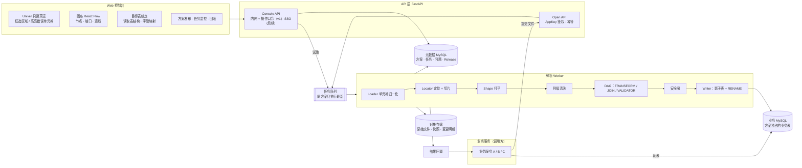

# CellFlow 自动化解析配置平台 · 详细设计方案（TECH_DESIGN.md）

| 项 | 内容 |
|---|---|
| 文档版本 | **v1.0 定稿**（2026-09-28 确认；此后按 §14 的变更流程修改） |
| 对应阶段 | KICKOFF 第 3 步「技术方案与数据模型」 |
| 前置文档 | `PRD.md` v1.0、`WIREFRAME.md` v1.0（三份文档的对照见 §16） |
| 定稿检查 | 已对 PRD / 原型 / 技术方案做一致性检查，修正项见 §0.3 |

---

## 0. 导读

### 0.1 一句话定位

CellFlow 是一个**「Excel 解析方案」的配置与执行平台**：

- **人（策划/运营/研发）在 Web 控制台**上，针对某一类 Excel 文件圈选区域、编排清洗/关联/校验流程，调试通过后**发布解析方案版本**；
- **业务服务**在自己的流程中把文件交给 CellFlow（Open API），CellFlow 按已发布的方案解析、校验，**校验与安全闸全部通过则自动写入该方案独占的 MySQL 业务表**，并通知业务服务；
- 业务服务直接读自己的业务表使用数据；出问题时，人可在控制台一键回滚到任一历史版本。

### 0.2 决策记录（2026-09-28 已确认）

| # | 问题 | 结论 | 对设计的影响 |
|---|---|---|---|
| D1 | 产品形态 | **Web 端平台**（控制台）+ 面向内部服务的 Open API | KICKOFF 已更新 |
| D2 | 数据模型 | **完整快照 + 写入时比对 + 版本指针回滚**，运行期不使用 CDC 模型 | §6.3、§6.4、§10 |
| D3 | 业务主键 | **不强制**声明 | 无主键时 Diff 只区分「新增/删除」（按行内容哈希），写入只能整表替换；见 §10.5 |
| D4 | 数据落点 | **写入已有的业务表** | 默认写入策略为影子表 + `RENAME TABLE` 原子切换；快照另存对象存储用于审计与回滚 |
| D5 | Univer 许可 | 采用推荐方案：**服务端把网格转换为 Univer 快照 JSON** | 不依赖 Univer 的 xlsx 导入导出能力 |
| D6 | 服务方式 | **业务服务提交文件触发解析，CellFlow 写业务表，业务服务读表** | 新增 Open API、任务队列、回调通知；§2、§6.5、§10.1 |
| D7 | 审批 | **校验通过就自动写**，不经人工审批 | 人的控制点前移到「方案版本发布」；新增**自动安全闸**（§10.2）兜底 |
| D8 | 业务库 | **MySQL** | 元数据库也统一用 MySQL 8；§3、§10.3 按 MySQL 语义设计 |
| D9 | 表归属 | 每张业务表**由一个解析方案独占** | 可安全整表替换；任何非 CellFlow 的写入都视为「漂移」并拦截 |
| D10 | 后端语言 | **Python**（3.11 + FastAPI + openpyxl + pandas） | §7 伪代码即实现语言 |
| D11 | 辅助表 | DBA **接受**在业务库创建 `_cellflow_marker` | APPLY_DIFF 的崩溃恢复方案可行（§10.3、§10.4） |
| D12 | 同方案多文件 | **只执行最新的一个** | 较早的任务标记为 `SUPERSEDED`，不写表（§10.1） |
| D13 | 最终用户报错页 | **不需要** | 回调与 Open API 只返回结构化问题列表，不提供 `reportUrl`；Univer 高亮只在控制台内部使用 |
| D14 | PRD | **需要**，先产出 `PRD.md` 确认后再定稿本文档 | 见 `PRD.md` |
| D15 | 首批接入范围 | **所有类型的 Excel** → v1 增加复杂区域形态（分组明细、表单型、重复块）与多 Sheet 同构合并；`.xls/.csv` 与 APPLY_DIFF 仍在 v2 | §4.3、§7.7~§7.9、§15；v1 中需要 APPLY_DIFF 的表（有触发器/外键/被引用的自增 ID）在绑定时拒绝并说明原因 |
| D16 | 交文件方式 | **只支持直接上传**（multipart） | 去掉 `fileRef`；文件大小上限取系统设置（默认 20MB） |
| D17 | 只校验模式 | `VALIDATE_ONLY` **进 v1** | §6.5.1 |
| D18 | 告警与通知 | **v1 不做**告警推送与回滚通知；只保留对提交方的任务结果回调 | 去掉 MQ 事件；问题只在控制台展示 |
| D19 | 控制台登录 | **v1 不做登录**，仅内网部署；发布、放行、回滚、冻结/解冻、修改数据源/调用方/系统设置需输入**操作口令**并填写操作人；后续接入公司统一登录（SSO） | §6.5.2、§12；审计记录操作人（自填）+ 来源 IP |
| D20 | 默认值 | 按推荐值，做成**系统设置**，控制台可修改；方案/表级配置可覆盖 | 新增 `cf_system_setting`（§3、§10.8） |
| D21 | 键值区与明细关联 | 广播关联、参数端口、键值区纵向输出模式三种**都进 v1** | §4.3、§7.6、§8.4 |
| D22 | 派生列 | 按函数库实现，跨行计算放 v2；删除 `column_mapping.transform`，计算只在派生列节点中做 | §5.5 |
| D23 | 样例文件归属 | 样例文件**归属方案**，所有源节点共用；源节点只选择 Sheet（或多 Sheet 匹配规则） | 一次任务只有一个文件，运行时所有源节点读同一文件；§1、§3、§6.1 |
| D24 | 外键引用 | 校验节点通过可见的**引用输入端口**接入被引用的流，外键规则只能引用已连接端口的字段 | 依赖关系全部体现为连线；§6.1、§9 |
| D25 | 跨文件引用 | **暂不支持**：被引用数据必须与主数据在同一个文件中 | 「引用另一方案的线上数据」保留为 v2 方向 |

### 0.3 定稿前一致性检查的修正项（v0.6 → v1.0）

| # | 发现的问题 | 修正 |
|---|---|---|
| C1 | 表达式中的 `$p.`、`$row.` 不是合法的 CEL 标识符（CEL 标识符不能含 `$`） | 改为保留变量 `params.<别名>.<字段>`、`meta.index`、`meta.sheetRow`；字段名不得使用 `params`、`meta` 及 CEL 保留字（§5.3、§5.5） |
| C2 | CEL 数值类型严格，`int * double` 不能直接运算，原示例 `int(baseHp * 系数)` 无法通过类型检查 | 示例改为 `int(double(baseHp) * params.global.hpRate)`；编辑器对类型错误给出「插入类型转换」的修复建议（§5.5） |
| C3 | 方案版本表注明「不可变」，但草稿需要反复保存 | 新增 `cf_pipeline_draft`（每个方案一份可变草稿，乐观锁）；`cf_pipeline_revision` 只在发布时生成（§3） |
| C4 | 控制台试跑的是草稿，但任务表要求 `revision_id` 非空 | `revision_id` 允许为空，试跑任务保存 `dsl_snapshot`（§3） |
| C5 | 表绑定既在 DSL 里又在 `cf_table_binding` 里，来源不唯一 | DSL 为唯一来源；`cf_table_binding` 改为发布时生成的只读索引；表占用在**草稿保存时**登记（§3） |
| C6 | 预览采样在源节点执行，会把外键引用集合、关联右表、参数也截断，导致误报 | 被引用输入 / 关联右侧 / 查表字典 / 参数端口消费的区域**不采样**（§7.9） |
| C7 | 类型转换失败的行用 `INVALID` 占位继续向下游流动，可能引发连锁误报 | 转换失败的行从区域主输出移除（问题已记录，任务不会写表）（§7.8） |
| C8 | 首次发布时线上行数为 0，G3/G4 的比例计算除以 0 | 线上为空时跳过 G3/G4，由 G2/G5 负责（§10.2） |
| C9 | 原型中的若干操作缺少接口：样例文件、草稿读取、配置对比、待处理计数、历史文件列表、连接测试、回调记录等 | Console API 补全（§6.5.2） |
| C10 | 原型 P3-4「变更摘要 + 安全闸预判」、只校验模式的预检结果缺少后端定义 | TEST / VALIDATE_ONLY 任务也执行 Diff 与安全闸，但只作「预判」不写表（§10.1） |
| C11 | 快照、原始文件、备份表的保留期只有设置项，没有清理机制 | 新增 §10.9 数据清理 |
| C12 | 第三方依赖分散在各章节，没有统一的审批清单 | §13.1 汇总依赖清单，随定稿一并确认（KICKOFF §3.2） |
| C13 | 文档头部与 §0.3/§0.4 仍是早期版本的描述（如「文件 URL 拉取的 SSRF 防护」） | 已清理；历史演进见 `KICKOFF.md` 变更记录 |

### 0.4 设计基础

- 区域 = **定位器 Locator（在哪）× 形态 Shape（怎么读）× 列规格 Columns（读成什么）**，按表头名绑定字段，抗插行插列（§4）。
- **四层清洗模型**：单元格归一化 → 形态解析 → 列级类型清洗 → 结构变换节点（§5）。
- 全链路**单元格血缘**：每个错误能定位到原始 Excel 的具体单元格（§6.3、§9.3）。
- 运行期只流转快照行；before/after 只出现在写表时的 Diff 中（§6.3、§6.4）。
- 人的控制点在**方案版本发布**（含历史文件回归）；运行期全自动，由**安全闸 + 一键回滚 + 冻结**兜底（§10）。

---

## 1. 核心概念与生命周期

```
 设计期（人 · Web 控制台 · 低频）          运行期（业务服务 · Open API · 高频）              运维期（人 · Web 控制台）
 ┌──────────────────────────────┐    ┌────────────────────────────────────┐    ┌─────────────────────────┐
 │ 1 用样例文件圈选、编排 DSL      │    │ 1 提交 ParseJob（文件 + 方案编码）      │    │ 任务监控 / 错误定位       │
 │ 2 绑定目标 MySQL 表、字段映射   │    │ 2 同方案只保留最新任务                 │    │ 发布历史 / 变更明细       │
 │ 3 试跑（PREVIEW / FULL 不写表）  │──▶│ 3 解析 → 校验 → 安全闸                  │──▶│ 一键回滚                  │
 │ 4 历史文件回归（新旧版本对比）   │    │ 4 通过：影子表灌数 → RENAME 原子切换     │    │ 安全闸拦截后的人工放行     │
 │ 5 发布方案版本（人的控制点）     │    │ 5 记录 Release + 快照 → 回调提交方       │    │                         │
 └──────────────────────────────┘    └────────────────────────────────────┘    └─────────────────────────┘
```

| 概念 | 说明 |
|---|---|
| **Pipeline（解析方案）** | 针对一类文件的解析配置，有全局唯一编码 `code`（如 `hero_config`），业务服务按编码调用。方案持有一份**样例文件**供设计期圈选与试跑（D23） |
| **PipelineRevision（方案版本）** | DSL 的不可变版本。状态 `DRAFT → PUBLISHED`；同一时刻只有一个 `PUBLISHED` 版本对外生效 |
| **DataSource（数据源）** | 目标 MySQL 实例/库的连接定义；凭证只存**引用名**，真实值来自环境变量/密钥管理 |
| **TableBinding（表绑定）** | 方案的一个输出数据集 → 一张业务表：字段映射、写入策略、可选主键、安全闸阈值 |
| **ClientApp（调用方）** | 调用 Open API 的业务服务，持有 AppKey，被授权可调用哪些方案 |
| **SourceFile** | 上传的原始文件，对象存储保存，sha256 去重 |
| **ParseJob（解析任务）** | 调用方的一次提交；控制台试跑也是 ParseJob（`mode=TEST`，永不写表） |
| **Snapshot（快照）** | 某数据集在某次任务中的全量结果，存对象存储（压缩 JSONL/Parquet），不可变 |
| **Release（发布记录）** | 一次成功写表：包含方案所有目标表的快照引用、写入前后校验和、备份表名。类型：正常 / 回滚 / 人工放行 / 接管基线 |
| **LiveState（线上指针）** | 每个方案当前写在业务表里的是哪个 Release；发布/回滚都更新它 |

---

## 2. 系统总体架构与数据流向

### 2.1 架构图



### 2.2 端到端数据流

**设计期（人）**

```
① 为方案上传样例文件（所有源节点共用）→ sha256 → 对象存储 → Loader 解析 → 服务端转 Univer 快照 JSON 返回前端
② 双击源节点进入分屏，在表格区框选区域 → 配置面板选择 形态 / 定位器 / 列规格 → 源节点长出对应输出端口
③ 画布拉线编排 TRANSFORM / JOIN / VALIDATOR → SINK；每次修改触发服务端 Schema 推导
④ SINK 绑定目标表：选择数据源 + 表名 → 服务端读取 information_schema → 自动字段映射 → 用户修正
   → 服务端检查：类型兼容、非空列是否都有来源、表是否有触发器/被外键引用/自增主键（决定可用的写入策略）
⑤ 试跑（TEST 任务，只产出结果与问题，永不写表）
⑥ 发布方案版本：自动对「该方案最近 N 个成功任务的原始文件」用新版本重跑，展示与线上版本的结果差异（回归）
   → 人确认后版本生效；之后提交的任务使用新版本
```

**运行期（业务服务，全自动）**

```
① 业务服务 POST /open/v1/jobs（文件 + pipelineCode + idempotencyKey + callbackUrl）→ 返回 jobId
② 任务入队；同一方案同一时刻只执行一个任务，排队中有更新的任务时较早的直接作废（SUPERSEDED）；不同方案并行
③ Worker：Loader → 定位切片 → 打平 → 列级清洗 → DAG → 快照写对象存储
④ 校验：存在 ERROR 级问题 → 任务 FAILED_VALIDATION，业务表不动，回调携带问题列表（精确到单元格）
⑤ Diff：新快照 vs 线上指针所指 Release 的快照 → 变更摘要（无变化 → NO_CHANGE，不写表）
⑥ 安全闸：行数范围 / 删除比例 / 清空保护 / 目标表结构 / 漂移检测 → 任一不通过 → FAILED_GUARD
⑦ 写表：为每张目标表建影子表并灌数 → 校验行数 → 一条 RENAME TABLE 原子切换全部表 → 旧表保留为备份
⑧ 记录 Release、更新线上指针 → 写 Outbox → 回调提交任务的业务服务
```

### 2.3 Univer 数据来源（D5 已确认）

1. 前端不直接打开 xlsx，由服务端 Loader 把网格（值、合并单元格、基础样式、隐藏行列）转换为 Univer 快照 JSON，**前端所见与后端解析的是同一份网格**，框选坐标不会错位。
2. 不依赖 Univer 的 xlsx 导入导出能力，规避许可问题。
3. 大 Sheet 按行分页加载（`?rows=1-500`）。

---

## 3. 元数据库表结构（MySQL 8）

> 元数据库与业务库**分开部署**（至少分库），CellFlow 对业务库只做 §10.3 所需操作。快照与变更明细存对象存储，数据库里只存引用与摘要。

```sql
-- ========== 设计期 ==========
CREATE TABLE cf_pipeline (
  id                BIGINT PRIMARY KEY AUTO_INCREMENT,
  code              VARCHAR(64)  NOT NULL,             -- 业务服务调用时使用，如 hero_config
  name              VARCHAR(128) NOT NULL,
  datasource_id     BIGINT       NOT NULL,             -- 一个方案的所有目标表必须在同一 MySQL 实例（原子切换前提）
  published_rev_id  BIGINT,
  sample_file_id    BIGINT,                            -- D23：方案级样例文件，所有源节点共用
  frozen            TINYINT(1)   NOT NULL DEFAULT 0,   -- 冻结后拒绝新任务（回滚后默认冻结，§10.6）
  description       VARCHAR(512),
  owner             VARCHAR(64)  NOT NULL,             -- v1 为创建人自填姓名（D19）
  created_at        DATETIME(3)  NOT NULL DEFAULT CURRENT_TIMESTAMP(3),
  updated_at        DATETIME(3)  NOT NULL DEFAULT CURRENT_TIMESTAMP(3) ON UPDATE CURRENT_TIMESTAMP(3),
  UNIQUE KEY uk_code (code)
) ENGINE=InnoDB DEFAULT CHARSET=utf8mb4;

CREATE TABLE cf_pipeline_draft (                       -- C3：每个方案一份可变草稿
  pipeline_id       BIGINT PRIMARY KEY,
  dsl               JSON        NOT NULL,
  base_rev          INT,                               -- 基于哪个已发布版本修改；新方案为空
  version           BIGINT      NOT NULL,              -- 乐观锁，每次保存 +1（冲突 409 DSL_REV_CONFLICT）
  updated_by        VARCHAR(64) NOT NULL,
  updated_at        DATETIME(3) NOT NULL DEFAULT CURRENT_TIMESTAMP(3) ON UPDATE CURRENT_TIMESTAMP(3)
) ENGINE=InnoDB DEFAULT CHARSET=utf8mb4;

CREATE TABLE cf_pipeline_revision (                    -- 不可变；只在发布时由草稿生成
  id                BIGINT PRIMARY KEY AUTO_INCREMENT,
  pipeline_id       BIGINT      NOT NULL,
  rev               INT         NOT NULL,
  dsl               JSON        NOT NULL,              -- §6.1
  dsl_schema_ver    VARCHAR(16) NOT NULL,
  status            VARCHAR(16) NOT NULL,              -- PUBLISHED（当前生效，唯一）| RETIRED
  note              VARCHAR(512),                      -- 发布说明
  regression_report JSON,                              -- 发布前历史文件回归结果
  created_by        VARCHAR(64) NOT NULL,
  published_by      VARCHAR(64),
  published_at      DATETIME(3),
  UNIQUE KEY uk_rev (pipeline_id, rev)
) ENGINE=InnoDB DEFAULT CHARSET=utf8mb4;

CREATE TABLE cf_datasource (
  id                BIGINT PRIMARY KEY AUTO_INCREMENT,
  name              VARCHAR(64)  NOT NULL,
  host_ref          VARCHAR(128) NOT NULL,             -- 环境变量/密钥管理中的引用名，不存真实地址与密码
  db_name           VARCHAR(64)  NOT NULL,
  credential_ref    VARCHAR(128) NOT NULL,
  UNIQUE KEY uk_name (name)
) ENGINE=InnoDB DEFAULT CHARSET=utf8mb4;

CREATE TABLE cf_table_binding (                        -- C5：发布时从 DSL 的 SINK 节点生成的只读索引，DSL 为唯一来源
  id                BIGINT PRIMARY KEY AUTO_INCREMENT,
  revision_id       BIGINT       NOT NULL,
  dataset           VARCHAR(128) NOT NULL,             -- SINK 节点的数据集名
  table_name        VARCHAR(64)  NOT NULL,
  strategy          VARCHAR(16)  NOT NULL,             -- SWAP | APPLY_DIFF
  key_fields        JSON,                              -- 可为空（D3）
  column_mapping    JSON         NOT NULL,             -- [{field, column}]；计算只在 DERIVE 节点中做（D22）
  guards            JSON,                              -- §10.2 安全闸阈值；为空则取系统设置（D20）
  UNIQUE KEY uk_ds (revision_id, dataset),
  UNIQUE KEY uk_tbl (revision_id, table_name)
) ENGINE=InnoDB DEFAULT CHARSET=utf8mb4;

CREATE TABLE cf_table_owner (                          -- D9：一张业务表只能被一个方案独占；草稿保存时登记，草稿与生效版本都不再引用时释放
  datasource_id     BIGINT      NOT NULL,
  table_name        VARCHAR(64) NOT NULL,
  pipeline_id       BIGINT      NOT NULL,
  PRIMARY KEY (datasource_id, table_name)
) ENGINE=InnoDB DEFAULT CHARSET=utf8mb4;

CREATE TABLE cf_client_app (
  id                BIGINT PRIMARY KEY AUTO_INCREMENT,
  app_key           VARCHAR(64)  NOT NULL,
  secret_ref        VARCHAR(128) NOT NULL,             -- 签名密钥引用
  name              VARCHAR(128) NOT NULL,
  allowed_pipelines JSON         NOT NULL,             -- ["hero_config", ...]
  callback_allowlist JSON        NOT NULL,             -- 允许的回调域名
  rate_limit_per_min INT         NOT NULL,             -- 新建时取系统设置 openapi.defaultRateLimitPerMin
  enabled           TINYINT(1)   NOT NULL DEFAULT 1,
  UNIQUE KEY uk_key (app_key)
) ENGINE=InnoDB DEFAULT CHARSET=utf8mb4;

-- ========== 运行期 ==========
CREATE TABLE cf_source_file (
  id                BIGINT PRIMARY KEY AUTO_INCREMENT,
  sha256            CHAR(64)     NOT NULL,
  storage_uri       VARCHAR(512) NOT NULL,
  file_name         VARCHAR(255) NOT NULL,
  size_bytes        BIGINT       NOT NULL,
  sheet_meta        JSON         NOT NULL,             -- [{name, maxRow, maxCol, fingerprint, hasUncachedFormula}]
  uploaded_by       VARCHAR(64)  NOT NULL,             -- 用户名或 app_key
  uploaded_at       DATETIME(3)  NOT NULL DEFAULT CURRENT_TIMESTAMP(3),
  KEY idx_sha (sha256)
) ENGINE=InnoDB DEFAULT CHARSET=utf8mb4;

CREATE TABLE cf_parse_job (
  id                BIGINT PRIMARY KEY AUTO_INCREMENT,
  pipeline_id       BIGINT       NOT NULL,
  revision_id       BIGINT,                            -- 入队时锁定的已发布版本；控制台试跑草稿时为空（C4）
  dsl_snapshot      JSON,                              -- 试跑草稿时保存所用 DSL，保证结果可复现
  client_app_id     BIGINT,                            -- 控制台试跑时为空
  idempotency_key   VARCHAR(128),
  file_id           BIGINT       NOT NULL,
  mode              VARCHAR(16)  NOT NULL,             -- EXECUTE | VALIDATE_ONLY | TEST
  status            VARCHAR(24)  NOT NULL,             -- 见 §10.1 状态机
  superseded_by     BIGINT,                            -- D12：被哪个更新的任务作废
  operator          VARCHAR(64),                       -- 调用方透传的操作人 / 控制台操作人
  callback_url      VARCHAR(512),
  error_summary     JSON,                              -- {error: n, warn: n, guard: "..."}
  metrics           JSON,                              -- 每节点行数、耗时、定位报告
  release_id        BIGINT,
  submitted_at      DATETIME(3)  NOT NULL DEFAULT CURRENT_TIMESTAMP(3),
  started_at        DATETIME(3),
  finished_at       DATETIME(3),
  UNIQUE KEY uk_idem (client_app_id, idempotency_key),
  KEY idx_pipe_status (pipeline_id, status, id)
) ENGINE=InnoDB DEFAULT CHARSET=utf8mb4;

CREATE TABLE cf_job_issue (
  id                BIGINT PRIMARY KEY AUTO_INCREMENT,
  job_id            BIGINT       NOT NULL,
  node_id           VARCHAR(64)  NOT NULL,
  rule_id           VARCHAR(64),
  severity          VARCHAR(8)   NOT NULL,             -- ERROR | WARN | INFO
  code              VARCHAR(32)  NOT NULL,             -- §6.6
  row_id            VARCHAR(64),
  sheet             VARCHAR(128),
  cell              VARCHAR(16),                       -- 如 D12，用于 Univer 高亮
  field             VARCHAR(128),
  value_text        VARCHAR(1024),
  message           VARCHAR(1024) NOT NULL,
  related_cells     JSON,                              -- 派生列、对账等涉及多个单元格时的全部位置
  KEY idx_job (job_id, node_id)
) ENGINE=InnoDB DEFAULT CHARSET=utf8mb4;

CREATE TABLE cf_snapshot (
  id                BIGINT PRIMARY KEY AUTO_INCREMENT,
  job_id            BIGINT       NOT NULL,
  dataset           VARCHAR(128) NOT NULL,
  storage_uri       VARCHAR(512) NOT NULL,             -- jsonl.gz / parquet，含每行 row_hash
  schema_json       JSON         NOT NULL,
  key_fields        JSON,
  row_count         INT          NOT NULL,
  content_hash      CHAR(64)     NOT NULL,             -- 行哈希排序后的整体哈希；相等即内容相同
  UNIQUE KEY uk_job_ds (job_id, dataset)
) ENGINE=InnoDB DEFAULT CHARSET=utf8mb4;

-- ========== 发布与回滚 ==========
CREATE TABLE cf_release (
  id                BIGINT PRIMARY KEY AUTO_INCREMENT,
  pipeline_id       BIGINT      NOT NULL,
  job_id            BIGINT,                            -- ROLLBACK 时为空
  kind              VARCHAR(16) NOT NULL,              -- NORMAL | ROLLBACK | FORCED（人工放行安全闸）| BASELINE（接管时的原表内容）
  rollback_to       BIGINT,
  prev_release_id   BIGINT,
  status            VARCHAR(16) NOT NULL,              -- WRITING | PUBLISHED | FAILED
  write_plan        JSON        NOT NULL,              -- 每表：策略、影子表名、备份表名（崩溃恢复依据）
  table_checksums   JSON,                              -- 写入后各表 CHECKSUM，用于下次漂移检测
  change_summary    JSON,                              -- 每表 {c, u, d}
  change_uri        VARCHAR(512),                      -- 完整变更明细文件（对象存储）
  operator          VARCHAR(64) NOT NULL,              -- app_key 或用户名
  reason            VARCHAR(512),
  created_at        DATETIME(3) NOT NULL DEFAULT CURRENT_TIMESTAMP(3),
  published_at      DATETIME(3),
  KEY idx_pipe (pipeline_id, id)
) ENGINE=InnoDB DEFAULT CHARSET=utf8mb4;

CREATE TABLE cf_release_snapshot (
  release_id        BIGINT       NOT NULL,
  dataset           VARCHAR(128) NOT NULL,
  snapshot_id       BIGINT       NOT NULL,
  table_name        VARCHAR(64)  NOT NULL,
  PRIMARY KEY (release_id, dataset)
) ENGINE=InnoDB DEFAULT CHARSET=utf8mb4;

CREATE TABLE cf_live_state (                           -- 线上指针
  pipeline_id       BIGINT PRIMARY KEY,
  release_id        BIGINT NOT NULL,
  version           BIGINT NOT NULL,                   -- 乐观锁
  updated_at        DATETIME(3) NOT NULL DEFAULT CURRENT_TIMESTAMP(3) ON UPDATE CURRENT_TIMESTAMP(3)
) ENGINE=InnoDB DEFAULT CHARSET=utf8mb4;

CREATE TABLE cf_outbox (
  id                BIGINT PRIMARY KEY AUTO_INCREMENT,
  release_id        BIGINT,
  job_id            BIGINT,
  channel           VARCHAR(16)  NOT NULL,             -- CALLBACK（v1 仅此一种，D18）
  target            VARCHAR(512) NOT NULL,
  payload           JSON         NOT NULL,
  status            VARCHAR(16)  NOT NULL DEFAULT 'PENDING',
  attempts          INT          NOT NULL DEFAULT 0,
  next_retry_at     DATETIME(3),
  KEY idx_status (status, next_retry_at)
) ENGINE=InnoDB DEFAULT CHARSET=utf8mb4;

-- ========== 系统设置与审计 ==========
CREATE TABLE cf_system_setting (                       -- D20：全局默认值，控制台可修改（§10.8）
  setting_key       VARCHAR(64)  PRIMARY KEY,
  value_json        JSON         NOT NULL,
  updated_by        VARCHAR(64)  NOT NULL,
  updated_at        DATETIME(3)  NOT NULL DEFAULT CURRENT_TIMESTAMP(3) ON UPDATE CURRENT_TIMESTAMP(3)
) ENGINE=InnoDB DEFAULT CHARSET=utf8mb4;

CREATE TABLE cf_audit_log (
  id                BIGINT PRIMARY KEY AUTO_INCREMENT,
  operator          VARCHAR(64)  NOT NULL,             -- v1 为操作人自填（D19），接入 SSO 后为登录账号
  source_ip         VARCHAR(45)  NOT NULL,
  action            VARCHAR(32)  NOT NULL,             -- PUBLISH_REVISION | REPUBLISH_REVISION | FORCE_PUBLISH | ROLLBACK | FREEZE | UNFREEZE | EDIT_DATASOURCE | EDIT_CLIENT | EDIT_SETTING
  target            VARCHAR(128) NOT NULL,
  detail            JSON,                              -- 修改前后值等
  reason            VARCHAR(512),
  created_at        DATETIME(3)  NOT NULL DEFAULT CURRENT_TIMESTAMP(3),
  KEY idx_target (target, id)
) ENGINE=InnoDB DEFAULT CHARSET=utf8mb4;
```

说明：
- 所有表不使用数据库外键约束，引用完整性由应用层保证（便于归档清理，§10.9）。
- 口令错误计数与 IP 锁定、Open API 的 nonce 去重、限流计数放在 Redis（带过期时间），不落元数据库。
- 业务库中 CellFlow 只会创建：影子表 `*__cfs_*`、备份表 `*__cfb_*`、辅助表 `_cellflow_marker`（D11）。

---

## 4. 区域模型：Locator × Shape × Columns

### 4.1 为什么要把「在哪」和「怎么读」拆开

策划最常见的改表动作是**在中间插几行、在右边加一列、把下方明细多填 20 行**。如果区域只存 `A17:E40`，下一次上传时：明细被截断（只读到 40 行）、或下方 SUMMARY 行被当成明细读入。因此：

- **Locator**：每次任务在**新文件**上重新计算出本次的物理矩形；
- **Shape**：决定这块矩形如何被打平成行；
- **Columns**：按**表头名**（而非列序号）绑定字段与类型，插列不影响已有字段。

### 4.2 定位器 Locator

| 类型 | 说明 | 适用 | 分期 |
|---|---|---|---|
| `FIXED` | 固定坐标 `startRow..endRow, startCol..endCol` | 结构永不变化的小块（如 KV 开关区） | MVP |
| `ANCHOR` | 按锚点文本（精确/正则）找到起点，加偏移；终点可为 `UNTIL_BLANK_ROWS(n)` / `UNTIL_ANCHOR(文本)` / `FIXED_SIZE` / `SHEET_END` | 「下方明细」「底部总计行」 | MVP |
| `AUTO_EXPAND` | 从表头起点向右扩展到空表头，向下扩展到连续 n 个空行 | 标准明细表 | MVP |
| `NAMED_RANGE` | Excel 定义名称 | 规范化程度高的模板 | v2 |
| `EXCEL_TABLE` | Excel「表格（ListObject）」对象 | 同上 | v2 |

**用户交互**：用户框选时，前端自动给出推荐定位器（框选区域上方/左侧有醒目文本→推荐 ANCHOR；框选区域下方紧邻空行→推荐 AUTO_EXPAND），并保留 `designRange` 作为设计时快照，用于"本次定位结果与设计时相比偏移了多少"的提示。

### 4.3 形态 Shape（区域流类型，完整清单）

| 形态 | 原始样子 | 打平结果 | 关键参数 | 分期 |
|---|---|---|---|---|
| `DETAIL` 明细 | 首行（或前 k 行）为表头，每行一条记录 | 每行 → 1 Row | `headerRows`（多级表头）、`headerJoiner`（如 `.`）、`orientation: ROW\|COLUMN`（**横向明细**：表头在第一列、每列一条记录，游戏配置常见） | MVP |
| `KEY_VALUE` 键值 | A 列 Key、B 列 Value（可有 C 列类型/备注） | `WIDE`（默认）：整块 → 1 Row（转置）；`LONG`：每个 Key → 1 Row `{key, value}` | `keyCol`、`valueCol`、`typeCol?`、`orientation`、`duplicateKey: ERROR\|LAST\|ARRAY`、`outputMode: WIDE\|LONG`（D21，与明细的关联方式见 §8.4） | MVP |
| `MATRIX` 矩阵 | 行头 × 列头，交叉点为值 | 每个非空交叉点 → 1 Row（逆透视） | `rowHeaderCols(n)`、`colHeaderRows(m)`（**多级维度**）、`rowDims[]`、`colDims[]`、`valueName`、`metricLevel?`（某一级列头是指标名时，逆透视后再横向展开）、`totalMarkers`（排除"合计"行列）、`dimParsers`（`"Lv.1"→1`） | MVP |
| `SUMMARY` 汇总 | 底部"总计"行或 KV 式汇总块 | 1 Row（供对账） | `layout: ROW\|KV`、`labelMatch` | MVP |
| `IGNORE` 屏蔽区 | 说明文字、备注、示例行 | 不产出；并从其他区域中**挖掉** | — | MVP |
| `GROUPED_DETAIL` 分组明细 | 明细中穿插"【武器类】"分组标题行、小计行，或用**缩进/大纲级别**表示层级 | 每条明细 Row 附带分组字段（向下填充） | `groupRowDetector`（仅首格有值 / 样式加粗 / 正则）、`groupField`、`outlineAsLevel`、`subtotalDetector` | MVP（D15） |
| `FORM` 表单/卡片 | 单元格散落在固定相对位置（如"名称：C3，品质：F3"） | 1 Row | `fields: {字段名: 相对锚点偏移}` | MVP（D15） |
| `REPEATING_BLOCK` 重复块 | 同一布局的块重复 N 次（每个英雄一个 6×4 的卡片） | 每块 → 1 Row（块内按 FORM 或 KV 解析） | `blockAnchor`（正则，找所有块起点）或 `stride{dRow,dCol}`、`innerShape` | MVP（D15） |

**源级扩展 `SHEET_SET`（v1，D15）**：多个 Sheet 结构相同（如每个服/每个章节一个 Sheet），一次配置，按 `sheetPattern` 正则匹配，自动 UNION 并追加 `_sheet` 维度列。

**不作为区域形态、而放在清洗层处理的**：单元格内多值（`1001|1002`）、单元格内结构（`1001:5,1002:3`）、单元格内 JSON —— 这些是**列级**问题（§5.3），与区域形态正交。

### 4.4 区域之间的约束

- 同一 Sheet 内区域**默认不允许重叠**；需要重叠时（如 SUMMARY 位于 DETAIL 定位范围内）必须显式声明 `excludeFrom: [regionId]`，被排除的区域从宿主区域中挖掉。
- `IGNORE` 区域自动从所有区域中挖掉。
- 每次任务输出「定位报告」：每个区域本次矩形、与设计时的偏移、是否与其他区域冲突。偏移超过阈值（默认行 ±50%）产生 WARN。

---

## 5. 清洗与打平：四层模型

```
L1 单元格归一化（Loader，所有区域共享，无需用户配置或全局开关）
   合并单元格 · 公式取值 · 错误值 · 隐藏行列 · 删除线行 · 日期系统 · 富文本
        ↓
L2 形态解析（Shape Parser，由区域形态决定）
   表头构建 · 逆透视 · 转置 · 分组填充 · 块提取  → 打平成「行」
        ↓
L3 列级清洗（Column Coercer，按 ColumnSpec 逐列）
   空值识别 · 去空白/全半角 · 类型转换 · 枚举映射 · 单元格内拆分 · 默认值
        ↓
L4 结构变换（画布 TRANSFORM 节点，用户按需拖入）
   过滤 · 派生列 · 重命名/选列 · 行展开 · 分组嵌套 · 聚合 · 合并 UNION · 去重 · 查找映射
```

### 5.1 L1 单元格归一化（策略项）

| 问题 | 默认策略 | 可选策略 |
|---|---|---|
| 合并单元格 | 纵向合并 → 向下填充；横向合并（表头）→ 向右填充 | `TOP_LEFT_ONLY`（其余视为空） |
| 公式 | 取**缓存值**（`data_only=True`） | 缓存值缺失（WPS/程序生成文件常见）→ 该单元格标记 `F_NOCACHE`，触发 ERROR；可选服务端重算（LibreOffice headless，v2） |
| 错误值 `#N/A #REF! #DIV/0!` | 标记为错误单元格，进入 Issue（ERROR） | 视为空 |
| 隐藏行/列 | **保留**并 WARN（隐藏≠删除，策划常用来临时屏蔽） | 跳过 |
| 删除线/特定底色行 | 不处理 | 按样式规则跳过（团队约定"删除线=废弃"时开启） |
| 日期 | 按工作簿的 1900/1904 日期系统换算 | — |
| 富文本 | 拼接纯文本 | — |
| 批注 | 丢弃 | 作为 `_comment` 元字段 |

### 5.2 L2 形态解析

见 §7 伪代码。所有形态解析器遵守统一契约：**输入 `Block`（切片后的网格 + 原点坐标）→ 输出 `DataFrame` + 每行的单元格血缘**。

### 5.3 L3 列级规格 ColumnSpec

```jsonc
{
  "source": "奖励道具",               // 表头文本（支持正则 /^奖励.*$/ ，支持多级表头 "奖励.道具"）
  "field": "rewardItems",            // 输出字段名（英文标识，符合 ^[a-zA-Z_][a-zA-Z0-9_]*$，且不得为 params / meta / CEL 保留字）
  "type": "list<struct<itemId:long,count:int>>",
  "required": true,
  "isKey": false,
  "nullTokens": ["", "-", "N/A", "无"],
  "default": null,
  "trim": true,
  "normalizeWidth": true,            // 全角数字/符号 → 半角
  "split": {"item": "|", "kv": ":"}, // "1001:5|1002:3" → [{itemId:1001,count:5},...]
  "enumMap": null,                   // {"普通":1,"稀有":2,"史诗":3}
  "boolTokens": null                 // {"true":["是","√","TRUE","1"],"false":["否","×","FALSE","0"]}
}
```

支持的类型：`string | int | long | decimal(p,s) | float | bool | date | datetime | enum | json | list<T> | struct<...>`。

**必须内建的防坑规则**：

| 坑 | 处理 |
|---|---|
| 长 ID 被 Excel 存成浮点（>15 位精度丢失、科学计数法 `1.23E+17`） | 目标类型为 `long`/`string` 且源是浮点且绝对值 ≥ 2^53 → ERROR「请将该列设为文本格式」 |
| `1.0` 写入 int 列 | 允许（无损），`1.5` → ERROR |
| 百分比 `15%` | Excel 存为 0.15，按单元格数字格式判断，默认保留 0.15 |
| 数字带千分位 `"1,000"` 文本 | 去千分位后转换 |
| 不可见字符（NBSP、零宽空格、BOM） | `trim` 时一并清除 |
| 表头有前后空格/换行 | 表头匹配前统一归一化 |
| 同名表头 | 自动 `name`, `name_2`，并 WARN，要求用户在 ColumnSpec 中消歧 |

**列绑定策略**：按表头名绑定。本次文件中 ① 缺少 `required` 列 → ERROR；② 出现未配置的新列 → WARN（默认丢弃，可选"自动带出为 string"）；③ 列顺序变化 → 无影响。

### 5.4 L4 结构变换节点（TRANSFORM 族）

| 节点 | 作用 | 分期 |
|---|---|---|
| `FILTER` | 按表达式过滤行 | MVP |
| `DERIVE` | 新增/覆盖列（表达式），详见 §5.5 | MVP |
| `SELECT_RENAME` | 选列、改名、排序 | MVP |
| `UNION` | 多流上下合并（按列名对齐，缺列补空） | MVP |
| `LOOKUP` | 维表映射（小表字典查找，比 JOIN 轻，保证不膨胀） | MVP |
| `EXPLODE` | 列表列展开成多行 | v2 |
| `NEST` | 按键分组，把子行收拢为数组字段（输出嵌套 JSON，游戏配置常用） | v2 |
| `AGGREGATE` | 分组聚合 | v2 |
| `DEDUP` | 按键去重（保留首/尾/报错） | v2 |
| `PIVOT` | 逆透视的反向操作 | v2 |

**表达式语言**：禁止 Python `eval/exec`。采用受限表达式，推荐 **CEL（Common Expression Language）**：无副作用、非图灵完备、可静态类型检查、有 Python/Java/Go/JS 多端实现（前端可做实时语法校验）。示例：`count > 0 && itemId != 0`、`level * 10 + 5`、`coalesce(icon, "default.png")`。FILTER / DERIVE / VALIDATOR 共用同一套表达式语言、函数库（§5.5）与参数引用（§8.4）。

**节点端口类型**

| 端口 | 所在节点 | 接受 | 用途 |
|---|---|---|---|
| 数据输入 `in` / `in_main` / `in_left` / `in_right` | 各节点 | 任意流 | 被处理的主数据 |
| **参数端口** `in_params` | FILTER / DERIVE / VALIDATOR | **单行流**，只接一条线，在 `config.params` 中起别名；需要多个参数来源时，先用广播关联把它们合成一行 | 表达式中 `params.<别名>.<字段>` 引用；RECONCILE 对账的汇总值（§8.4、§9） |
| **引用输入** `in_ref_<别名>` | VALIDATOR | 多行流（可添加多个，各起别名） | 外键规则的被引用集合（D24，§9） |
| 侧输出 `out_reject` / `out_unmatched` | DERIVE / VALIDATOR / JOIN | — | 被拒行、未匹配行 |

**源节点只有输出端口**：两个源节点之间不能直接相连，需要各自连到关联 / 合并 / 查表映射 / 参数端口 / 引用输入等下游节点汇合。

### 5.5 派生列 DERIVE（D22）

```json
{"id": "derive_reward", "type": "DERIVE", "config": {
  "params": {"global": "in_params"},
  "columns": [
    {"field": "rowId",    "expr": "rewardId * 100 + level",           "type": "long"},
    {"field": "hp",       "expr": "int(double(baseHp) * params.global.hpRate)", "type": "int"},
    {"field": "tag",      "expr": "job + '_' + string(level)",        "type": "string"},
    {"field": "grade",    "expr": "level >= 60 ? 'HIGH' : 'LOW'",     "type": "string"},
    {"field": "iconPath", "expr": "coalesce(icon, 'default.png')",    "type": "string"},
    {"field": "count",    "expr": "count * 2", "mode": "REPLACE",     "type": "int"}
  ],
  "onError": "ERROR"
},
 "ports": {"inputs": [{"portId": "in"}, {"portId": "in_params", "optional": true, "kind": "PARAM"}],
           "outputs": [{"portId": "out"}, {"portId": "out_reject", "side": true}]}}
```

**语义规则**

| 规则 | 说明 |
|---|---|
| 计算顺序 | 按 `columns` 顺序逐列计算；后面的列可引用前面已派生的列；引用自身或后面的列 → 保存时报错 |
| 新增 / 覆盖 | 默认 `mode: ADD`，与已有字段同名 → 保存时报错；覆盖原字段需显式 `REPLACE` |
| 类型 | 保存时推导表达式结果类型，与 `type` 不兼容 → 报错；输出 Schema 自动加入新字段 |
| 空值 | 任一参与运算的操作数为空 → 结果为空，不报错；需要默认值时用 `coalesce()`；写入 NOT NULL 列由 G6/G8 拦截 |
| 单行出错 | 除以 0、转换失败、溢出：`onError: ERROR`（默认）记 ERROR，定位到表达式所引用字段的**原始单元格**，该行进入 `out_reject`；`onError: NULL` 置空并记 WARN |
| 血缘 | 派生字段的 `_lineage` = 所引用字段来源单元格的并集（含参数端口的键值区单元格） |
| 安全 | CEL 沙箱；表达式长度 ≤ 1000 字符、单行求值步数上限 |
| 数值类型 | CEL 不做隐式数值转换：`int` 与 `double` 混合运算需显式 `double(x)` / `int(x)`；编辑器检测到此类类型错误时给出「插入类型转换」的一键修复（C2） |
| 保留名 | `params`、`meta` 为保留变量；字段名不得与之或 CEL 保留字（`in`、`as`、`null`、`true`、`false` 等）相同，列规格保存时校验（C1） |
| 不支持 | 跨行计算（上一行、累计、组内序号）→ v2 的 WINDOW 节点 |

**v1 函数库**（CEL 内置 + CellFlow 注册的自定义函数，前后端同一份清单用于自动补全与校验）

| 类别 | 函数 |
|---|---|
| 文本 | `len`, `upper`, `lower`, `trim`, `substr(s, start, len)`, `replace`, `split`, `join`, `startsWith`, `endsWith`, `contains`, `matches`, `format` |
| 数学 | `+ - * / %`, `abs`, `round(x, n)`, `floor`, `ceil`, `min`, `max`, `clamp(x, lo, hi)` |
| 条件与空值 | `a ? b : c`, `coalesce(a, b, ...)`, `isNull`, `x in [..]` |
| 类型转换 | `int`, `double`, `string`, `bool`, `decimal(x, scale)` |
| 日期 | `date(s)`, `datetime(s)`, `addDays`, `diffDays`, `formatDate(d, fmt)`, `timestamp(d)` |
| 列表 | `size`, `list[i]`, `sum`, `exists`, `all`, `map`, `filter`（配合 §5.3 单元格内拆分得到的列表字段） |
| 参数与行信息 | `params.<别名>.<字段>`（§8.4）、`meta.index`（区域内序号，从 1 开始）、`meta.sheetRow`（Excel 行号） |

```python
def run_derive(cfg, inputs, ctx):
    ds = inputs["in"]; df = ds.df.copy(); lin = [dict(l) for l in ds.lineage]
    params, p_lin = load_params(cfg.get("params", {}), inputs)     # {"global": {...}}，必须恰好 1 行
    bad = pd.Series(False, index=df.index)
    for col in cfg["columns"]:
        prog = compile_expr(col["expr"], schema=current_schema(df), params=params)   # 设计期已校验，这里命中缓存
        if prog.vectorizable:                                       # 纯四则运算/比较 → pandas 整列运算
            values, errs = prog.eval_vectorized(df, params)
        else:
            values, errs = prog.eval_rows(df, params, row_ctx=row_meta(lin))
        for idx, err in errs.items():                               # 除 0 / 转换失败 / 溢出
            cells = [lin[idx].get(f) for f in prog.referenced_fields] + prog.referenced_param_cells(p_lin)
            if cfg.get("onError", "ERROR") == "ERROR":
                ctx.issue("ERROR", "DERIVE_EVAL_FAILED", cell=first(cells), related=cells, message=err)
                bad[idx] = True
            else:
                ctx.issue("WARN", "DERIVE_EVAL_FAILED", cell=first(cells), message=err)
        df[col["field"]] = cast(values, col["type"])
        for i in range(len(lin)):                                   # 派生字段血缘 = 引用字段来源并集
            lin[i][col["field"]] = [lin[i].get(f) for f in prog.referenced_fields]
    return {"out": Dataset(df[~bad], ...), "out_reject": Dataset(df[bad], ...)}
```

---

## 6. 前后端通信协议与元数据模型

### 6.1 画布拓扑 JSON（PipelineRevision.dsl，含目标表绑定）

示例场景（同一个文件的两个 Sheet，由两个源节点分别读取，D23）：Sheet「角色配置」上方是全局开关 KV，中间是「职业×等级→基础血量」矩阵，下方是奖励明细，底部是总计行；另一个 Sheet「道具表」是道具主表。

> 坐标约定：**1-based、闭区间**，与 Excel 行号/列号一致（A=1）；`a1` 仅用于展示，以数值字段为准。

```json
{
  "dslVersion": "1.0",
  "pipelineCode": "hero_config",
  "sampleFileId": 5012,
  "datasource": "game_cfg_mysql",
  "baseRev": 7,
  "draftVersion": 23,
  "nodes": [
    {
      "id": "src_hero",
      "type": "EXCEL_SOURCE",
      "label": "角色配置表",
      "position": {"x": 80, "y": 120},
      "config": {
        "sheet": {"match": "EXACT", "value": "角色配置"},
        "loaderOptions": {
          "mergePolicy": "FILL",
          "hiddenRows": "KEEP_WARN",
          "strikethroughRows": "KEEP"
        },
        "regions": [
          {
            "regionId": "rg_global",
            "name": "全局开关",
            "shape": "KEY_VALUE",
            "outputPortId": "out_global",
            "designRange": {"startRow": 1, "startCol": 1, "endRow": 5, "endCol": 2, "a1": "A1:B5"},
            "locator": {"type": "FIXED"},
            "shapeOptions": {"keyCol": 1, "valueCol": 2, "orientation": "VERTICAL", "duplicateKey": "ERROR"},
            "columns": [
              {"source": "开服天数上限", "field": "maxOpenDays", "type": "int", "required": true},
              {"source": "双倍经验开关", "field": "doubleExp", "type": "bool",
               "boolTokens": {"true": ["开", "是", "1"], "false": ["关", "否", "0"]}}
            ]
          },
          {
            "regionId": "rg_hp",
            "name": "职业等级血量",
            "shape": "MATRIX",
            "outputPortId": "out_hp",
            "designRange": {"startRow": 8, "startCol": 1, "endRow": 14, "endCol": 6, "a1": "A8:F14"},
            "locator": {
              "type": "ANCHOR",
              "start": {"text": "职业\\等级", "match": "EXACT", "offset": {"row": 0, "col": 0}},
              "end": {"rows": {"mode": "UNTIL_BLANK_ROWS", "n": 1},
                      "cols": {"mode": "UNTIL_BLANK_HEADER"}}
            },
            "shapeOptions": {
              "rowHeaderCols": 1,
              "colHeaderRows": 1,
              "rowDims": ["job"],
              "colDims": ["level"],
              "valueName": "baseHp",
              "dropEmpty": true,
              "totalMarkers": ["合计", "总计"],
              "dimParsers": {"level": {"regex": "^(?:Lv\\.?)?(\\d+)$", "type": "int"}}
            },
            "columns": [
              {"source": "job", "field": "job", "type": "string", "isKey": true, "required": true},
              {"source": "level", "field": "level", "type": "int", "isKey": true, "required": true},
              {"source": "baseHp", "field": "baseHp", "type": "int", "required": true}
            ]
          },
          {
            "regionId": "rg_reward",
            "name": "等级奖励明细",
            "shape": "DETAIL",
            "outputPortId": "out_reward",
            "designRange": {"startRow": 17, "startCol": 1, "endRow": 40, "endCol": 5, "a1": "A17:E40"},
            "locator": {
              "type": "ANCHOR",
              "start": {"text": "奖励ID", "match": "EXACT", "offset": {"row": 0, "col": 0}},
              "end": {"rows": {"mode": "UNTIL_ANCHOR", "text": "总计", "inclusive": false},
                      "cols": {"mode": "UNTIL_BLANK_HEADER"}}
            },
            "shapeOptions": {"headerRows": 1, "orientation": "ROW",
                             "skipRows": {"blank": true, "commentPrefix": "#"}},
            "columns": [
              {"source": "奖励ID", "field": "rewardId", "type": "long", "isKey": true, "required": true},
              {"source": "职业", "field": "job", "type": "string", "required": true},
              {"source": "等级", "field": "level", "type": "int", "required": true},
              {"source": "道具ID", "field": "itemId", "type": "long", "required": true},
              {"source": "数量", "field": "count", "type": "int", "required": true}
            ]
          },
          {
            "regionId": "rg_total",
            "name": "奖励总计",
            "shape": "SUMMARY",
            "outputPortId": "out_total",
            "designRange": {"startRow": 41, "startCol": 1, "endRow": 41, "endCol": 5, "a1": "A41:E41"},
            "locator": {
              "type": "ANCHOR",
              "start": {"text": "总计", "match": "EXACT", "offset": {"row": 0, "col": 0}},
              "end": {"rows": {"mode": "FIXED_SIZE", "n": 1}, "cols": {"mode": "FIXED_SIZE", "n": 5}}
            },
            "shapeOptions": {"layout": "ROW", "alignWith": "rg_reward"},
            "columns": [
              {"source": "数量", "field": "totalCount", "type": "int", "required": true}
            ]
          },
          {
            "regionId": "rg_note",
            "name": "填表说明",
            "shape": "IGNORE",
            "designRange": {"startRow": 1, "startCol": 8, "endRow": 30, "endCol": 12, "a1": "H1:L30"},
            "locator": {"type": "FIXED"}
          }
        ]
      },
      "ports": {
        "inputs": [],
        "outputs": [
          {"portId": "out_global", "regionId": "rg_global"},
          {"portId": "out_hp", "regionId": "rg_hp"},
          {"portId": "out_reward", "regionId": "rg_reward"},
          {"portId": "out_total", "regionId": "rg_total"}
        ]
      }
    },
    {
      "id": "src_item",
      "type": "EXCEL_SOURCE",
      "label": "道具主表",
      "config": {
        "sheet": {"match": "EXACT", "value": "道具表"},
        "regions": [
          {
            "regionId": "rg_item", "name": "道具", "shape": "DETAIL", "outputPortId": "out_item",
            "designRange": {"startRow": 1, "startCol": 1, "endRow": 500, "endCol": 4, "a1": "A1:D500"},
            "locator": {"type": "AUTO_EXPAND", "blankRowsToStop": 2},
            "shapeOptions": {"headerRows": 1},
            "columns": [
              {"source": "道具ID", "field": "itemId", "type": "long", "isKey": true, "required": true},
              {"source": "名称", "field": "name", "type": "string", "required": true},
              {"source": "品质", "field": "quality", "type": "enum",
               "enumMap": {"普通": 1, "稀有": 2, "史诗": 3}}
            ]
          }
        ]
      },
      "ports": {"inputs": [], "outputs": [{"portId": "out_item", "regionId": "rg_item"}]}
    },
    {
      "id": "join_reward_item",
      "type": "JOIN",
      "label": "奖励关联道具",
      "config": {
        "joinType": "LEFT",
        "leftAlias": "reward",
        "rightAlias": "item",
        "on": [{"left": "itemId", "right": "itemId"}],
        "expectedCardinality": "MANY_TO_ONE",
        "conflictPolicy": {
          "mode": "EXPLICIT_THEN_PREFIX",
          "aliases": {"item.name": "itemName"},
          "keyColumns": "MERGE"
        },
        "select": ["reward.*", "item.name", "item.quality"],
        "explosionGuard": {"maxOutputRows": 1000000, "maxAmplification": 1.0},
        "unmatchedPolicy": "SIDE_OUTPUT"
      },
      "ports": {
        "inputs": [{"portId": "in_left"}, {"portId": "in_right"}],
        "outputs": [{"portId": "out_main"}, {"portId": "out_unmatched", "side": true}]
      }
    },
    {
      "id": "val_reward",
      "type": "VALIDATOR",
      "label": "奖励校验",
      "config": {
        "params": {"total": "in_params"},
        "refs": {"item": "in_ref_item"},
        "rules": [
          {"ruleId": "r1", "type": "NOT_NULL", "fields": ["itemId", "count"], "severity": "ERROR"},
          {"ruleId": "r2", "type": "EXPR", "expr": "count > 0", "severity": "ERROR",
           "message": "奖励数量必须大于 0"},
          {"ruleId": "r3", "type": "FOREIGN_KEY", "field": "itemId",
           "ref": {"input": "item", "field": "itemId"},
           "severity": "ERROR"},
          {"ruleId": "r4", "type": "UNIQUE", "fields": ["job", "level", "itemId"], "severity": "WARN"},
          {"ruleId": "r5", "type": "RECONCILE",
           "detailAgg": "sum(count)", "summary": {"param": "total", "field": "totalCount"},
           "tolerance": 0, "severity": "ERROR"}
        ]
      },
      "ports": {
        "inputs": [{"portId": "in_main"},
                   {"portId": "in_params", "kind": "PARAM", "optional": true},
                   {"portId": "in_ref_item", "kind": "REF", "optional": true}],
        "outputs": [{"portId": "out_pass"}, {"portId": "out_reject", "side": true}]
      }
    },
    {
      "id": "sink_hp", "type": "SINK", "label": "输出:基础血量",
      "config": {
        "dataset": "hero_base_hp",
        "binding": {
          "table": "cfg_hero_base_hp",
          "strategy": "SWAP",
          "keyFields": ["job", "level"],
          "columnMapping": [
            {"field": "job", "column": "job_name"},
            {"field": "level", "column": "lv"},
            {"field": "baseHp", "column": "base_hp"}
          ],
          "guards": {"maxRowChangeRatio": 0.5, "maxDeleteRatio": 0.3, "forbidEmpty": true}
        }
      },
      "ports": {"inputs": [{"portId": "in"}], "outputs": []}
    },
    {
      "id": "sink_reward", "type": "SINK", "label": "输出:等级奖励",
      "config": {
        "dataset": "level_reward",
        "binding": {
          "table": "cfg_level_reward",
          "strategy": "SWAP",
          "keyFields": ["rewardId"],
          "columnMapping": [
            {"field": "rewardId", "column": "id"},
            {"field": "job", "column": "job_name"},
            {"field": "level", "column": "lv"},
            {"field": "itemId", "column": "item_id"},
            {"field": "count", "column": "item_count"},
            {"field": "itemName", "column": "item_name"}
          ],
          "guards": {"maxRowChangeRatio": 0.5, "maxDeleteRatio": 0.3, "forbidEmpty": true}
        }
      },
      "ports": {"inputs": [{"portId": "in"}], "outputs": []}
    },
    {
      "id": "sink_global", "type": "SINK", "label": "输出:全局开关",
      "config": {
        "dataset": "global_switch",
        "binding": {
          "table": "cfg_global_switch",
          "strategy": "SWAP",
          "keyFields": null,
          "columnMapping": [
            {"field": "maxOpenDays", "column": "max_open_days"},
            {"field": "doubleExp", "column": "double_exp"}
          ],
          "guards": {"forbidEmpty": true}
        }
      },
      "ports": {"inputs": [{"portId": "in"}], "outputs": []}
    }
  ],
  "edges": [
    {"id": "e1", "source": {"nodeId": "src_hero", "portId": "out_hp"},     "target": {"nodeId": "sink_hp", "portId": "in"}},
    {"id": "e2", "source": {"nodeId": "src_hero", "portId": "out_reward"}, "target": {"nodeId": "join_reward_item", "portId": "in_left"}},
    {"id": "e3", "source": {"nodeId": "src_item", "portId": "out_item"},   "target": {"nodeId": "join_reward_item", "portId": "in_right"}},
    {"id": "e4", "source": {"nodeId": "join_reward_item", "portId": "out_main"}, "target": {"nodeId": "val_reward", "portId": "in_main"}},
    {"id": "e5", "source": {"nodeId": "src_hero", "portId": "out_total"},  "target": {"nodeId": "val_reward", "portId": "in_params"}},
    {"id": "e8", "source": {"nodeId": "src_item", "portId": "out_item"},   "target": {"nodeId": "val_reward", "portId": "in_ref_item"}},
    {"id": "e6", "source": {"nodeId": "val_reward", "portId": "out_pass"}, "target": {"nodeId": "sink_reward", "portId": "in"}},
    {"id": "e7", "source": {"nodeId": "src_hero", "portId": "out_global"}, "target": {"nodeId": "sink_global", "portId": "in"}}
  ]
}
```

**DSL 静态校验（保存时，服务端）**：

1. 图无环；每个非可选输入端口恰好一条入边；输出端口可多条出边（fan-out）。
2. 每个 `outputPortId` 在节点内唯一，且与 `regions[].outputPortId` 一一对应（`IGNORE` 除外）。
3. Schema 推导：按拓扑序推导每个端口的列清单，检查下游引用字段存在、JOIN 键类型兼容、表达式可通过类型检查。
4. SINK：`dataset` 名在方案内唯一；`keyFields` 可为空（D3），非空时必须存在于输入 Schema；为空时提示「只能使用 SWAP，变更明细只区分新增/删除」；`binding` 按 §10.3 检查策略可行性，所有 SINK 的目标表须在方案绑定的同一数据源内且未被其他方案占用（D9）。
5. `side: true` 的端口允许悬空（不连线时仅进入问题报告）。
6. `kind: REF` 的引用输入必须有且只有一条入边；`refs` 中的别名与端口一一对应；外键规则的 `ref.input` 必须指向已连接的引用输入，`ref.field` 必须存在于其 Schema（D24）。删除被引用的源或连线时，相关规则在保存时报错。
7. 所有 `EXCEL_SOURCE` 读取方案的同一个样例文件/任务文件（D23），源节点配置中不含文件，只含 Sheet 匹配规则。
8. `kind: PARAM` 的参数端口只能接入**单行流**（`KEY_VALUE` 的 `WIDE` 输出、`SUMMARY`，或经推导确定为单行的流）；表达式中的 `params.<别名>.<字段>` 必须存在于所连参数流的 Schema。

### 6.2 端口 Schema（推导结果，前端用于下拉和冲突提示）

```json
{
  "nodeId": "join_reward_item",
  "portId": "out_main",
  "columns": [
    {"field": "rewardId", "type": "long", "isKey": true, "origin": "reward.rewardId"},
    {"field": "itemId",   "type": "long", "origin": "reward.itemId|item.itemId"},
    {"field": "name",     "type": "string", "origin": "reward.name", "renamedFrom": null},
    {"field": "itemName", "type": "string", "origin": "item.name", "renamedFrom": "name"},
    {"field": "quality",  "type": "enum",   "origin": "item.quality"}
  ],
  "warnings": [{"code": "COL_CONFLICT_RESOLVED", "message": "item.name 按别名重命名为 itemName"}]
}
```

### 6.3 运行期行模型 Row（取代运行期 GenericRecord）

```json
{
  "_rid": "src_hero/rg_hp/0007",
  "data": {"job": "战士", "level": 1, "baseHp": 100},
  "_lineage": {
    "sheet": "角色配置",
    "cells": {"job": "A9", "level": "B8", "baseHp": "B9"}
  }
}
```

- `_rid`：`节点/区域/序号`，JOIN 后为 `左rid+右rid`，用于问题定位与去重。
- `_lineage`：字段级单元格来源。派生列的来源为参与表达式的字段来源并集。JOIN/UNION/LOOKUP 保留，AGGREGATE 后置为聚合组的行集合（截断至前 20 个）。
- 内部实现：数据在 DataFrame 中列式存储，`_lineage` 以旁路数组存储，不进入业务列。

### 6.4 写入期变更模型 ChangeRecord（before/after 只在这里出现）

变更明细在写表前由 Diff 生成，以 JSONL 文件存对象存储（`cf_release.change_uri`），数据库只存每表的 `{c, u, d}` 摘要。

**有主键的数据集**（可识别「修改」）：

```json
{
  "releaseId": 3021,
  "prevReleaseId": 3017,
  "dataset": "hero_base_hp",
  "table": "cfg_hero_base_hp",
  "rowKey": {"job": "战士", "level": 1},
  "op": "u",
  "before": {"job": "战士", "level": 1, "baseHp": 100},
  "after":  {"job": "战士", "level": 1, "baseHp": 120},
  "changedFields": ["baseHp"],
  "source": {"jobId": 88123, "fileSha256": "9f2c…", "sheet": "角色配置", "cells": {"baseHp": "B9"}}
}
```

**无主键的数据集**（D3：按整行内容哈希比对，「修改」会表现为一删一增）：

```json
{"releaseId": 3021, "dataset": "global_switch", "rowKey": null, "rowHash": "5e1a…", "op": "d",
 "before": {"maxOpenDays": 30, "doubleExp": false}, "after": null}
```

`op` 取值：`c` 新增 / `u` 修改（仅有主键时）/ `d` 删除。完全相同的行不产生记录。

### 6.5 API 协议

统一响应：`{"code": "OK" | 错误码, "message": "...", "data": {...}, "traceId": "..."}`；HTTP 状态码表达传输层语义（200/202/400/401/403/404/409/413/422/429/500）。

#### 6.5.1 Open API（业务服务调用）

**鉴权**：请求头 `X-CF-AppKey`、`X-CF-Timestamp`、`X-CF-Nonce`、`X-CF-Signature = HMAC-SHA256(secret, method + path + timestamp + nonce + sha256(body))`；时间戳偏差 > 5 分钟或 nonce 重复则拒绝。密钥从环境变量/密钥管理读取。

| 方法 | 路径 | 说明 |
|---|---|---|
| POST | `/open/v1/jobs` | 提交解析任务（见下）。返回 `202 {jobId, status}` |
| GET | `/open/v1/jobs/{jobId}` | 任务状态、摘要、`releaseId`、问题数 |
| GET | `/open/v1/jobs/{jobId}/issues` | 问题列表（分页），每条含 `sheet/cell/field/value/message` |
| GET | `/open/v1/pipelines/{code}` | 方案当前生效版本、目标表清单、每张表的输出字段（便于调用方对接） |
| GET | `/open/v1/pipelines/{code}/live` | 当前线上 Release（`releaseId`、发布时间、每表行数与校验和） |

提交任务（`multipart/form-data`：`file` + `meta` JSON；只支持直接上传，D16）：

```json
{
  "pipelineCode": "hero_config",
  "idempotencyKey": "biz-A-upload-20260928-0001",
  "mode": "EXECUTE",
  "pinRevision": null,
  "callbackUrl": "https://biz-a.internal/cellflow/callback",
  "operator": "planner_zhang",
  "note": "9 月版本数值调整"
}
```

- `mode`：`EXECUTE`（校验通过即写表）/ `VALIDATE_ONLY`（只解析校验，不写表；供调用方在自己的上传页面做「预检」）。
- 文件大小上限取系统设置 `file.maxSizeMB`（默认 20MB），超过返回 413。
- `idempotencyKey`：同一调用方内唯一；重复提交返回首个任务，不重复执行。
- `pinRevision`：通常为空，使用方案当前生效版本；灰度或回放时可指定。
- `operator`：透传的最终操作人，仅用于审计展示。

回调载荷，`X-CF-Signature` 签名，失败按指数退避重试（最多 10 次），调用方需按 `jobId` 幂等：

```json
{
  "event": "JOB_FINISHED",
  "jobId": 88123,
  "pipelineCode": "hero_config",
  "status": "PUBLISHED",
  "releaseId": 3021,
  "prevReleaseId": 3017,
  "tables": [
    {"table": "cfg_hero_base_hp", "rows": 120, "changes": {"c": 2, "u": 15, "d": 0}},
    {"table": "cfg_level_reward",  "rows": 860, "changes": {"c": 0, "u": 3, "d": 1}}
  ],
  "issues": {"error": 0, "warn": 2}
}
```

`status` 可能为：`PUBLISHED` / `NO_CHANGE` / `SUPERSEDED` / `FAILED_VALIDATION` / `FAILED_GUARD` / `FAILED_WRITE` / `FAILED`；失败时附 `issues` 前 50 条（含 `sheet/cell/field/value/message`），完整列表通过 `GET /open/v1/jobs/{jobId}/issues` 分页获取。


#### 6.5.2 Console API（Web 控制台）

**v1 鉴权（D19）**：不做登录，仅内网部署。标记为 🔒 的高危接口需请求头 `X-CF-Op-Token`（与环境变量中配置的操作口令比对）和 `X-CF-Operator`（操作人姓名），并写入 `cf_audit_log`；口令连续错误 5 次锁定该 IP 10 分钟。接入 SSO 后，口令校验替换为角色权限校验，接口不变。

| 分组 | 方法 | 路径 | 说明 | 对应原型 |
|---|---|---|---|---|
| 文件 | POST | `/api/files` | 上传文件，返回 `fileId`、Sheet 列表、结构指纹 | P2、P3 |
| 文件 | GET | `/api/files/{fileId}/sheets/{sheet}/univer` | Univer 快照 JSON（`?rows=1-500` 分页） | P3-1、P6 |
| 方案 | GET / POST | `/api/pipelines`、`/api/pipelines/{id}` | 列表（含生效版本、草稿是否有改动、冻结、最近任务）/ 新建 / 详情 | P1、P2 |
| 方案 | PATCH | `/api/pipelines/{id}` | 修改名称、说明 | P8 |
| 方案 | PUT | `/api/pipelines/{id}/sample-file` | 设置/更换样例文件 `{fileId}`，返回各区域在新文件上的定位变化 | P3 |
| 草稿 | GET / PUT | `/api/pipelines/{id}/draft` | 读取 / 保存草稿（带 `draftVersion`，冲突 409 `DSL_REV_CONFLICT`，返回对方保存人与时间） | P3 |
| 草稿 | POST | `/api/pipelines/{id}/schema` | 草稿静态校验 + 每个端口的 Schema 推导（§6.2） | P3 |
| 草稿 | POST | `/api/regions/suggest` | 按框选范围推荐形态 / 定位器 / 表头 | P3-1 |
| 表达式 | POST | `/api/expressions/check` | 表达式语法与类型检查、补全候选、快速预览（前 5 行） | P3-2 |
| 绑定 | GET | `/api/datasources/{id}/tables`、`/api/datasources/{id}/tables/{table}` | 表清单（含占用方案）/ 表结构（列、类型、主键/唯一键、自增、触发器、被引用外键、字符集） | P3-3 |
| 绑定 | POST | `/api/pipelines/{id}/bindings/check` | 校验字段映射与写入策略可行性 | P3-3 |
| 试跑 | GET | `/api/pipelines/{id}/recent-files` | 最近 20 个任务的文件（文件名、调用方、时间），供完整试跑选择（W2） | P3 |
| 试跑 | POST | `/api/jobs/test` | 试跑草稿（`mode=TEST`，`fileId`、`sampleRows?`、`untilNodeId?`），永不写表；返回结果、问题、定位报告、Diff 与安全闸预判 | P3-4 |
| 试跑 | GET | `/api/jobs/{jobId}/nodes/{nodeId}/ports/{portId}/rows` | 分页查看节点输出（含 `_lineage`） | P3-4 |
| 版本 | GET | `/api/pipelines/{id}/revisions` | 版本列表 | P4 |
| 版本 | GET | `/api/pipelines/{id}/revisions/{rev}/diff?against=draft\|live\|{rev}` | 配置差异（节点、连线、绑定） | P4、P4-1 |
| 版本 | POST / GET | `/api/pipelines/{id}/regression`、`/api/regressions/{rid}` | 用草稿对最近 N 个成功任务的文件做回归（异步）/ 查询进度与结果 | P4-1 |
| 版本 | POST | `/api/pipelines/{id}/publish` | 🔒 草稿发布为新版本 `{draftVersion, note, regressionId}` | P4-1 |
| 版本 | POST | `/api/pipelines/{id}/revisions/{rev}/republish` | 🔒 重新发布历史版本 | P4 |
| 任务 | GET | `/api/jobs` | 列表（方案/调用方/状态/模式/时间/任务 ID 筛选；`view=pending` 为待处理视图） | P5 |
| 任务 | GET | `/api/jobs/pending-count` | 待处理数量（导航角标，W4） | 全局 |
| 任务 | GET | `/api/jobs/{jobId}` | 详情：阶段时间线、安全闸逐条结果、指标、定位报告 | P6 |
| 任务 | GET | `/api/jobs/{jobId}/issues`、`/api/jobs/{jobId}/changes` | 问题列表 / 变更明细（`?table=&op=`） | P6 |
| 任务 | GET | `/api/jobs/{jobId}/callbacks`、`/api/jobs/{jobId}/file` | 回调投递记录 / 原始文件下载 | P6 |
| 任务 | POST | `/api/jobs/{jobId}/force-publish` | 🔒 放行被安全闸拦截的任务（理由必填，`kind=FORCED`；G1/G6/G8 不可放行） | P6 |
| 发布 | GET | `/api/pipelines/{id}/releases`、`/api/releases/{id}/changes` | 发布历史 / 变更明细 | P7 |
| 发布 | POST | `/api/pipelines/{id}/rollback/preview` | 回滚预览：各表变化、执行方式、结构兼容与漂移检查 | P7-1 |
| 发布 | POST | `/api/pipelines/{id}/rollback` | 🔒 `{targetReleaseId, expectedLiveReleaseId, reason, freeze, confirmDrift}` | P7-1 |
| 发布 | POST | `/api/pipelines/{id}/freeze`、`/unfreeze` | 🔒 冻结 / 解冻 | P7、P8 |
| 管理 | GET / POST / PUT / DELETE | `/api/datasources[/{id}]` | 数据源列表 / 🔒 新建、修改、删除（无方案使用时） | P9 |
| 管理 | POST | `/api/datasources/{id}/test` | 连通性与权限检查（CREATE/DROP/ALTER/INSERT/SELECT、`_cellflow_marker`） | P9 |
| 管理 | GET / POST / PUT | `/api/client-apps[/{id}]` | 调用方列表 / 🔒 新建、修改、启用停用 | P10 |
| 管理 | GET / PUT | `/api/settings` | 查看 / 🔒 修改系统设置（§10.8） | P11 |
| 管理 | GET | `/api/audit-logs` | 审计日志查询 | P12 |

### 6.6 错误码（节选）

| 错误码 | 级别 | 含义 |
|---|---|---|
| `AUTH_INVALID_SIGNATURE` / `AUTH_PIPELINE_FORBIDDEN` | 401 / 403 | 签名错误 / 调用方无权调用该方案 |
| `RATE_LIMITED` | 429 | 调用方超过频率限制 |
| `PIPELINE_NOT_PUBLISHED` / `PIPELINE_FROZEN` | 422 | 方案没有已发布版本 / 方案已冻结（§10.6） |
| `OP_TOKEN_INVALID` | 403 | 高危操作口令错误或缺少操作人 |
| `PARAM_NOT_SINGLE_ROW` | ERROR | 参数端口或广播关联的右侧不是恰好 1 行 |
| `DERIVE_EVAL_FAILED` | ERROR / WARN | 派生列表达式求值失败（除 0、转换失败、溢出） |
| `STRATEGY_NOT_AVAILABLE` | 保存 | 目标表需要 APPLY_DIFF（触发器/外键/被引用自增 ID），v1 不支持，拒绝绑定 |
| `FILE_TOO_LARGE` / `FILE_UNSUPPORTED` | 413 / 422 | 超过大小限制 / 非 xlsx（xlsm 只读数据、不执行宏） |
| `SHEET_NOT_FOUND` | ERROR | 按 Sheet 匹配规则找不到 Sheet |
| `ANCHOR_NOT_FOUND` / `ANCHOR_AMBIGUOUS` | ERROR / WARN | 锚点找不到 / 找到多个 |
| `REGION_OVERLAP` | ERROR | 区域重叠且未声明排除 |
| `HEADER_MISSING_REQUIRED` / `HEADER_NEW_COLUMN` / `HEADER_DUPLICATE` | ERROR / WARN / WARN | 表头漂移 |
| `CELL_FORMULA_NO_CACHE` / `CELL_ERROR_VALUE` | ERROR | 公式无缓存值 / 错误值 |
| `TYPE_COERCE_FAILED` / `ID_PRECISION_LOST` | ERROR | 类型转换失败 / 长 ID 精度丢失 |
| `KV_DUPLICATE_KEY` | ERROR | KV 区 Key 重复 |
| `JOIN_KEY_NOT_UNIQUE` / `JOIN_EXPLOSION` | ERROR | 声明 M:1 但右侧键重复 / 输出行数超阈值 |
| `RULE_VIOLATION` / `RECONCILE_MISMATCH` | 按规则 | 校验规则不通过 / 明细汇总 ≠ SUMMARY |
| `DUPLICATE_KEY` | ERROR | 数据集声明了主键但存在重复（或违反目标表主键/唯一键） |
| `COLUMN_OVERFLOW` | ERROR | 值超出目标列长度/范围/精度（如 VARCHAR(32)、TINYINT、DECIMAL(10,2)） |
| `GUARD_ROW_COUNT` / `GUARD_DELETE_RATIO` / `GUARD_EMPTY_TABLE` | 闸 | 安全闸拦截（§10.2） |
| `TARGET_SCHEMA_MISMATCH` | 闸 | 目标表结构被改动，与字段映射不兼容 |
| `TARGET_DRIFT` | 闸 | 目标表当前内容与上次发布不一致（被非 CellFlow 写入） |
| `TARGET_LOCK_TIMEOUT` | 写入 | RENAME 等待元数据锁超时（已重试仍失败） |
| `DSL_REV_CONFLICT` | 409 | 画布并发编辑冲突 |
| `LIVE_STATE_CONFLICT` | 409 | 回滚时线上版本已变化 |

---

## 7. 后端核心解析与打平算法（Python 伪代码）

> 技术栈：Python 3.11 + FastAPI + openpyxl（需要合并单元格、样式、隐藏行信息）+ pandas 2.x + numpy。
> 下列为**设计级伪代码**，用于评审算法与边界处理，不是最终实现。

### 7.1 数据结构

```python
from dataclasses import dataclass, field
from typing import Any
import numpy as np
import pandas as pd

@dataclass(frozen=True)
class Rect:                     # 1-based、闭区间，与 Excel 一致
    r1: int; c1: int; r2: int; c2: int
    def height(self): return self.r2 - self.r1 + 1
    def width(self):  return self.c2 - self.c1 + 1

@dataclass
class SheetGrid:
    name: str
    values: np.ndarray          # object 二维数组，0-based；values[r-1][c-1] 对应 Excel (r,c)
    flags: np.ndarray           # uint16 位图：HIDDEN_ROW|HIDDEN_COL|STRIKE|ERROR|F_NOCACHE|MERGED_FILLED
    number_formats: np.ndarray  # 单元格数字格式（判断日期/百分比/文本格式）
    date1904: bool
    issues: list = field(default_factory=list)

@dataclass
class Block:                    # 切片结果：局部网格 + 原点，用于回推单元格地址
    sheet: str
    origin: Rect
    values: np.ndarray
    flags: np.ndarray
    def addr(self, i: int, j: int) -> str:          # 局部 0-based → "D12"
        return to_a1(self.origin.r1 + i, self.origin.c1 + j)
```

### 7.2 Loader：单元格归一化（L1）

```python
def load_sheet(path: str, sheet_rule: dict, opts: dict) -> SheetGrid:
    # 注意：openpyxl read_only 模式拿不到合并单元格与部分样式，因此用普通模式；
    #      大文件时先用 read_only 扫描尺寸，超过阈值（如 50 万格）拒绝或走分片（§12）。
    wb_val = openpyxl.load_workbook(path, data_only=True)    # 公式的缓存值
    wb_raw = openpyxl.load_workbook(path, data_only=False)   # 用于识别"是公式但无缓存值"
    ws, ws_raw = pick_sheet(wb_val, sheet_rule), pick_sheet(wb_raw, sheet_rule)

    H, W = ws.max_row, ws.max_column
    values = np.empty((H, W), dtype=object)
    flags = np.zeros((H, W), dtype=np.uint16)
    fmts = np.empty((H, W), dtype=object)

    for row in ws.iter_rows(min_row=1, max_row=H, max_col=W):
        for cell in row:
            i, j = cell.row - 1, cell.column - 1
            v, raw = cell.value, ws_raw.cell(cell.row, cell.column).value
            if isinstance(raw, str) and raw.startswith("=") and v is None:
                flags[i, j] |= F_NOCACHE
            if isinstance(v, str) and v in EXCEL_ERRORS:           # "#N/A", "#REF!" ...
                flags[i, j] |= ERROR
            if cell.font and cell.font.strike:
                flags[i, j] |= STRIKE
            values[i, j] = rich_text_to_plain(v)
            fmts[i, j] = cell.number_format

    for r, dim in ws.row_dimensions.items():
        if dim.hidden: flags[r - 1, :] |= HIDDEN_ROW
    for col_letter, dim in ws.column_dimensions.items():
        if dim.hidden: flags[:, col_index(col_letter) - 1] |= HIDDEN_COL

    # 合并单元格：openpyxl 只在左上角保留值
    for mr in ws.merged_cells.ranges:
        top_left = values[mr.min_row - 1, mr.min_col - 1]
        if opts.get("mergePolicy", "FILL") == "FILL":
            values[mr.min_row - 1: mr.max_row, mr.min_col - 1: mr.max_col] = top_left
            flags[mr.min_row - 1: mr.max_row, mr.min_col - 1: mr.max_col] |= MERGED_FILLED

    return SheetGrid(ws.title, values, flags, fmts, wb_val.epoch == CALENDAR_MAC_1904)
```

### 7.3 定位 + 切片核心

```python
def resolve_rect(grid: SheetGrid, locator: dict, design: Rect) -> Rect:
    t = locator["type"]
    if t == "FIXED":
        return clamp(design, grid)

    if t == "ANCHOR":
        hits = find_cells(grid, locator["start"]["text"], locator["start"]["match"],
                          scope=locator.get("searchScope"))           # 可限制在某列/某区间
        if not hits:     raise LocateError("ANCHOR_NOT_FOUND", locator)
        if len(hits) > 1:
            hits = [nearest(hits, design)]                             # 取离设计时位置最近的
            grid.issues.append(warn("ANCHOR_AMBIGUOUS", hits))
        r1 = hits[0].row + locator["start"]["offset"]["row"]
        c1 = hits[0].col + locator["start"]["offset"]["col"]
        r2 = resolve_end_row(grid, r1, c1, locator["end"]["rows"], design)
        c2 = resolve_end_col(grid, r1, c1, locator["end"]["cols"], design)
        return Rect(r1, c1, r2, c2)

    if t == "AUTO_EXPAND":
        r1, c1 = design.r1, design.c1
        c2 = c1
        while c2 + 1 <= grid.values.shape[1] and not is_blank(grid.values[r1 - 1, c2]):
            c2 += 1                                                    # 表头向右直到空表头
        r2, blanks = r1, 0
        n = locator.get("blankRowsToStop", 1)
        for r in range(r1 + 1, grid.values.shape[0] + 1):
            if row_blank(grid, r, c1, c2): 
                blanks += 1
                if blanks >= n: break
            else:
                blanks, r2 = 0, r
        return Rect(r1, c1, r2, c2)

def resolve_end_row(grid, r1, c1, rule, design) -> int:
    mode = rule["mode"]
    if mode == "FIXED_SIZE":        return r1 + rule["n"] - 1
    if mode == "SHEET_END":         return last_non_blank_row(grid)
    if mode == "UNTIL_BLANK_ROWS":  return scan_until_blank_rows(grid, r1, c1, rule["n"])
    if mode == "UNTIL_ANCHOR":
        hit = find_first_below(grid, rule["text"], from_row=r1 + 1, col=c1)
        if hit is None: raise LocateError("END_ANCHOR_NOT_FOUND", rule)
        return hit.row if rule.get("inclusive") else hit.row - 1

def slice_block(grid: SheetGrid, rect: Rect, masks: list[Rect]) -> Block:
    """通用切片：基于物理索引做内存切割，并挖掉 IGNORE / excludeFrom 区域"""
    if rect.r1 > rect.r2 or rect.c1 > rect.c2:
        raise LocateError("EMPTY_REGION", rect)
    i1, i2, j1, j2 = rect.r1 - 1, rect.r2, rect.c1 - 1, rect.c2        # 1-based 闭区间 → 0-based 半开
    vals = grid.values[i1:i2, j1:j2].copy()                             # copy：避免下游修改污染共享网格
    flg  = grid.flags[i1:i2, j1:j2].copy()
    for m in masks:
        ov = intersect(rect, m)
        if ov:
            vals[ov.r1 - rect.r1: ov.r2 - rect.r1 + 1, ov.c1 - rect.c1: ov.c2 - rect.c1 + 1] = None
    return Block(grid.name, rect, vals, flg)

# pandas 等价写法（仅值，无血缘）：
# df = pd.read_excel(path, sheet_name=s, header=None, dtype=object)
# block = df.iloc[r1-1:r2, c1-1:c2]
```

### 7.4 DETAIL（含多级表头、横向明细）

```python
def parse_detail(b: Block, opt: dict) -> tuple[pd.DataFrame, list[dict]]:
    vals = b.values if opt.get("orientation", "ROW") == "ROW" else b.values.T   # 横向明细：先转置
    k = opt.get("headerRows", 1)

    # 1) 多级表头：横向前向填充（合并单元格/空白视为同左），再按层级拼接 "属性.攻击"
    hdr = ffill_axis(vals[:k, :], axis=1)
    headers = [opt.get("headerJoiner", ".").join(norm_header(x) for x in hdr[:, j] if not is_blank(x))
               for j in range(hdr.shape[1])]
    headers = dedupe_names(headers)                         # name, name_2 ... + WARN

    rows, lineage = [], []
    for i in range(k, vals.shape[0]):
        row = vals[i, :]
        if row_is_blank(row):                           continue
        if starts_with(row[0], opt.get("skipRows", {}).get("commentPrefix")): continue
        if is_subtotal(row, opt.get("subtotalMarkers")):    continue
        rows.append(row)
        lineage.append({h: addr_of(b, i, j, opt) for j, h in enumerate(headers)})  # 转置时交换 i,j
    return pd.DataFrame(rows, columns=headers, dtype=object), lineage
```

### 7.5 MATRIX 逆透视（Unpivot / Melt，含多级维度）

输入示例（`A8:F11`）：

| 职业\等级 | Lv1 | Lv2 | Lv3 | 合计 |
|---|---|---|---|---|
| 战士 | 100 | 120 | 150 | 370 |
| 法师 | 60 | 70 | | 130 |

输出：`[{"job":"战士","level":1,"baseHp":100}, {"job":"战士","level":2,"baseHp":120}, {"job":"战士","level":3,"baseHp":150}, {"job":"法师","level":1,"baseHp":60}, {"job":"法师","level":2,"baseHp":70}]`（合计列被排除，空值被丢弃）。

```python
def unpivot_matrix(b: Block, opt: dict) -> tuple[pd.DataFrame, list[dict]]:
    m, n = opt["colHeaderRows"], opt["rowHeaderCols"]
    raw = b.values
    col_hdr = ffill_axis(raw[:m, n:], axis=1)       # m × W'：多级列头，合并单元格向右填充
    row_hdr = ffill_axis(raw[m:, :n], axis=0)       # H' × n：多级行头，向下填充
    body    = raw[m:, n:]                           # H' × W'

    totals = set(opt.get("totalMarkers", []))
    keep_c = [j for j in range(body.shape[1]) if not any(norm(x) in totals for x in col_hdr[:, j])]
    keep_r = [i for i in range(body.shape[0]) if not any(norm(x) in totals for x in row_hdr[i, :])
                                                  and not is_blank_row(row_hdr[i, :])]

    # 用 numpy 显式生成笛卡尔积，天然携带单元格血缘（比 DataFrame.stack 更可控）
    ii, jj = np.meshgrid(keep_r, keep_c, indexing="ij")
    ii, jj = ii.ravel(), jj.ravel()
    out = {}
    for d, name in enumerate(opt["rowDims"]): out[name] = row_hdr[ii, d]
    for d, name in enumerate(opt["colDims"]): out[name] = col_hdr[d, jj]
    out[opt["valueName"]] = body[ii, jj]
    long = pd.DataFrame(out, dtype=object)
    lineage = [{**{nm: b.addr(m + i, d) for d, nm in enumerate(opt["rowDims"])},
                **{nm: b.addr(d, n + j) for d, nm in enumerate(opt["colDims"])},
                opt["valueName"]: b.addr(m + i, n + j)} for i, j in zip(ii, jj)]

    if opt.get("dropEmpty", True):
        mask = ~long[opt["valueName"]].map(is_blank)
        long, lineage = long[mask].reset_index(drop=True), [l for l, k in zip(lineage, mask) if k]

    # 某一级列头其实是"指标名"（如 [等级] × [血量, 攻击]）：逆透视后再按指标横向展开
    if metric := opt.get("metricLevel"):
        dims = opt["rowDims"] + [d for d in opt["colDims"] if d != metric]
        long = long.pivot_table(index=dims, columns=metric, values=opt["valueName"],
                                aggfunc=raise_on_duplicate).reset_index()
        lineage = merge_lineage_by(dims, lineage)

    for dim, p in opt.get("dimParsers", {}).items():     # "Lv.1" → 1
        long[dim] = long[dim].map(lambda s: parse_by_regex(s, p["regex"], p["type"]))
    return long, lineage

# 单级行头/列头的等价 pandas 写法：
# wide = pd.DataFrame(body, columns=col_hdr[0]); wide.insert(0, "job", row_hdr[:, 0])
# long = wide.melt(id_vars=["job"], var_name="level", value_name="baseHp").dropna(subset=["baseHp"])
```

### 7.6 KEY_VALUE 转置

```python
def transpose_kv(b: Block, opt: dict) -> tuple[pd.DataFrame, list[dict]]:
    vals = b.values if opt.get("orientation", "VERTICAL") == "VERTICAL" else b.values.T
    kc, vc, tc = opt["keyCol"] - 1, opt["valueCol"] - 1, opt.get("typeCol")
    record, lin, types = {}, {}, {}
    for i in range(vals.shape[0]):
        key = norm_header(vals[i, kc])
        if is_blank(key) or starts_with(key, "#"):
            continue
        val = vals[i, vc]
        if key in record:
            policy = opt.get("duplicateKey", "ERROR")
            if policy == "ERROR": raise_issue("KV_DUPLICATE_KEY", b.addr(i, kc))
            elif policy == "ARRAY":
                record[key] = as_list(record[key]) + [val]; continue
            # LAST：直接覆盖
        record[key], lin[key] = val, b.addr(i, vc)
        if tc is not None: types[key] = vals[i, tc - 1]     # "带类型声明的 KV"：交给 L3 做类型转换
    if opt.get("outputMode", "WIDE") == "LONG":             # 纵向输出：每个 Key 一行，value 统一为文本
        rows = [{"key": k, "value": to_text(v)} for k, v in record.items()]
        return pd.DataFrame(rows, dtype=object), [{"key": lin[k], "value": lin[k]} for k in record]
    df = pd.DataFrame([record], dtype=object)               # 旋转 90°：N 行 KV → 1 行 N 列
    df.attrs["declaredTypes"] = types
    return df, [lin]

# pandas 等价写法：pd.DataFrame(vals).set_index(kc)[vc].to_dict()（但丢失重复键检测与血缘）
```

### 7.7 GROUPED_DETAIL 分组填充

```python
def parse_grouped(b: Block, opt: dict):
    df, lineage = parse_detail(b, {**opt, "skipRows": {}})
    group_val, keep = None, []
    for idx, row in df.iterrows():
        if is_group_row(row, opt["groupRowDetector"]):    # 仅首格有值 / 正则 "^【(.+)】$" / 加粗
            group_val = extract_group(row, opt); continue
        if is_subtotal(row, opt.get("subtotalDetector")): continue
        keep.append(idx); df.at[idx, opt["groupField"]] = group_val
    return df.loc[keep].reset_index(drop=True), [lineage[i] for i in keep]
```

### 7.7.1 FORM 表单型 与 REPEATING_BLOCK 重复块

```python
def parse_form(b: Block, opt: dict):
    """字段散落在相对区域左上角的固定偏移处，如 {"name": {"row": 0, "col": 2}, "quality": {"row": 0, "col": 5}}"""
    rec, lin = {}, {}
    for field, off in opt["fields"].items():
        if off["row"] >= b.values.shape[0] or off["col"] >= b.values.shape[1]:
            raise LocateError("FORM_FIELD_OUT_OF_RANGE", field)
        rec[field], lin[field] = b.values[off["row"], off["col"]], b.addr(off["row"], off["col"])
    return pd.DataFrame([rec], dtype=object), [lin]

def parse_repeating(grid: SheetGrid, region_rect: Rect, opt: dict):
    """在区域内找出所有块起点，每块按 innerShape（FORM / KEY_VALUE）解析为 1 行"""
    if "blockAnchor" in opt:                                  # 正则匹配所有块标题，如 "^英雄[:：]"
        starts = find_cells(grid, opt["blockAnchor"], "REGEX", scope=region_rect)
    else:                                                     # 固定步长
        starts = [Cell(r, c) for r in range(region_rect.r1, region_rect.r2 + 1, opt["stride"]["dRow"] or 1)
                             for c in range(region_rect.c1, region_rect.c2 + 1, opt["stride"]["dCol"] or 1)]
    frames, lineage = [], []
    for k, s0 in enumerate(sorted(starts)):
        rect = Rect(s0.row, s0.col, s0.row + opt["blockSize"]["rows"] - 1, s0.col + opt["blockSize"]["cols"] - 1)
        check_no_overlap(rect, previous_rects)                # 块之间重叠 → ERROR
        df, lin = SHAPE_PARSERS[opt["innerShape"]](slice_block(grid, rect, masks=[]), opt["innerOptions"])
        if opt.get("skipEmptyBlocks", True) and df.iloc[0].map(is_blank).all():
            continue
        df["_block"] = k + 1                                  # 块序号，可作为主键的一部分
        frames.append(df); lineage += lin
    return pd.concat(frames, ignore_index=True), lineage
```

### 7.7.2 SHEET_SET 多 Sheet 同构合并

```python
def run_sheet_set(cfg, ctx):
    """EXCEL_SOURCE 的 sheet 配置为 {"match": "REGEX", "value": "^S\\d+服$", "asColumn": "server"}"""
    names = [n for n in ctx.workbook_sheets() if re.fullmatch(cfg["sheet"]["value"], n)]
    if not names: raise LocateError("SHEET_NOT_FOUND", cfg["sheet"])
    per_port = defaultdict(list)
    for n in names:                                           # 同一套区域配置逐 Sheet 执行，定位互不影响
        out = ExcelSourceNode().run({**cfg, "sheet": {"match": "EXACT", "value": n}}, {}, ctx)
        for port, ds in out.items():
            ds.df[cfg["sheet"].get("asColumn", "_sheet")] = n  # 追加来源 Sheet 维度列
            per_port[port].append(ds)
    return {port: union_by_name(dss) for port, dss in per_port.items()}   # 字段不一致按 UNION 规则对齐并 WARN
```

### 7.8 L3 列级类型清洗

```python
def coerce_column(series: pd.Series, spec: dict, lineage, ctx) -> pd.Series:
    out = []
    for i, v in enumerate(series):
        cell = lineage[i].get(spec["field"])
        try:
            v = clean_text(v, trim=spec.get("trim", True), width=spec.get("normalizeWidth", True))
            if is_null_token(v, spec.get("nullTokens", DEFAULT_NULLS)):
                if spec.get("required"): raise CoerceError("REQUIRED_EMPTY")
                out.append(spec.get("default")); continue
            out.append(convert(v, spec, ctx))
        except CoerceError as e:
            ctx.issue("ERROR", e.code, cell=cell, field=spec["field"], value=v)
            out.append(INVALID)                           # 占位；bind_and_coerce 随后把含 INVALID 的行从主输出移除（C7）
    return pd.Series(out, dtype=object)

def convert(v, spec, ctx):
    t = spec["type"]
    if t in ("int", "long"):
        if isinstance(v, float):
            if abs(v) >= 2**53: raise CoerceError("ID_PRECISION_LOST")
            if not v.is_integer(): raise CoerceError("TYPE_COERCE_FAILED")
            return int(v)
        return int(str(v).replace(",", ""))
    if t == "bool":  return map_bool(v, spec.get("boolTokens", DEFAULT_BOOL))
    if t == "enum":  return spec["enumMap"][v] if v in spec["enumMap"] else fail("ENUM_UNKNOWN")
    if t in ("date", "datetime"):
        return excel_serial_to_dt(v, ctx.date1904) if isinstance(v, (int, float)) else parse_dt(v)
    if t.startswith("list<"):
        return [convert(x, {**spec, "type": inner(t)}, ctx) for x in split_nonempty(v, spec["split"]["item"])]
    if t.startswith("struct<"):
        return parse_struct(v, t, spec["split"], ctx)       # "1001:5" → {itemId:1001, count:5}
    if t == "json":  return json.loads(v)
    return str(v)
```

### 7.9 DAG 执行器

```python
def execute(dsl: dict, file_id: int, mode: str, sample_rows: int | None = None) -> RunResult:
    validate_dsl(dsl)                                        # §6.1 静态校验
    order = toposort(dsl["nodes"], dsl["edges"])
    ctx = RunContext(file=open_file(file_id), mode=mode, sample_rows=sample_rows)
    outputs: dict[tuple[str, str], Dataset] = {}             # (nodeId, portId) → Dataset

    for node in order:
        inputs = {e["target"]["portId"]: outputs[(e["source"]["nodeId"], e["source"]["portId"])]
                  for e in dsl["edges"] if e["target"]["nodeId"] == node["id"]}
        impl = NODE_REGISTRY[node["type"]]
        t0 = now()
        try:
            produced = impl.run(node["config"], inputs, ctx)   # {portId: Dataset}
        except FatalNodeError as e:                          # 结构性错误（锚点找不到、JOIN 爆炸）
            ctx.issue("ERROR", e.code, node=node["id"], message=str(e))
            mark_downstream_skipped(node, dsl, ctx)          # 下游跳过，但其他分支继续执行
            continue
        for port, ds in produced.items():
            outputs[(node["id"], port)] = ds
        ctx.metrics[node["id"]] = {p: len(d) for p, d in produced.items()} | {"ms": now() - t0}

    return RunResult(outputs=outputs, issues=ctx.issues, metrics=ctx.metrics,
                     publishable=not any(i.severity == "ERROR" for i in ctx.issues))

class ExcelSourceNode:
    def run(self, cfg, inputs, ctx):
        if cfg["sheet"]["match"] == "REGEX":                      # 多 Sheet 同构合并，§7.7.2
            return run_sheet_set(cfg, ctx)
        # 注：REPEATING_BLOCK 需要在整张网格上找块，解析器接收 (grid, rect)，其余形态接收 Block
        grid = ctx.grid_cache.get_or_load(cfg["sheet"], cfg.get("loaderOptions", {}))  # 同 Sheet 只加载一次
        rects = {r["regionId"]: resolve_rect(grid, r["locator"], to_rect(r["designRange"]))
                 for r in cfg["regions"]}
        check_overlaps(rects, cfg["regions"], ctx)
        out = {}
        for r in cfg["regions"]:
            if r["shape"] == "IGNORE": continue
            masks = [rects[x["regionId"]] for x in cfg["regions"]
                     if x["shape"] == "IGNORE" or x["regionId"] in r.get("excludeFrom", [])]
            block = slice_block(grid, rects[r["regionId"]], masks)
            df, lin = SHAPE_PARSERS[r["shape"]](block, r.get("shapeOptions", {}))
            df, lin = bind_and_coerce(df, lin, r["columns"], ctx)   # 按表头名绑定 + L3 清洗；转换失败的行已移除（C7）
            if ctx.sample_rows and not ctx.is_reference_port(r["outputPortId"]):
                # C6：被引用输入 / 关联右侧 / 查表字典 / 参数端口消费的区域不采样，避免外键与关联误报
                df, lin = df.head(ctx.sample_rows), lin[:ctx.sample_rows]
            out[r["outputPortId"]] = Dataset(df, lin, schema_of(r["columns"]))
        ctx.locate_report[cfg["sheet"]["value"]] = rects
        return out
```

**PREVIEW 注意**：采样只截断**区域输出**，不截断定位；JOIN/校验在采样数据上的结果（如外键找不到）可能是假阳性，UI 需标注「预览结果基于采样」。FK 校验在 PREVIEW 下对右侧引用**不采样**。

---

## 8. JOIN 关联节点

### 8.1 画布配置

1. 用户把两条流分别连到 `in_left` / `in_right`，节点面板基于两侧**推导 Schema** 提供字段下拉。
2. 配置：`joinType`（INNER / LEFT；RIGHT 通过交换左右实现，FULL 放 v2）、关联键对（支持多键）、**期望基数** `expectedCardinality`（`ONE_TO_ONE / MANY_TO_ONE / ONE_TO_MANY / MANY_TO_MANY`，默认 `MANY_TO_ONE`）、输出字段选择、别名。
3. 配置即时校验：键类型不兼容（`long` vs `string`）给出「自动转为 string 比较」的建议而非静默转换。

### 8.2 重名字段冲突解决（Schema 层，设计期就解决）

策略 `EXPLICIT_THEN_PREFIX`（默认）：

1. **关联键**：同名同义的键默认合并为一列（`keyColumns: MERGE`），LEFT JOIN 取左值。
2. **显式别名优先**：`aliases: {"item.name": "itemName"}`。
3. **未配置别名的冲突**：用端口别名做前缀 → `reward_name` / `item_name`，并在 Schema 推导结果中产生 `COL_CONFLICT_RESOLVED` 提示，前端在节点上显示黄点。
4. **禁止** pandas 默认的 `_x/_y` 后缀：它依赖左右位置，上游一改 Schema，下游表达式引用就悄悄失效。
5. 别名结果写入下游 Schema；下游引用的是**别名后的稳定字段名**。如果上游删除了被引用的字段，保存 DSL 时即报错，而不是运行时。

### 8.3 数据爆炸拦截（运行期，在 merge 之前）

```python
def run_join(cfg, left: Dataset, right: Dataset, ctx):
    lk = [p["left"] for p in cfg["on"]]; rk = [p["right"] for p in cfg["on"]]
    L = normalize_keys(left.df, lk, cfg);  R = normalize_keys(right.df, rk, cfg)   # 类型统一、trim

    # 1) 空键：SQL 语义下 NULL 不匹配；LEFT JOIN 时空键行直接进入 unmatched 并 WARN
    null_l = L[lk].isna().any(axis=1)

    # 2) 基数校验：声明 M:1 / 1:1 时，右侧键必须唯一
    rc = R.groupby(rk, dropna=True).size()
    if cfg["expectedCardinality"] in ("MANY_TO_ONE", "ONE_TO_ONE") and (rc > 1).any():
        dups = rc[rc > 1].sort_values(ascending=False).head(20)
        raise FatalNodeError("JOIN_KEY_NOT_UNIQUE", sample=with_lineage(dups, right))
    lc = L[~null_l].groupby(lk).size()
    if cfg["expectedCardinality"] in ("ONE_TO_MANY", "ONE_TO_ONE") and (lc > 1).any():
        raise FatalNodeError("JOIN_KEY_NOT_UNIQUE", side="left", ...)

    # 3) 预估输出行数：Σ_k count_L(k) × count_R(k)（+ LEFT 时未匹配的左行），O(n) 计算，不物化
    both = lc.to_frame("l").join(rc.to_frame("r"), how="inner")
    est = int((both["l"] * both["r"]).sum())
    if cfg["joinType"] == "LEFT":
        est += int(null_l.sum()) + int(lc[~lc.index.isin(both.index)].sum())
    g = cfg["explosionGuard"]
    if cfg["expectedCardinality"] == "MANY_TO_MANY":
        limit = g["maxOutputRows"]                                   # 多对多只受绝对上限约束
    else:
        limit = min(g["maxOutputRows"], max(len(L), 1) * g.get("maxAmplification", 1.0))
    if est > limit:
        top = (both["l"] * both["r"]).sort_values(ascending=False).head(10)   # 罪魁键
        raise FatalNodeError("JOIN_EXPLOSION", estimated=est, limit=limit, topKeys=top)

    # 4) 真正执行；validate 参数做二次保险
    merged = L.merge(R, left_on=lk, right_on=rk, how=cfg["joinType"].lower(),
                     indicator=True, validate=PANDAS_VALIDATE[cfg["expectedCardinality"]])
    merged = apply_conflict_policy(merged, cfg["conflictPolicy"], cfg["select"])

    # 5) 侧输出：LEFT JOIN 中未匹配的左行
    unmatched = merged[merged["_merge"] == "left_only"]
    main = merged if cfg["unmatchedPolicy"] == "KEEP_NULLS" else merged[merged["_merge"] == "both"]
    for r in unmatched.itertuples():
        ctx.issue("WARN", "JOIN_UNMATCHED", node=..., cell=lineage_of(r, lk))
    return {"out_main": to_dataset(main), "out_unmatched": to_dataset(unmatched)}
```

要点：
- **先估算后执行**，避免 OOM 后才发现；`maxAmplification=1.0` 意味着 M:1 关联输出不得多于左表行数。
- 报错信息给出「是哪几个键重复了、分别在 Excel 哪几行」，让策划能直接去改表。
- `MANY_TO_MANY` 必须用户显式选择，并且只受绝对上限约束。

### 8.4 键值区与明细的关联（D21）

键值区输出默认只有 1 行，和明细没有共同的键，普通 JOIN 无法使用。按用途提供三种方式：

| 场景 | 例子 | 方式 |
|---|---|---|
| A. 全局参数附加到每一行 | 键值区有「活动ID」「配置版本」，明细每行写表都要带上 | JOIN 的 `joinType: BROADCAST` |
| B. 参数参与计算或校验 | `hp = baseHp * 血量系数`、`count <= 单次奖励上限` | 节点参数端口 `in_params` + 表达式 `params.<别名>.<字段>` |
| C. 明细按参数名查值 | 明细某列写「参数名」，需到键值区取值 | 键值区 `outputMode: LONG` → 普通 JOIN / LOOKUP（按 `key`） |

**A. 广播关联**

```json
{"id": "attach_global", "type": "JOIN", "config": {
  "joinType": "BROADCAST",
  "leftAlias": "reward", "rightAlias": "global",
  "select": ["reward.*", "global.activityId", "global.cfgVersion"],
  "conflictPolicy": {"mode": "EXPLICIT_THEN_PREFIX", "aliases": {}}
}}
```

```python
def run_broadcast(cfg, left: Dataset, right: Dataset, ctx):
    if len(right.df) != 1:                                    # 0 行：键值区为空；>1 行：多半连错了线
        raise FatalNodeError("PARAM_NOT_SINGLE_ROW", rows=len(right.df))
    attach = select_fields(right.df.iloc[0], cfg["select"], cfg["rightAlias"])     # 冲突消解规则同 §8.2
    df = left.df.assign(**attach)                            # 每行附加相同的值；行数 = 左侧行数，不会膨胀
    lin = [{**l, **{f: right.lineage[0][src] for f, src in attach_sources(cfg)}} for l in left.lineage]
    return {"out_main": Dataset(df, lin, ...)}
```

- 附加字段的血缘指向**键值区单元格**：写表或校验出错时，高亮的是键值区里的那个值。
- 不需要关联键、不做爆炸拦截（输出行数恒等于左侧行数）。

**B. 参数端口**

- FILTER / DERIVE / VALIDATOR 的 `in_params` 端口接入单行流，在 `config.params` 中给它起别名：`{"params": {"global": "in_params"}}`。
- 表达式引用 `params.global.hpRate`；保存时检查字段存在、类型兼容（§6.1 第 8 条）；运行时参数流不是恰好 1 行 → `PARAM_NOT_SINGLE_ROW`。
- 与广播关联相比，不会把参数字段带到下游，适合「只用来算/校验，不写表」的参数。

**C. 纵向输出**

- 键值区 `outputMode: LONG` 输出 `{key, value}` 多行，`value` 统一为文本（各 Key 的类型可能不同），由下游 DERIVE 转换。
- 同一个键值区可以只配一种输出模式；两种都需要时，框选同一区域两次，分别设置（允许 `KEY_VALUE` 区域之间重叠）。

---

## 9. VALIDATOR 校验节点

### 9.1 规则类型

| 类型 | 配置 | 编译为 |
|---|---|---|
| `NOT_NULL` | `fields[]` | 向量化 `df[f].isna()` |
| `RANGE` | `field, min, max, inclusive` | 向量化比较 |
| `REGEX` | `field, pattern` | `str.fullmatch`（正则需预编译并限制长度，防 ReDoS） |
| `ENUM` | `field, values[]` | `isin` |
| `UNIQUE` | `fields[]`（复合唯一） | `duplicated(keep=False)` |
| `FOREIGN_KEY` | `field, ref{input, field}` | 集合成员判断；被引用集合来自已连接的**引用输入端口**（D24）。引用另一方案的线上数据（跨文件）暂不支持（D25，v2 方向） |
| `EXPR` | CEL 表达式 | 编译一次，逐行求值（或下推为向量化） |
| `RECONCILE` | 明细聚合 vs 参数端口中汇总流的字段（`summary{param, field}`）、容差 | 聚合比较，失败时 Issue 指向 SUMMARY 单元格 |
| `ROW_COUNT` | `min, max` 或「相对线上版本变化不超过 ±x%」 | 防止误删半张表（**强烈建议默认开启**） |

### 9.2 规则 → 动态判定（非侵入）

```python
def compile_rules(rules: list[dict], schema: Schema) -> list[CompiledRule]:
    compiled = []
    for r in rules:
        if r["type"] == "EXPR":
            ast = cel.compile(r["expr"], declarations=schema.to_cel_decls())   # 类型检查不通过 → 保存 DSL 时报错
            fn = lambda df, ast=ast: df.apply(lambda row: bool(cel.eval(ast, row.to_dict())), axis=1)
        else:
            fn = BUILTIN[r["type"]](r, schema)                                 # 返回 df -> bool Series
        compiled.append(CompiledRule(r["ruleId"], r["severity"], fn, r.get("message")))
    return compiled

def run_validator(cfg, inputs, ctx):
    df, lin = inputs["in_main"].df, inputs["in_main"].lineage
    params = load_params(cfg.get("params", {}), inputs)             # 单行流，否则 PARAM_NOT_SINGLE_ROW
    refs = {alias: inputs[port] for alias, port in cfg.get("refs", {}).items()}   # 引用输入（多行）
    # FOREIGN_KEY：ref_set = set(normalize(refs[r["ref"]["input"]].df[r["ref"]["field"]].dropna()))
    failed_any = pd.Series(False, index=df.index)
    for rule in compile_rules(cfg["rules"], inputs["in_main"].schema):
        ok = rule.fn(df, inputs)                          # True = 通过；不修改 df（非侵入）
        bad = ~ok
        for idx in df.index[bad]:
            ctx.issue(rule.severity, "RULE_VIOLATION", node=ctx.node_id, rule=rule.id,
                      row_id=lin[idx]["_rid"], cell=lin[idx].get(rule.primary_field),
                      value=df.at[idx, rule.primary_field], message=rule.render_message(df.loc[idx]))
        if rule.severity == "ERROR":
            failed_any |= bad
    return {"out_pass":   Dataset(df[~failed_any], ...),       # 主流继续向下游
            "out_reject": Dataset(df[failed_any], ...)}        # 侧输出流
```

### 9.3 侧输出流与前端反馈

- **不阻塞执行**：失败行进入 `out_reject`，主流带着通过的行继续跑完整个 DAG，这样**一次任务能暴露全部问题**，而不是改一个报一个。
- **阻塞写表**：只要存在 ERROR 级 Issue，任务即为 `FAILED_VALIDATION`，业务表不动（安全闸 G1，不可人工放行）。WARN 不阻塞，随回调返回给调用方并在控制台展示。
  - 不提供「丢弃坏行后部分写入」：配置数据部分生效通常比不生效更危险。
- **调用方反馈**：回调载荷附带前 50 条问题（含 `sheet/cell/field/value/message`），完整列表走 Open API 分页获取；是否及如何展示给其最终用户由调用方决定（D13：CellFlow 不提供对外报错页面）。
- **控制台三级反馈**：
  1. 画布：节点右上角角标 `✖ 12 ⚠ 3`；侧输出端口显示行数；连线颜色按是否有被拒行变化。
  2. 问题面板：按节点/规则/Sheet 分组的列表，点击某条定位。
  3. Univer：根据 Issue 中的 `sheet + cell` 在原始表格中**标红单元格并附带悬浮说明**，这是策划真正修改的地方。多个下游节点引用同一单元格时合并展示。

---

## 10. 任务执行、写入业务表与一键回滚

### 10.1 任务调度、并发与状态机

**并发规则**：

- 同一方案**同一时刻只有一个任务在执行**：Worker 执行前在元数据库上 `GET_LOCK('cellflow:pipeline:{id}', 0)`。原因：每个任务都要与「线上指针」做 Diff 并切换同一批表，并行必然互相覆盖。
- **只执行最新的一个（D12）**，「最新」以提交顺序（`cf_parse_job.id`）为准，只针对 `mode=EXECUTE` 的任务：
  1. 新任务提交时，把该方案所有 `QUEUED` 状态的 EXECUTE 任务置为 `SUPERSEDED`（`superseded_by` = 新任务 ID），并回调通知各自的提交方；
  2. 正在 `RUNNING` 的较早任务在**进入写表前**再检查一次：若已有更新的 EXECUTE 任务，则放弃写表，置为 `SUPERSEDED`；
  3. 已经开始写表（Release 为 `WRITING`）的任务不中断，正常完成，随后执行最新任务；
  4. `VALIDATE_ONLY` / `TEST` 任务不写表，既不作废别人、也不被作废，也**不获取方案锁**，可与写表任务并行。
  - 语义保证：业务表最终一定是**最后提交的那份文件**的结果（前提是它通过校验与安全闸；若它失败，业务表保持原样，不会回退去执行被作废的旧文件）。
- 不同方案并行；每个 MySQL 数据源同时执行写入的任务数有上限（默认 2），避免集中 DDL 冲击业务库。
- **版本锁定**：任务在**提交时**锁定方案版本（`revision_id`），排队期间发布新版本不影响已提交任务，结果可复现。
- **幂等**：`(client_app_id, idempotency_key)` 唯一；文件 sha256 与线上 Release 所用文件相同且方案版本相同 → 直接 `NO_CHANGE`。
- **预判（C10）**：`VALIDATE_ONLY` 与完整试跑同样执行 Diff 与安全闸，结果记为「若现在写入，会新增/修改/删除多少行、会被哪条安全闸拦截」，供调用方预检与控制台 P3-4 展示；以当时的线上版本为基准，不保证与稍后真正提交时一致。
- **方案冻结**：`cf_pipeline.frozen = 1` 时新任务直接拒绝（`PIPELINE_FROZEN`），用于回滚后阻止下一份文件立刻把问题数据写回去（§10.6）。

**状态机**：

```
SUBMITTED → QUEUED ──(有更新的 EXECUTE 任务)──────────────→ SUPERSEDED          （业务表未动）
               │
               ▼
            RUNNING ─┬─ ERROR 级问题 ─────────────────────→ FAILED_VALIDATION   （业务表未动）
                     ├─ mode=VALIDATE_ONLY / TEST ────────→ VALIDATED
                     ├─ 与线上内容完全相同 ───────────────→ NO_CHANGE
                     ├─ 安全闸不通过 ─────────────────────→ FAILED_GUARD        （业务表未动；可输入口令放行）
                     ├─ 写表前发现更新的 EXECUTE 任务 ────→ SUPERSEDED          （业务表未动）
                     └─ 写入 ─┬─ 成功 ────────────────────→ PUBLISHED
                              └─ 失败（已自动清理）───────→ FAILED_WRITE        （业务表未动）
任何阶段的系统异常 → FAILED；Worker 崩溃 → 由恢复程序按 write_plan 判定最终状态（§10.4）
```

### 10.2 自动安全闸（替代人工审批的兜底）

没有人工审批（D7），因此在写表之前按下列顺序自动检查，**任一不通过即不写表**。阈值默认值来自系统设置（§10.8），可在表绑定中覆盖：

| # | 闸 | 默认阈值（`cf_table_binding.guards` 可按表配置） | 可否人工放行 |
|---|---|---|---|
| G1 | 存在 ERROR 级问题 | 0 条 | **不可** |
| G2 | 清空保护：新数据为空而线上非空 | 开启 | 可 |
| G3 | 行数波动：`|新行数 − 线上行数| / 线上行数` | ≤ 50% | 可 |
| G4 | 删除比例：`删除行数 / 线上行数` | ≤ 30% | 可 |
| G5 | 绝对行数范围 | `min/max` 未配置则不检查 | 可 |
| G6 | 目标表结构兼容：每个映射列存在且类型兼容；表中未映射的列均可为空或有默认值 | 必须通过 | **不可** |
| G7 | 漂移检测：业务表当前 `CHECKSUM TABLE` = 上次发布时记录的值 | 不一致 → 拒绝 | 可（覆盖，记入审计） |
| G8 | 值域：字符串长度、整数范围、DECIMAL 精度不超目标列定义 | 必须通过 | **不可**（否则 MySQL 严格模式会报错或非严格模式下静默截断） |

- **线上为空时**（首次发布、或线上表本来就空）：跳过 G3、G4（分母为 0），由 G2、G5 负责（C8）。
- 拦截后任务为 `FAILED_GUARD`，回调给调用方，并在控制台任务列表中标出（v1 不做告警推送，D18）。核实后可在控制台对**该任务的快照**执行「放行」，生成 `kind=FORCED` 的 Release，并记录理由。
- 方案版本发布前的**历史文件回归**（§1、§6.5.2）是另一道防线：用新版本重跑最近 N 个成功任务的原始文件，对比新旧版本的输出，把「配置改错了」在上线前暴露出来。

### 10.3 写入策略（MySQL）

#### 策略选择

| 条件（绑定目标表时由服务端从 `information_schema` 自动检查） | 可用策略 |
|---|---|
| 普通表，无触发器、不被其他表外键引用、自身无外键、没有「未映射的自增主键」 | **SWAP**（默认，可不声明主键） |
| 表上有触发器（`CREATE TABLE LIKE` 不复制触发器，RENAME 后触发器留在备份表上） | 只能 APPLY_DIFF |
| 被其他表外键引用（InnoDB 的外键引用会跟随被改名的表，指向备份表）或自身有外键（`LIKE` 不复制外键） | 只能 APPLY_DIFF |
| 自增代理主键未从 Excel 映射，且 ID 被其他表或服务引用（SWAP 每次重新分配 ID） | 只能 APPLY_DIFF（主键必填，用以保持 ID 不变），或把 ID 列纳入 Excel |
| 需要保留 `created_at` 等首次写入信息 | 建议 APPLY_DIFF |
| APPLY_DIFF 但未声明主键 | 不允许；**D3 主键可选，代价是只能用 SWAP** |

**同一方案内所有目标表必须使用同一种策略、位于同一 MySQL 实例**：`RENAME TABLE` 会隐式提交事务，无法与 APPLY_DIFF 的事务合并；跨实例无法原子切换。

#### SWAP：影子表 + RENAME 原子切换（默认）

```python
def write_swap(job, plan: list[TableWrite], conn):
    # plan 中每项：table, shadow=f"{table}__cfs_{job.id}", backup=f"{table}__cfb_{live_release_id}"
    # 表名超过 64 字符时改为 cf_{sha1(table)[:8]}_{...}
    save_release(job, status="WRITING", write_plan=plan)          # 先落盘写入计划：崩溃恢复依据
    try:
        for t in plan:
            conn.execute(f"CREATE TABLE `{t.shadow}` LIKE `{t.table}`")   # 复制列、索引、分区、字符集
            for batch in chunks(read_snapshot(t.snapshot_uri), 1000):
                conn.executemany(insert_sql(t.shadow, t.columns), map_columns(batch, t.mapping))
                throttle_if_replica_lag(conn)                     # 大表灌数时控制从库延迟
            assert count(conn, t.shadow) == t.expected_rows

        # 所有表一条语句原子交换；等待元数据锁的时间要短，否则会把业务查询堵在它后面
        conn.execute("SET SESSION lock_wait_timeout = 3")
        pairs = []
        for t in plan:
            pairs += [f"`{t.table}` TO `{t.backup}`", f"`{t.shadow}` TO `{t.table}`"]
        retry(lambda: conn.execute("RENAME TABLE " + ", ".join(pairs)),
              on=LockWaitTimeout, times=5, backoff=[1, 2, 4, 8, 16])
    except Exception:
        for t in plan: conn.execute(f"DROP TABLE IF EXISTS `{t.shadow}`")   # RENAME 未发生，业务表未动
        mark_release(job, "FAILED"); raise

    checksums = {t.table: checksum_table(conn, t.table) for t in plan}      # 下次漂移检测用
    publish_meta(job, checksums)                                            # 更新 cf_release / cf_live_state / cf_outbox（元数据库事务）
    drop_old_backups(conn, keep=3)                                          # 只保留最近 3 份备份表
```

注意事项：
- **元数据锁排队**：`RENAME` 在等待长事务/长查询释放元数据锁时，会让后续所有访问该表的查询排在它后面。因此 `lock_wait_timeout` 必须设得很短（3s），失败后退避重试，最终失败为 `TARGET_LOCK_TIMEOUT`（业务表未动）。
- 业务库账号需要：`CREATE`、`DROP`、`ALTER`、`INSERT`、`SELECT` 权限，只授予目标库。
- `CREATE TABLE LIKE` 会复制当前表结构，所以 DBA 给业务表加列后影子表自动跟随；新增的 NOT NULL 且无默认值的列会被 G6 拦下，提示补充字段映射。
- 视图按名称解析，切换后自动指向新表；表级授权按名称存储，也不受影响。

#### APPLY_DIFF：单事务增量应用

```python
def write_apply_diff(job, plan, conn):
    save_release(job, status="WRITING", write_plan=plan)
    with conn.transaction():
        for t in plan:
            ch = t.changes                                         # 来自 §10.5 Diff，必须有主键
            if len(ch) > t.guards.get("maxChangedRows", 20000):
                raise GuardError("DIFF_TOO_LARGE")                 # 超大事务会拖慢主从同步，改用 SWAP
            for batch in chunks([c for c in ch if c.op == "d"], 500): delete_by_keys(conn, t, batch)
            for batch in chunks([c for c in ch if c.op == "u"], 500): update_by_keys(conn, t, batch)
            for batch in chunks([c for c in ch if c.op == "c"], 500): insert_rows(conn, t, batch)
        conn.execute("REPLACE INTO `_cellflow_marker` (pipeline_id, release_id) VALUES (%s, %s)",
                     (job.pipeline_id, job.release_id))            # 与数据同事务提交：崩溃恢复判定依据
    publish_meta(job, {t.table: checksum_table(conn, t.table) for t in plan})
```

- 主键需与目标表的主键或唯一索引一致（否则 UPDATE/DELETE 会全表扫描），绑定时检查。
- `_cellflow_marker` 是 CellFlow 在业务库中唯一需要创建的辅助表（一行一个方案），DBA 已同意（D11）。

### 10.4 崩溃恢复

Worker 在写入中途崩溃时，恢复程序扫描 `cf_release.status = 'WRITING'`，根据 `write_plan` 判定：

| 策略 | 观察到的业务库状态 | 判定 |
|---|---|---|
| SWAP | 影子表 `__cfs_{job}` 仍存在 | RENAME 未发生 → 删除影子表，任务 `FAILED_WRITE` |
| SWAP | 影子表不存在，备份表 `__cfb_{prev}` 存在 | RENAME 已完成（它对所有表是原子的）→ 补写 checksum，`PUBLISHED`，补发通知 |
| APPLY_DIFF | `_cellflow_marker.release_id` = 本次 | 事务已提交 → `PUBLISHED` |
| APPLY_DIFF | marker 不是本次 | 事务已回滚 → `FAILED_WRITE` |

### 10.5 快照比对（Diff），有主键与无主键两种

```python
def diff_snapshot(old_rows, new_rows, key_fields: list[str] | None) -> Iterator[ChangeRecord]:
    if key_fields:                                            # 有主键：能识别"修改"
        old = {key_of(r, key_fields): r for r in old_rows}
        new = {key_of(r, key_fields): r for r in new_rows}    # 主键重复已在 SINK 报 DUPLICATE_KEY
        for k in new.keys() - old.keys(): yield ChangeRecord("c", k, None, new[k])
        for k in old.keys() - new.keys(): yield ChangeRecord("d", k, old[k], None)
        for k in new.keys() & old.keys():
            if row_hash(new[k]) != row_hash(old[k]):
                yield ChangeRecord("u", k, old[k], new[k], changed=changed_fields(old[k], new[k]))
    else:                                                     # 无主键（D3）：整行内容的多重集比对
        old_c = Counter(row_hash(r) for r in old_rows)
        new_c = Counter(row_hash(r) for r in new_rows)
        by_hash = {row_hash(r): r for r in chain(old_rows, new_rows)}
        for h, n in (new_c - old_c).items(): yield from [ChangeRecord("c", None, None, by_hash[h], hash=h)] * n
        for h, n in (old_c - new_c).items(): yield from [ChangeRecord("d", None, by_hash[h], None, hash=h)] * n
```

- `row_hash`：对「映射后要写入业务表的列」按列名排序、值规范化（数字统一表示、日期统一时区）后计算 SHA-256，保证不受 Excel 列顺序影响。
- 所有 Diff 结果都为空 → `NO_CHANGE`，不写表、不产生 Release。
- 首次接管一张已有数据的业务表：绑定时先把表的当前内容导出为 **基线快照**（`kind=BASELINE` 的 Release），第一次发布就能与之比对，也能回滚到接管前的状态。

### 10.6 一键回滚

**原则**：回滚 = 把历史 Release 的快照当作一次新的写入（前滚式，生成 `kind=ROLLBACK` 的新 Release），线上指针随之指向它；不逐条回放 `before`。

```python
def rollback(pipeline_id, target_release_id, expected_live_id, operator, reason, freeze=True):
    live = live_release(pipeline_id)
    if live.id != expected_live_id: raise Conflict("LIVE_STATE_CONFLICT")
    target = load_release(target_release_id)                   # PUBLISHED / ROLLBACK / FORCED / BASELINE 均可作为目标
    if freeze: set_frozen(pipeline_id, True)                   # 默认冻结方案，防止下一份文件马上覆盖回去
    with pipeline_lock(pipeline_id):                           # 与正常任务共用同一把串行锁
        check_target_schema(target)                            # G6：期间业务表结构可能已变
        check_drift(live)                                      # G7
        if can_fast_swap(live, target):
            # 快路径：目标恰是上一个版本，且其备份表仍在 → 两张表互换名字，秒级完成
            pairs = []
            for t in live.tables:                              # __cfb_{X} 保存的是 Release X 的数据
                pairs += [(t, f"{t}__cfb_{live.id}"), (f"{t}__cfb_{target.id}", t)]
            rename_atomic(pairs)
            record_release(kind="ROLLBACK", rollback_to=target.id)
        else:
            # 常规路径：从对象存储读取目标快照，走与正常任务相同的 SWAP / APPLY_DIFF 写入
            write_release_from_snapshots(target, kind="ROLLBACK", rollback_to=target.id)
        record_changes(diff(live, target))                     # 审计：本次回滚改了什么
    audit("ROLLBACK", pipeline_id, operator, reason)               # v1 不推送通知（D18）
```

- **回滚不重新校验数据**（历史快照写入时已校验过），但必须重新检查目标表结构（G6）和漂移（G7）。
- **回滚后默认冻结方案**：调用方此时再提交任务会得到 `PIPELINE_FROZEN`，直到有人修复 Excel 或方案后在控制台解冻。可在回滚时取消勾选。
- 回滚只影响**数据**，不回滚**方案版本**；若故障由方案配置引起，需在控制台把方案版本切回旧版本（同样是一次发布动作）。
- 回滚本身也是一个 Release，可以再被回滚（撤销回滚），历史线性可审计。
- 快照保留期限决定可回滚的最远版本（系统设置，默认保留最近 50 个 Release 或 180 天，取较大者）。

为什么不按 `before` 逐条回放：跨多个版本回滚需要按顺序逐批回放，任何一批缺失即失败；期间表结构新增了字段时 `before` 中没有该字段；而快照方式一步写回目标状态，且可复用写入路径的全部保护。

### 10.7 通知

- **回调**：发给提交任务的调用方（§6.5.1 载荷），经 Outbox 投递，签名 + 指数退避重试，调用方按 `jobId` 幂等。
- v1 **不做**告警推送、回滚通知与 MQ 事件（D18）。回滚、安全闸拦截等只在控制台展示；读业务表的服务如需感知变化，可调用 `/open/v1/pipelines/{code}/live` 核对当前 `releaseId`。
- 回调只是**提醒**，数据以业务表为准。

### 10.8 系统设置（D20）

所有默认值集中在 `cf_system_setting`，控制台「系统设置」页可修改（🔒 需操作口令，写审计）；优先级：**表绑定 / 方案配置 > 系统设置 > 代码内置默认值**。修改只影响之后开始执行的任务。

| 设置键 | 默认值 | 说明 |
|---|---|---|
| `file.maxSizeMB` | 20 | 上传文件大小上限 |
| `file.maxCells` | 500000 | 单文件有效单元格上限 |
| `preview.sampleRows` | 200 | 试跑预览每个区域的采样行数 |
| `guard.maxRowChangeRatio` | 0.5 | G3 行数波动上限 |
| `guard.maxDeleteRatio` | 0.3 | G4 删除比例上限 |
| `guard.forbidEmpty` | true | G2 清空保护 |
| `guard.driftPolicy` | REJECT | G7 漂移处理：REJECT / OVERWRITE |
| `join.maxOutputRows` | 1000000 | JOIN 输出行数绝对上限 |
| `regression.fileCount` | 5 | 方案发布前回归使用的历史文件数 |
| `retention.releases` / `retention.days` | 50 / 180 | 快照与原始文件保留（取较大者） |
| `retention.backupTables` | 3 | 业务库中保留的备份表份数 |
| `write.lockWaitTimeoutSec` / `write.renameRetries` | 3 / 5 | RENAME 等待元数据锁与重试 |
| `write.maxConcurrentPerDatasource` | 2 | 每个数据源同时写入的任务数 |
| `callback.maxAttempts` | 10 | 回调最大重试次数 |
| `openapi.defaultRateLimitPerMin` | 60 | 新建调用方的默认限流 |

### 10.9 数据清理（C11）

每天低峰期运行一次清理任务（每个方案串行、获取方案锁，避免与写入冲突）：

| 对象 | 规则 | 永不删除 |
|---|---|---|
| 快照、变更明细（对象存储） | 超出 `retention.releases` 且早于 `retention.days` 的 Release 所引用的快照 | 线上 Release、基线 Release、最近一次成功 Release 引用的快照 |
| 原始文件（对象存储） | 所属任务均已超出保留期，且不被任何保留中的 Release 引用 | 方案样例文件 |
| 试跑任务（`mode=TEST`）的结果与问题 | 7 天 | — |
| 业务库备份表 `*__cfb_*` | 每个方案只保留最近 `retention.backupTables` 份 | 线上 Release 的上一份（保证快路径回滚可用） |
| 元数据行（任务、问题、审计） | 任务与问题随快照一起清理；审计日志**不清理** | 审计日志 |

被清理的 Release 在发布历史中仍显示（标记「已超过保留期」），但不可作为回滚目标（F14-7）。

---

## 11. 边界与异常 Case 汇总

| 类别 | Case | 处理策略 |
|---|---|---|
| 文件 | `.xls` / `.csv` | v1 拒绝（`FILE_UNSUPPORTED`），提示另存为 xlsx；v2 服务端转换 |
| 文件 | `.xlsm` 含宏 | 只读数据，**绝不执行宏** |
| 文件 | 超大文件 / zip 炸弹 | 上传限制（默认 20MB）、解压后大小与单元格数上限、Worker 内存与超时限制 |
| 文件 | 同一文件重复提交 | 幂等键命中 → 返回原任务；内容与线上相同 → `NO_CHANGE` |
| Sheet | Sheet 被改名 | Sheet 匹配支持 `EXACT / REGEX / INDEX`；找不到 → ERROR 并列出现有 Sheet 名 |
| 定位 | 锚点文本被改（"奖励ID"→"奖励编号"） | ERROR，提示最相似的候选单元格（编辑距离） |
| 定位 | 锚点出现多次 | 取离设计位置最近的，并 WARN |
| 定位 | 区域为空（只有表头） | 产出空数据集 → 安全闸 G2 拦截「清空整表」 |
| 表头 | 表头为数字/日期（矩阵列头 1、2、3 或 2026-01） | 表头统一转为规范化字符串用于匹配，再由 `dimParsers` 转类型 |
| 表头 | 多级表头部分空白 | 横向前向填充后拼接，空层级跳过 |
| 单元格 | 公式无缓存值 | ERROR `CELL_FORMULA_NO_CACHE`，提示「用 Excel 打开并保存一次」 |
| 单元格 | `#N/A` 等错误值 | ERROR，指向单元格 |
| 单元格 | 长 ID 精度丢失 | ERROR `ID_PRECISION_LOST` |
| 单元格 | 全角数字、NBSP、零宽字符 | L3 清洗自动处理 |
| 单元格 | 日期 1904 系统（Mac 老文件） | Loader 读取工作簿日期系统 |
| 单元格 | emoji / 生僻字 | 目标表字符集非 utf8mb4 时 G6 提示，写入前 G8 拦截 |
| 矩阵 | 行/列头中含"合计" | `totalMarkers` 排除 |
| 矩阵 | 交叉点为空 | 默认丢弃（`dropEmpty`）；配置为 `KEEP_NULL` 时保留空值行 |
| 矩阵 | 行头重复（两行"战士"） | 声明主键时 `DUPLICATE_KEY`；未声明时写入，若违反目标表唯一索引则 G8 前置检查报错 |
| KV | 重复 Key | `duplicateKey` 策略，默认 ERROR |
| KV | Key 顺序调整/新增 Key | 按 Key 名绑定，新 Key WARN |
| JOIN | 键类型不一致（1 vs "1"） | 设计期提示；运行期按配置规范化 |
| JOIN | 空键 / 多对多 | 空键不匹配并 WARN；多对多未显式声明 → 拦截 |
| 主键 | 未声明主键 | 只能 SWAP；变更明细只有「新增/删除」；回滚、审计不受影响 |
| 主键 | 目标表有唯一索引但数据集未声明主键 | 写入前按目标表唯一索引做重复检查，避免 RENAME 前灌数失败 |
| 目标表 | 自增主键未映射 | SWAP 会让 ID 每次变化 → 绑定时警告；ID 被引用时强制 APPLY_DIFF |
| 目标表 | 有触发器 / 外键 | 强制 APPLY_DIFF（§10.3） |
| 目标表 | DBA 修改了表结构 | 每次任务 G6 重新检查；影子表 `LIKE` 自动跟随新结构 |
| 目标表 | 被其他程序写入（违反独占） | G7 漂移检测拦截，控制台标出 |
| 目标表 | 有触发器 / 外键 / 被引用的自增 ID（需要 APPLY_DIFF） | v1 绑定时拒绝（`STRATEGY_NOT_AVAILABLE`），说明原因；v2 支持 |
| 目标表 | 同一张表被绑定到两个方案 | `cf_table_owner` 主键冲突，绑定时拒绝（D9） |
| 写入 | RENAME 等待元数据锁 | 3s 超时 + 退避重试，最终失败业务表不变 |
| 写入 | 大表灌数导致从库延迟 | 分批写入，检测从库延迟超阈值时暂停 |
| 写入 | Worker 在写入中途崩溃 | 按 `write_plan` 恢复（§10.4） |
| 并发 | 同方案短时间收到多个文件 | 只执行最新的一个，较早的标记 `SUPERSEDED` 并回调（D12） |
| 并发 | 最新文件校验失败 | 业务表保持原样，不回退执行被作废的旧文件；调用方需修正后重新提交 |
| 并发 | 任务排队期间方案发布了新版本 | 使用提交时锁定的版本；回调中返回实际使用的版本号 |
| 回滚 | 回滚后下一份文件马上又覆盖 | 回滚默认冻结方案 |
| 回滚 | 目标快照已过保留期 | 不可选，控制台置灰 |
| 通知 | 回调失败 | Outbox 重试，超过次数在控制台标出；调用方可主动查询任务状态 |
| 键值关联 | 广播关联 / 参数端口的右侧为 0 行或多行 | `PARAM_NOT_SINGLE_ROW` |
| 派生列 | 引用自身或后面的列 / 与已有字段重名未声明 REPLACE | 保存时报错 |
| 派生列 | 除以 0、转换失败 | 默认 ERROR 并定位到引用的单元格；可配置置空 + WARN |
| 重复块 | 块之间重叠 / 块内字段超出块范围 | ERROR |
| 引用 | 删除了被外键引用的源节点或连线 | 相关规则标红，保存时报错 |
| 引用 | 被引用数据在另一个文件 | v1 不支持（D25）；需把引用数据放入同一文件的某个 Sheet |
| 多 Sheet | 某个匹配到的 Sheet 缺少必填列 | ERROR 并指明是哪个 Sheet；其余 Sheet 的问题一并列出 |
| 控制台 | 高危操作口令错误 | 403；连续 5 次锁定该 IP 10 分钟 |
| 调用方 | 签名错误 / 重放 / 超频 | 401 / 拒绝 / 429 |
| 编辑 | 多人同时编辑画布 | 草稿 `baseRev` 乐观锁 |
| 安全 | 用户表达式 / 正则 | CEL 沙箱限步数；正则限长度 + 超时防 ReDoS |
| 安全 | 文件来源 | 只接受直接上传，不拉取任何 URL |

---

## 12. 非功能设计

| 项 | 设计 |
|---|---|
| 性能目标（默认值见系统设置） | 单文件 ≤ 20MB、≤ 50 万有效单元格：试跑预览 < 3s；解析 + 校验 < 30s；写表视行数而定（10 万行约 1 分钟内） |
| 大文件 | openpyxl 普通模式内存约为文件大小的 30~50 倍；超过阈值的 Sheet 改用 `python-calamine` 快速读取值（新依赖，需审批） |
| 执行隔离 | 任务在独立 Worker 进程执行，限制 CPU 时间/内存；API 进程不做解析 |
| 吞吐 | 同方案只执行最新任务、方案间并行；每个数据源写入并发上限；调用方按 AppKey 限流 |
| 缓存 | 同一 `fileId + sheet + loaderOptions` 的网格在 Worker 内 LRU 缓存，控制台连续调参时复用 |
| 权限 | v1：仅内网部署，所有人可查看与编辑；高危操作需操作口令（D19）。后续接入 SSO 后启用角色：查看者 / 编辑者 / 发布者 / 管理员 |
| 审计 | 方案版本发布、任务、写入、放行、回滚、冻结/解冻、数据源/调用方/系统设置修改全部写入 `cf_audit_log`（操作人、来源 IP、时间、对象、理由） |
| 可观测 | 每个任务的节点行数/耗时/问题数；各方案成功率、安全闸拦截率、队列积压、回调积压在控制台展示（v1 不推送告警，D18） |
| 配置与密钥 | 数据库连接、对象存储、调用方签名密钥、控制台操作口令全部读取环境变量/密钥管理（KICKOFF §3.3），代码与文档中不出现真实值 |

---

## 13. 技术选型与风险

### 13.1 选型

| 层 | 选型 | 理由 |
|---|---|---|
| 画布 | **React Flow**（备选 AntV X6） | React 生态原生，端口/连线/自定义节点够用 |
| 表格预览 | **Univer**（只读 + 选区 API，数据由服务端转换，D5） | Canvas 渲染、大表流畅 |
| 表达式 | **CEL**（cel-python / cel-js） | 安全、可类型检查、前后端同一语义 |
| 后端 | **Python 3.11 + FastAPI**（D10） | pandas/numpy 做区域运算最直接 |
| Excel 读取 | openpyxl（主）+ python-calamine（大文件快速路径，v2） | 前者信息全，后者快 |
| 任务队列 | Redis + arq（或 Celery） | 按方案加锁、作废旧任务、延迟重试 |
| 元数据库 | **MySQL 8**（D8，与业务库同技术栈，分库部署） | JSON 列、团队运维熟悉 |
| MySQL 驱动 | SQLAlchemy Core + PyMySQL | 需要精确控制 DDL 与事务，不用 ORM |
| 快照 / 原始文件 | S3 兼容对象存储；快照格式 Parquet（pyarrow）或 JSONL.gz | 不可变、便宜、按需读取 |
| 通知 | Outbox → HTTP 回调 | v1 只回调提交方 |
| 控制台鉴权 | v1 操作口令；后续公司 SSO | 接口层预留统一的身份抽象，替换时接口不变 |

**第三方依赖清单（C12，已随定稿于 2026-09-28 批准，KICKOFF §3.2）**

| 端 | 依赖 | 用途 | 分期 |
|---|---|---|---|
| 后端 | FastAPI、Uvicorn、Pydantic | Web 框架与数据校验 | v1 |
| 后端 | SQLAlchemy（Core）、PyMySQL | MySQL 访问 | v1 |
| 后端 | openpyxl | 读取 xlsx（值、合并单元格、样式、隐藏行列） | v1 |
| 后端 | pandas、numpy | 区域运算与数据变换 | v1 |
| 后端 | cel-python | 表达式解析与求值 | v1 |
| 后端 | redis-py、arq | 任务队列、锁、限流、nonce 去重 | v1 |
| 后端 | boto3 | S3 兼容对象存储 | v1 |
| 后端 | pyarrow | 快照以 Parquet 存储 | v1 |
| 后端 | python-calamine | 大文件快速读取 | v2 |
| 前端 | React、TypeScript、Vite | 前端框架与构建 | v1 |
| 前端 | React Flow（@xyflow/react） | 画布 | v1 |
| 前端 | Univer（开源核心，只读模式） | 表格预览与框选 | v1 |
| 前端 | Ant Design | 通用组件（表格、表单、弹窗） | v1 |
| 前端 | CodeMirror 6 | 表达式编辑器 | v1 |
| 前端 | cel-js | 前端表达式语法校验 | v1 |
| 基础设施 | MySQL 8、Redis、S3 兼容对象存储 | 元数据、队列、文件 | v1 |

### 13.2 关键风险

| # | 风险 | 应对 |
|---|---|---|
| R1 | 没有人工审批，「格式合法但内容错误」的文件直接进线上 | 安全闸 G1~G8 + 方案发布前回归 + 一键回滚 + 回滚后冻结 |
| R2 | RENAME 等待元数据锁拖住业务查询 | 短 `lock_wait_timeout` + 重试；写入避开业务高峰（可配置写入时间窗，v2） |
| R3 | 业务表存在触发器/外键/被引用的自增 ID，SWAP 会破坏关联 | 绑定时自动检查；v1 拒绝绑定，v2 用 APPLY_DIFF |
| R4 | 策划改表导致定位漂移 | ANCHOR/AUTO_EXPAND 定位器 + 定位报告 + 表头按名绑定 |
| R5 | 公式缓存值缺失导致数据为空 | Loader 检测并报 ERROR |
| R6 | 未声明主键时变更明细可读性差（修改显示为一删一增） | 绑定时若目标表有主键/唯一索引，自动**建议**同名字段作为主键（不强制） |
| R10 | CEL 严格类型对非技术用户不友好（如整数乘小数需显式转换） | 编辑器自动补全、类型提示与一键修复；函数库文档内嵌在补全说明中 |
| R8 | v1 无登录，只靠内网与共享口令 | 高危操作口令 + 审计 + IP 锁定；尽快接入 SSO |
| R9 | v1 范围扩大（复杂形态、多 Sheet） | 形态解析器相互独立，可并行开发；优先交付 MVP 形态，复杂形态随后迭代 |
| R7 | 业务库权限需要 DDL | 与 DBA 约定最小权限与专用账号；`_cellflow_marker` 表 DBA 已同意（D11） |

---

## 14. 定稿与变更流程

- 本文档经你确认后成为 **v1.0 定稿**，作为开发的契约锚点；PRD、原型同步定稿。
- 定稿后，任何对**数据库表结构（§3）、DSL 协议（§6.1）、接口契约（§6.5）、错误码（§6.6）**的修改，都需按 KICKOFF §3.1 先做影响面分析、经你确认，并在 `KICKOFF.md` 变更记录中登记。
- 不影响上述契约的实现细节（伪代码中的具体写法、内部模块划分）可在开发中调整，但需在对应任务的验收说明中写明偏差。
- 已确认的决策见 §0.2（D1~D25）与 `WIREFRAME.md` §5（W1~W8）。**当前无待确认问题。**

---

## 15. 分期建议

| 模块 | v1 | v2 |
|---|---|---|
| 源 | 单 xlsx、多 Sheet、**SHEET_SET 多 Sheet 同构合并** | xls/csv、公式重算 |
| 定位器 | FIXED / ANCHOR / AUTO_EXPAND | NAMED_RANGE / EXCEL_TABLE |
| 形态 | DETAIL（多级表头、横向）/ KV（WIDE、LONG）/ MATRIX（多级）/ SUMMARY / IGNORE / **GROUPED_DETAIL / FORM / REPEATING_BLOCK** | — |
| 清洗 | L1、L3 全量（含 list/struct 拆分） | — |
| 变换 | FILTER / DERIVE（含函数库）/ SELECT_RENAME / UNION / LOOKUP；参数端口 | WINDOW（跨行）/ EXPLODE / NEST / AGGREGATE / DEDUP / PIVOT |
| 关联/校验 | JOIN（INNER/LEFT/**BROADCAST**）+ 冲突消解 + 爆炸拦截；全部校验规则（外键通过引用输入端口） | FULL JOIN；跨方案/跨文件外键（D25） |
| Open API | 直接上传提交、查询、问题列表、回调、`VALIDATE_ONLY` | 批量提交、MQ 事件 |
| 写入 | SWAP、安全闸 G1~G8、崩溃恢复、基线快照 | APPLY_DIFF、写入时间窗 |
| 回滚 | 快路径（备份表互换）+ 常规路径（快照重写）、冻结 | 按表部分回滚、回滚通知 |
| 方案管理 | 版本发布、历史文件回归 | 灰度（按调用方指定版本）、模板市场 |
| 控制台 | 内网 + 操作口令、审计日志、系统设置 | SSO 登录与角色权限、告警推送 |

---

## 16. 需求 / 原型 / 技术方案对照

| PRD 功能 | 原型页面 | 技术方案章节 |
|---|---|---|
| F1 样例文件上传与预览 | P2、P3、P3-1 | §2.3、§3（`cf_pipeline.sample_file_id`）、§6.5.2 文件/方案、§7.2 |
| F2 区域圈选与配置 | P3-1 | §4、§7.3~§7.7 |
| F3 字段配置与清洗 | P3-1 | §5.1、§5.3、§7.8 |
| F4 画布编排与变换节点 | P3、P3-2 | §5.4、§5.5、§6.1、§6.2、§8.4 |
| F5 关联节点 | P3-2 | §8 |
| F6 校验节点 | P3-2、P3-4 | §9、§6.1（引用输入） |
| F7 目标表绑定 | P3-3 | §6.1（SINK）、§10.3、§6.5.2 绑定 |
| F8 试跑与问题定位 | P3、P3-4 | §6.3、§7.9、§10.1（预判）、§6.5.2 试跑 |
| F9 方案版本发布 | P4、P4-1 | §3（草稿/版本）、§6.5.2 版本、§10.2（回归） |
| F10 Open API | —（P5/P6 展示） | §6.5.1 |
| F11 自动写表与安全闸 | P6 | §10.2~§10.5 |
| F12 同方案只执行最新 | P5（已作废状态） | §10.1 |
| F13 任务监控 | P5、P6 | §6.5.2 任务 |
| F14 发布历史与回滚 | P7、P7-1、P8 | §10.6、§10.9 |
| F15 数据源与调用方 | P9、P10 | §3、§6.5.2 管理 |
| F16 操作口令与审计 | 口令弹窗、P12 | §6.5.2 鉴权、§3（`cf_audit_log`）、§12 |
| F17 系统设置 | P11 | §10.8 |

---

## 附录 A：术语对照

| 术语 | 含义 |
|---|---|
| Pipeline / 解析方案 | 针对一类文件的解析配置（画布 DSL + 目标表绑定），按 `code` 被调用 |
| PipelineRevision / 方案版本 | 方案的不可变版本，同一时刻只有一个生效 |
| ParseJob / 解析任务 | 业务服务的一次提交（或控制台试跑） |
| Locator | 区域定位器，决定区域在本次文件中的物理位置 |
| Shape | 区域形态，决定区域如何打平成行 |
| ColumnSpec | 列规格，决定字段名、类型、清洗规则 |
| Lineage | 血缘，行/字段到原始 Excel 单元格的映射 |
| Side Output | 侧输出，被拒行/未匹配行的旁路流 |
| TableBinding | 数据集到业务表的绑定：字段映射、写入策略、可选主键、安全闸 |
| Snapshot | 某数据集某次任务的全量结果，存对象存储，不可变 |
| ChangeSet | 两个快照之间的差异（c/u/d + before/after） |
| Release | 一次成功写表的记录；回滚也会生成新的 Release |
| LiveState | 线上指针：业务表当前对应哪个 Release |
| SWAP / APPLY_DIFF | 写入策略：影子表整表切换 / 单事务增量应用 |
| Guard / 安全闸 | 自动写表前的保护检查，替代人工审批 |
