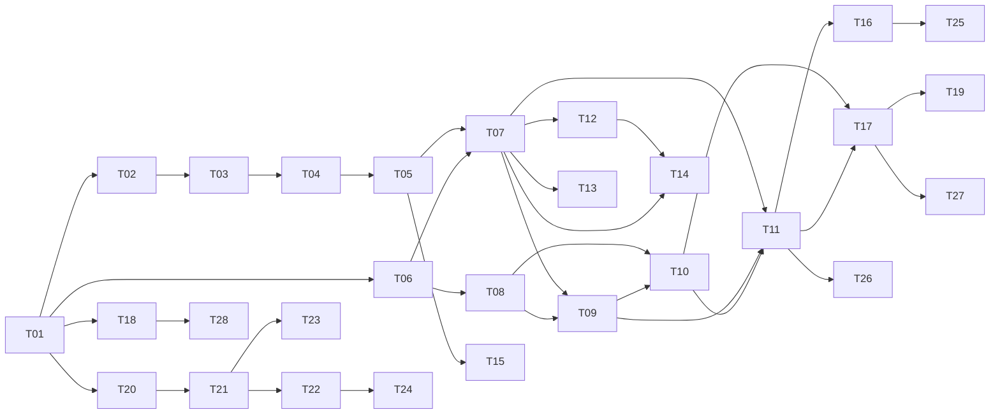

# CellFlow 任务看板（TODO.md）

| 项 | 内容 |
|---|---|
| 版本 | v1.0（优先级已确认：按阶段 1→4 推进，整体验收） |
| 依据 | `PRD.md` v1.0（功能 F1~F17 与验收用例编号）、`WIREFRAME.md` v1.0（页面 P1~P12）、`TECH_DESIGN.md` v1.0（章节 §） |
| 状态标记 | ⬜ 未开始 ／ 🔄 进行中 ／ ✅ 已完成 ／ ⛔ 阻塞 |
| 规模估算 | S ≈ 1~2 天 ／ M ≈ 3~5 天 ／ L ≈ 6~10 天（单人，含测试） |

**拆分原则**

- 每个任务是一个**可独立验证的功能闭环**：有明确输入、输出和验收用例，而不是「写某个文件」。
- 验收标准优先引用 PRD 的验收用例编号（如 F2-3），每条都要落成自动化测试；前端任务以组件测试 + 端到端测试验收。
- 后端任务用仓库内的**测试夹具 Excel**（`tests/fixtures/*.xlsx`，由 T01 建立、各任务补充）和**临时 MySQL / Redis / 对象存储容器**验证，不依赖任何真实环境。
- 每完成一个任务：更新本看板状态、在 `PROGRESS.md` 记录「做了什么、怎么验证的、风险点」，然后**停下等你验收**（KICKOFF §3.4）。

---

## 1. 总览

| 编号 | 任务 | 覆盖 | 依赖 | 规模 | 阶段 | 状态 |
|---|---|---|---|---|---|---|
| T01 | 工程脚手架与本地环境 | 全局 | — | M | 1 | ✅ |
| T02 | 文件上传、单元格归一化与 Univer 预览数据 | F1 | T01 | M | 1 | ✅ |
| T03 | 区域定位器与切片 | F2（定位部分） | T02 | M | 1 | ✅ |
| T04 | 基础形态解析：明细 / 键值 / 矩阵 / 汇总 | F2 | T03 | L | 1 | ✅ |
| T05 | 字段规格与类型清洗 | F3、F2-4 | T04 | M | 1 | ✅ |
| T06 | 方案、草稿、DSL 校验与 Schema 推导 | F4（结构部分）、F1-7/8 | T01 | M | 1 | ✅ |
| T07 | DAG 执行器与基础变换节点 | F4、F8 | T05、T06 | L | 1 | ✅ |
| T08 | 数据源管理与目标表绑定检查 | F7、F15-1/2 | T06 | M | 1 | ✅ |
| T09 | 快照、比对与安全闸 | F11（判定部分）、F8-5 | T07、T08 | M | 1 | ✅ |
| T10 | 整表替换写入器、崩溃恢复与接管基线 | F11（写入部分）、F7-7 | T08、T09 | L | 1 | ✅ |
| T11 | Open API、任务队列、只执行最新与回调 | F10、F12 | T07、T09、T10 | L | 1 | ✅ |
| T12 | 表达式引擎、派生列、过滤与参数端口 | F4-2/7~18 | T07 | L | 2 | ✅ |
| T13 | 关联节点（内连接/左连接/广播） | F5 | T07 | M | 2 | ✅ |
| T14 | 校验节点（含引用输入、对账、侧输出） | F6 | T07、T12 | M | 2 | ✅ |
| T15 | 复杂形态与多 Sheet 合并 | F2-13~18 | T05 | L | 2 | ✅ |
| T16 | 方案版本发布与历史文件回归 | F9 | T07、T11 | M | 2 | ✅ |
| T17 | 发布历史、一键回滚与冻结 | F14 | T10、T11 | M | 2 | ✅ |
| T18 | 操作口令、审计日志与系统设置 | F16、F17 | T01 | M | 2 | ✅ |
| T19 | 数据清理任务 | §10.9 | T10、T17 | S | 2 | ✅ |
| T20 | 前端框架、公共组件与方案列表 | P1、P2、§3 口令弹窗 | T01（接口可先用模拟数据） | M | 3 | ✅ |
| T21 | 工作台画布 | P3 | T06、T20 | L | 3 | ✅ |
| T22 | 分屏区域圈选 | P3-1 | T04、T05、T21 | L | 3 | ✅ |
| T23 | 节点配置面板、表达式编辑器、目标表绑定抽屉 | P3-2、P3-3 | T08、T12~T14、T21 | L | 3 | ✅ |
| T24 | 试跑结果面板与单元格高亮联动 | P3-4 | T07、T22 | M | 3 | ✅ |
| T25 | 版本列表与发布页 | P4、P4-1 | T16、T21 | M | 3 | ✅ |
| T26 | 任务列表与任务详情 | P5、P6 | T11、T20 | M | 3 | ✅ |
| T27 | 发布历史与回滚页、方案设置 | P7、P7-1、P8 | T17、T20 | M | 3 | ✅ |
| T28 | 管理页：数据源、调用方、系统设置、审计 | P9~P12 | T08、T11、T18、T20 | M | 3 | ✅ |
| T29 | 端到端验收、性能与安全检查 | 全部 | T01~T28 | M | 4 | ✅ |

### 1.1 依赖关系与并行

| 可并行的工作线 | 任务 |
|---|---|
| 解析引擎线 | T02 → T03 → T04 → T05 → T15 |
| 方案与写入线 | T06 → T08 → T09 → T10（T06、T08 可与解析引擎线同时进行） |
| 节点能力线 | T12、T13 在 T07 完成后可并行；T14 在 T12 后 |
| 前端线 | T20 在 T01 完成后即可开始（先用模拟数据），T21 起逐步对接真实接口 |

### 1.2 建议的阶段与里程碑

| 阶段 | 任务 | 里程碑（可演示的结果） |
|---|---|---|
| 1 后端最小闭环 | T01~T11 | 用接口（无界面）创建一个只含明细/键值/矩阵的方案，业务服务通过 Open API 提交示例文件 → 自动写入 MySQL 业务表 → 收到回调；同方案连续提交只执行最新 |
| 2 后端能力补齐 | T12~T19 | 派生列、关联、校验、复杂形态全部可用；可发布方案版本、回滚、冻结；高危操作需口令并留审计 |
| 3 控制台 | T20~T28 | 在浏览器中完成：新建方案 → 分屏圈选 → 编排 → 试跑 → 发布 → 查看任务 → 放行 → 回滚 |
| 4 验收 | T29 | PRD 全部验收用例通过；性能与安全检查通过 |

> 为什么先做后端闭环：写表、回滚、只执行最新这些**风险最高**的部分越早在真实 MySQL 上跑通越好；前端可在阶段 1 后半程并行启动。

---

## 2. 任务详情

### T01 工程脚手架与本地环境 ✅

- **目标**：建立前后端工程、本地一键启动的依赖环境、数据库迁移与持续集成，后续任务都在此基础上验收。
- **范围**
  - 目录：`backend/`（FastAPI 应用、Worker）、`frontend/`（React + Vite）、`tests/fixtures/`（测试夹具 Excel）、`deploy/`（本地编排文件）。
  - 本地依赖：MySQL 8（元数据库 + 模拟业务库两个库）、Redis、S3 兼容对象存储（MinIO）。
  - 数据库迁移：按 TECH_DESIGN §3 建出全部元数据表。
  - 配置：全部从环境变量读取，提供不含真实值的 `.env.example`（KICKOFF §3.3）。
  - 持续集成：后端代码检查 + 单元测试，前端代码检查 + 构建。
- **验收标准**
  1. 一条命令启动全部依赖与后端服务，`GET /healthz` 返回元数据库、Redis、对象存储均可用。
  2. 迁移脚本在空库上建出 §3 全部表；重复执行不报错；可回退。
  3. CI 在一个空提交上全部通过。
  4. 仓库中搜索不到任何看起来像真实密钥的值。
- **需要你批准的开发期依赖**（不进入生产运行时）：pytest、ruff、Alembic（数据库迁移）、testcontainers（测试中启动临时 MySQL/Redis）、Vitest、Playwright（前端端到端测试）。
- **依赖**：无

### T02 文件上传、单元格归一化与 Univer 预览数据 ✅

- **目标**：上传 xlsx 后，服务端得到归一化网格，并转换为 Univer 能显示的数据（§2.3、§5.1、§7.2）。
- **范围**：`POST /api/files`、`GET /api/files/{id}/sheets/{sheet}/univer`；Loader（合并单元格、公式缓存值检测、错误值、隐藏行列、删除线、1900/1904 日期系统、富文本）；文件大小与单元格数上限（读系统设置默认值）；sha256 去重。
- **验收标准**：F1-1~F1-6；另加夹具测试：合并单元格填充、公式无缓存值标记、`#N/A` 标记、1904 日期、隐藏行标记、富文本转纯文本；`.xlsm` 不执行宏。
- **依赖**：T01

### T03 区域定位器与切片 ✅

- **目标**：在任意新文件上，按定位器重新算出区域的实际范围并切片（§4.2、§4.4、§7.3）。
- **范围**：固定坐标、锚点（起点文本 + 4 种终点方式）、自动扩展；屏蔽区与 `excludeFrom` 挖空；重叠检测；定位报告；`POST /api/regions/suggest` 的定位器推荐。
- **验收标准**：F2-2、F2-3、F2-5、F2-6、F2-7、F8-4；锚点多次出现取最近并警告；终点锚点缺失报错；区域为空时产出空数据。
- **依赖**：T02

### T04 基础形态解析：明细 / 键值 / 矩阵 / 汇总 ✅

- **目标**：四种基础形态打平为行，并携带单元格血缘（§4.3、§7.4~§7.6）。
- **范围**：明细（多级表头、横向明细、跳过规则、小计行）；键值（宽 / 纵向输出、类型列、重复 Key 策略）；矩阵（多级行列头、指标层、排除合计、维度解析）；汇总；形态推荐。
- **验收标准**：F2-1、F2-8、F2-9、F2-10、F2-11、F2-12、F2-19；每个输出值都能回查到正确的 Excel 单元格地址（血缘测试）。
- **依赖**：T03

### T05 字段规格与类型清洗 ✅

- **目标**：按表头名绑定字段，并完成列级类型清洗（§5.3、§7.8）。
- **范围**：表头归一化与按名绑定（新列警告、缺列报错、同名表头）；全部类型转换；空值写法、布尔、枚举、单元格内拆分（列表 / 结构）；长 ID 精度检查；保留字段名校验；转换失败的行从输出移除（C7）。
- **验收标准**：F2-4、F3-1~F3-9；字段名为 `params` / `meta` / `in` 时报错（F4-16b）。
- **依赖**：T04

### T06 方案、草稿、DSL 校验与 Schema 推导 ✅

- **目标**：方案与草稿的存取，以及保存时的静态校验与每个端口的字段推导（§3、§6.1、§6.2）。
- **范围**：方案增删改查、样例文件归属方案（D23）；草稿读写与乐观锁冲突；DSL 静态校验 8 条规则（无环、端口约束、源节点无输入、参数端口单行、引用输入等）；Schema 推导接口。
- **验收标准**：F1-7、F1-8（接口层）、F4-3、F4-4、F4-5、F4-5a；两人同时保存草稿时后保存者收到 409 并带对方信息。
- **依赖**：T01

### T07 DAG 执行器与基础变换节点 ✅

- **目标**：按拓扑顺序执行整个方案，得到每个节点每个端口的输出与问题（§7.9）。
- **范围**：执行器（结构性错误只跳过下游、其余分支继续）；源节点（接 T03~T05）；选列改名、合并、查表映射三个节点；输出节点；预览采样与「被引用数据不采样」（C6）；`POST /api/jobs/test`（试跑草稿，记录 `dsl_snapshot`）；节点输出分页接口；最近文件列表。
- **验收标准**：F4-1、F4-6、F8-1、F8-2、F8-3；一个节点结构性失败时，不相关分支仍产出结果；试跑结果可用同一 DSL 快照复现。
- **依赖**：T05、T06

### T08 数据源管理与目标表绑定检查 ✅

- **目标**：登记业务库，并在绑定目标表时自动判断能否整表替换（§10.3「策略选择」）。
- **范围**：数据源增删改（只存引用名）；连接与权限检查；读取表结构（列、主键/唯一键、自增、触发器、被引用外键、字符集）；字段映射校验；表占用登记与释放（C5）；主键建议。
- **验收标准**：F7-1~F7-6、F7-8、F15-1、F15-2；有触发器 / 被外键引用 / 未映射且被引用的自增 ID 的表返回 `STRATEGY_NOT_AVAILABLE`。
- **依赖**：T06

### T09 快照、比对与安全闸 ✅

- **目标**：把输出存为不可变快照，与线上版本比对，并执行 8 条安全检查（§6.4、§10.2、§10.5）。
- **范围**：快照写对象存储（含行哈希）；有主键 / 无主键两种比对；变更明细文件；G1~G8；线上为空时跳过 G3/G4（C8）；试跑与只校验的「预判」（C10）。
- **验收标准**：F11-3、F11-5、F11-6、F11-7、F11-9、F11-12（判定部分）、F8-5；有主键时能识别修改，无主键时修改表现为一删一增；阈值按「表绑定 > 系统设置 > 内置默认」取值。
- **依赖**：T07、T08

### T10 整表替换写入器、崩溃恢复与接管基线 ✅

- **目标**：把快照原子地写入业务表，任何失败都不留下部分写入（§10.3、§10.4）。
- **范围**：影子表建表与分批灌数；多表一条 `RENAME TABLE` 原子切换；元数据锁超时重试；备份表命名与保留；写后校验和（漂移检测 G7 依据）；写入计划落盘与崩溃恢复程序；首次接管时保存基线。
- **验收标准**：F11-1、F11-2、F11-8、F11-10、F11-11、F7-7；在测试中于灌数中途、RENAME 之后分别杀掉进程，恢复后状态正确；写入期间另一连接持续查询，始终读到完整的旧数据或完整的新数据。
- **依赖**：T08、T09

### T11 Open API、任务队列、只执行最新与回调 ✅

- **目标**：业务服务提交文件后全自动完成解析、校验、写表并回调（§6.5.1、§10.1、§10.7）。
- **范围**：签名鉴权、nonce 防重放、限流；直接上传；幂等键；写表 / 只校验两种模式；方案锁；只执行最新（排队中作废、写表前再检查、写表中不中断）；冻结拒绝；任务状态机；回调投递与重试；任务查询与问题分页；调用方管理接口。
- **验收标准**：F10-1~F10-10、F12-1~F12-6；**阶段 1 里程碑**：示例文件经 Open API 提交后写入 MySQL 业务表并收到回调。
- **依赖**：T07、T09、T10

### T12 表达式引擎、派生列、过滤与参数端口 ✅

- **目标**：CEL 表达式的检查、补全与求值，以及派生列、过滤节点和参数端口（§5.5、§8.4-B）。
- **范围**：函数库注册（前后端同一份清单）；保留变量 `params` / `meta`；类型推导与「插入类型转换」修复建议；空值传递；整列运算优化；出错处理；`POST /api/expressions/check`。
- **验收标准**：F4-2、F4-7~F4-17、F4-16a；表达式长度与求值步数超限被拒绝。
- **依赖**：T07

### T13 关联节点（内连接 / 左连接 / 广播） ✅

- **目标**：多流关联，设计期消解重名，运行期拦截数据膨胀（§8）。
- **范围**：内连接、左连接、广播关联；多键；期望对应关系校验；重名字段别名与自动前缀；膨胀预估与拦截；未匹配侧输出；键值区纵向输出配合查表。
- **验收标准**：F5-1~F5-11。
- **依赖**：T07

### T14 校验节点（含引用输入、对账、侧输出） ✅

- **目标**：非侵入式规则校验，失败行进入侧输出，问题定位到单元格（§9）。
- **范围**：9 种规则；引用输入端口与外键（D24）；对账使用参数端口；规则级别；被拒行侧输出。
- **验收标准**：F6-1~F6-7、F6-3a~F6-3c。
- **依赖**：T07、T12（表达式规则与参数）

### T15 复杂形态与多 Sheet 合并 ✅

- **目标**：分组明细、表单型、重复块与多 Sheet 同构合并（§7.7~§7.7.2，D15）。
- **验收标准**：F2-13~F2-18。
- **依赖**：T05

### T16 方案版本发布与历史文件回归 ✅

- **目标**：草稿发布为新版本前，用历史文件回归对比；支持重新发布历史版本（§3、§6.5.2 版本组）。
- **范围**：回归（异步）与结果；配置差异对比；发布与重新发布（口令接口先按 T18 的约定实现，T18 完成前可临时放开）；任务提交时锁定版本。
- **验收标准**：F9-1~F9-6。
- **依赖**：T07、T11

### T17 发布历史、一键回滚与冻结 ✅

- **目标**：回滚到任一保留期内的版本，并默认冻结方案（§10.6）。
- **范围**：发布历史与变更明细；回滚预览；快路径（备份表互换）与常规路径（快照重写）；结构兼容与漂移确认；并发保护；冻结 / 解冻；人工放行被拦截任务（`kind=FORCED`）。
- **验收标准**：F14-1~F14-7、F14-9；人工放行：G1/G6/G8 拦截的任务不可放行，其余可放行且写入审计。
- **依赖**：T10、T11

### T18 操作口令、审计日志与系统设置 ✅

- **目标**：v1 无登录下的高危操作保护、审计，以及可修改的默认值（§6.5.2 鉴权、§10.8、D19、D20）。
- **范围**：口令校验与 IP 锁定；操作人；审计写入与查询；系统设置读写、校验与优先级；预留身份抽象便于后续接入 SSO。
- **验收标准**：F16-1~F16-5、F17-1~F17-4。
- **依赖**：T01

### T19 数据清理任务 ✅

- **目标**：按保留期清理快照、文件、备份表与试跑数据（§10.9）。
- **验收标准**：超期数据被清理；线上版本、基线、最近一次成功版本、样例文件、审计日志不被清理；清理后超期版本在回滚列表中不可选（F14-7）。
- **依赖**：T10、T17

### T20 前端框架、公共组件与方案列表 ✅

- **目标**：控制台骨架与公共交互（WIREFRAME §3、P1、P2）。
- **范围**：顶栏导航与待处理角标、操作人（浏览器本地保存）、口令弹窗、未保存离开提示、状态标签、空状态；方案列表与新建方案。
- **验收标准**：口令弹窗三种结果（成功 / 口令错误 / 锁定）；新建方案时编码实时查重、创建后不可改；刷新页面后操作人仍在。
- **依赖**：T01（接口未就绪时用模拟数据）

### T21 工作台画布 ✅

- **目标**：画布编辑与草稿保存（P3）。
- **范围**：节点库拖入；端口样式（数据 / 参数 / 引用输入 / 侧输出）；连线规则（类型不匹配不可放下、无环、源节点无输入）；端口悬停字段；草稿自动/手动保存与冲突弹窗；撤销重做；样例文件更换。
- **验收标准**：F4-1、F4-5、F4-5a（界面层）；409 冲突时弹窗三个选项可用；端到端测试：拖入节点 → 连线 → 保存 → 刷新后恢复。
- **依赖**：T06、T20

### T22 分屏区域圈选 ✅

- **目标**：画布页内分屏的区域圈选（P3-1，W1）。
- **范围**：左右 / 上下分屏与比例记忆；Univer 只读表格、区域彩色覆盖、框选新建、拖动调整；区域列表；三步配置（形态 / 定位 / 字段）；端口实时增减；多 Sheet 匹配规则。
- **验收标准**：F2-1、F2-6（界面层）、F2-7；端到端测试：框选明细 → 选形态 → 配字段 → 源节点出现端口 → 预览出数据。
- **依赖**：T04、T05、T21

### T23 节点配置面板、表达式编辑器、目标表绑定抽屉 ✅

- **目标**：所有节点的配置界面（P3-2、P3-3）。
- **范围**：表达式编辑器（补全、实时检查、类型修复、快速预览）；派生列、过滤、关联、校验（含添加引用输入）、选列改名、合并、查表映射面板；目标表绑定抽屉。
- **验收标准**：F4-18、F5-2（界面层）、F6-3a、F7-2、F7-3、F7-4、F7-5（界面层）。
- **依赖**：T08、T12、T13、T14、T21

### T24 试跑结果面板与单元格高亮联动 ✅

- **目标**：P3-4 结果面板，以及「点值 / 点问题 → 表格高亮」。
- **验收标准**：F6-7、F8-1、F8-3（界面提示）、F8-4、F8-5；点击问题自动进入分屏并高亮对应单元格，画布上对应节点闪烁。
- **依赖**：T07、T22

### T25 版本列表与发布页 ✅

- **目标**：P4、P4-1。
- **验收标准**：F9-1、F9-2（含口令弹窗再次红字提示，W3）、F9-5。
- **依赖**：T16、T21

### T26 任务列表与任务详情 ✅

- **目标**：P5、P6（含待处理视图，W4）。
- **验收标准**：F13-1~F13-4；待处理数量与导航角标一致；已作废任务显示替代它的任务；放行按钮只在可放行时出现。
- **依赖**：T11、T20（放行对接 T17）

### T27 发布历史与回滚页、方案设置 ✅

- **目标**：P7、P7-1、P8。
- **验收标准**：F14-1、F14-4、F14-5、F14-7、F14-9（界面层）；回滚预览中的变化数与实际回滚结果一致。
- **依赖**：T17、T20

### T28 管理页：数据源、调用方、系统设置、审计 ✅

- **目标**：P9~P12。
- **验收标准**：F15-1~F15-3、F16-4、F17-1~F17-4（界面层）；页面中不出现任何真实密钥或口令明文。
- **依赖**：T08、T11、T18、T20

### T29 端到端验收、性能与安全检查 ✅

- **目标**：按 PRD 全量验收。
- **范围**：PRD 全部验收用例的自动化回归；PRD §6 性能指标压测（20MB / 50 万单元格、预览 ≤ 3 秒、解析 + 校验 ≤ 30 秒、10 万行写表 ≤ 1 分钟）；安全检查（签名、口令、表达式沙箱、正则防 ReDoS、宏不执行、密钥不外泄）。
- **验收标准**：以上全部通过；输出验收报告到 `PROGRESS.md`。
- **依赖**：T01~T28

---

## 3. 需要你确认

1. **优先级与阶段划分**：是否按「阶段 1 后端最小闭环 → 阶段 2 后端补齐 → 阶段 3 控制台 → 阶段 4 验收」推进？
2. **T01 的开发期依赖**：pytest、ruff、Alembic、testcontainers、Vitest、Playwright 是否批准？
3. **测试夹具**：我会自己构造覆盖各种排版的测试 Excel。如果你有**真实的样例文件**（可脱敏），提供后能显著提高解析规则的可靠性。
4. **开发方式**：按 KICKOFF §3.4，每完成一个任务停下等你验收；是否需要调整为「每完成一个阶段验收一次」？
