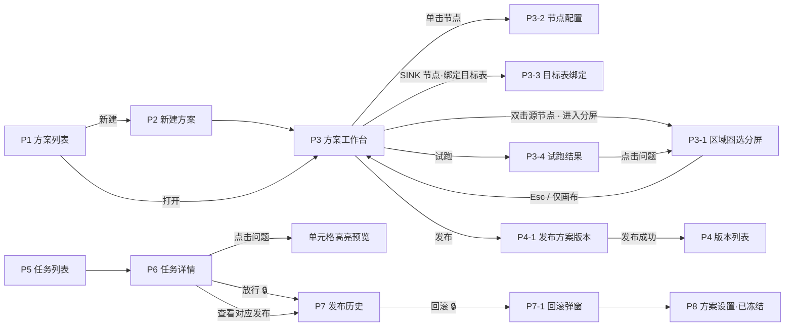

# CellFlow 页面原型与交互说明（WIREFRAME.md）

| 项 | 内容 |
|---|---|
| 文档版本 | **v1.0 定稿稿**（W1~W8 已确认；与 PRD v1.0、TECH_DESIGN v1.0 一同确认后生效） |
| 对应阶段 | KICKOFF 第 2 步「产品原型与交互确认」 |
| 依据 | `PRD.md` v0.2（功能编号 F1~F17）、`TECH_DESIGN.md` v0.5（决策 D1~D22） |
| 形式 | 低保真线框：只描述信息架构、区块和操作流程，不含视觉设计 |

**阅读约定**

- 线框图用字母标注区块（`A`、`B`…），区块内容在其下方的表格中说明。
- 标记：
  - ✏️ **数据输入**：用户在此填写/选择会被保存的数据
  - 🔒 **高危操作**：需要输入操作口令 + 操作人（D19，统一弹窗见 §3.2）
  - 🔁 **状态跳转**：操作会改变方案/任务/发布的状态
- 面向桌面浏览器（Chrome/Edge），最小宽度 1280px；不做移动端。

---

## 1. 信息架构

### 1.1 站点地图

```
CellFlow 控制台（仅内网，v1 无登录）
├── 方案                      P1 方案列表
│   └── 方案详情（标签页）
│       ├── 画布编辑          P3 方案工作台 ──┬── P3-1 区域圈选（画布页内分屏）
│       │                                    ├── P3-2 节点配置面板（按节点类型）
│       │                                    ├── P3-3 目标表绑定（抽屉）
│       │                                    └── P3-4 试跑结果面板
│       ├── 版本              P4 版本列表 ── P4-1 发布方案版本（回归对比）
│       ├── 任务              P5 任务列表（按本方案过滤）
│       ├── 发布历史          P7 发布历史 ── P7-1 回滚弹窗
│       └── 方案设置          P8 方案设置（基本信息、冻结/解冻）
├── 任务                      P5 任务列表 ── P6 任务详情
├── 数据源                    P9 数据源管理
├── 调用方                    P10 调用方管理
├── 系统设置                  P11 系统设置
└── 审计日志                  P12 审计日志
```

### 1.2 页面与 PRD 功能对照

| 页面 | 覆盖的 PRD 功能 |
|---|---|
| P1 方案列表 / P2 新建方案 | F9（方案状态总览）、F14（冻结状态） |
| P3 方案工作台 | F1、F2、F3、F4、F5、F6、F8 |
| P3-1 区域圈选（分屏模式） | F1、F2、F3 |
| P3-2 节点配置面板 | F4、F5、F6 |
| P3-3 目标表绑定 | F7 |
| P3-4 试跑结果面板 | F6-7、F8 |
| P4 / P4-1 版本与发布 | F9 |
| P5 / P6 任务列表与详情 | F10（结果展示）、F11（放行）、F12（作废状态）、F13 |
| P7 / P7-1 发布历史与回滚 | F14 |
| P8 方案设置 | F14-4（冻结/解冻） |
| P9 数据源 / P10 调用方 | F15 |
| P11 系统设置 | F17 |
| P12 审计日志、口令弹窗 | F16 |

> F10、F11、F12 的主体是 Open API 与后台自动流程，没有专属页面；它们的结果在 P5/P6 中呈现。

### 1.3 主要跳转关系



---

## 2. 核心操作流程

### 2.1 首次接入一类 Excel（方案编辑者 → 发布者）

| 步骤 | 页面 | 操作 | 结果 |
|---|---|---|---|
| 1 | P1 → P2 | 新建方案，填编码、名称、选择数据源，上传样例文件 ✏️ | 进入空白工作台 |
| 2 | P3 | 从左侧拖入「Excel 源」节点，选择它读取的 Sheet ✏️；文件中每个要用的 Sheet 各拖一个源节点 | 节点显示 Sheet 名 |
| 3 | P3-1 | 双击源节点进入分屏：左侧表格框选区域 → 右侧选形态、定位方式 → 配字段 ✏️ | 同屏可见源节点右侧实时长出输出端口 |
| 4 | P3 / P3-2 | 拖入过滤/派生/关联/校验节点，拉线，配置 ✏️ | 每次改动后端口字段自动刷新 |
| 5 | P3-3 | 拖入「输出」节点，绑定目标表、确认字段映射 ✏️ | 显示可用写入方式，不满足则红色提示 |
| 6 | P3-4 | 点「预览」或「完整试跑」，逐个处理问题 | 问题清零（至少无 ERROR） |
| 7 | P4-1 | 点「发布」，查看历史文件回归对比，输入口令 🔒🔁 | 方案版本 → 已发布；Open API 开始按此版本处理 |

### 2.2 业务服务提交后的问题排查（任何人）

| 步骤 | 页面 | 操作 | 结果 |
|---|---|---|---|
| 1 | P5 | 按方案/状态筛选，找到失败或被拦截的任务 | — |
| 2 | P6 | 查看失败阶段与问题列表；点问题 → 原始表格高亮单元格 | 明确是 Excel 问题还是方案问题 |
| 3a | — | Excel 问题：通知提交方修正后重新提交（线下） | — |
| 3b | P3 | 方案问题：修改方案 → 试跑 → 发布新版本 | — |
| 3c | P6 | 被安全闸拦截且确认数据无误：点「放行」🔒🔁 | 写入业务表，生成「人工放行」发布记录 |

### 2.3 线上数据出错，紧急回滚（管理者）

| 步骤 | 页面 | 操作 | 结果 |
|---|---|---|---|
| 1 | P7 | 找到出问题的那次发布，查看变更明细确认 | — |
| 2 | P7-1 | 选择回滚目标版本 → 预览将发生的变化 → 保持「回滚后冻结」勾选 → 口令 🔒🔁 | 业务表恢复；方案进入「已冻结」 |
| 3 | P3 / 线下 | 修正方案或让提交方修正 Excel | — |
| 4 | P8 | 解冻方案 🔒🔁 | 恢复接收新任务 |

---

## 3. 全局框架与公共组件

### 3.1 全局框架

```
+----------------------------------------------------------------------------------+
| A  logo | nav: Pipelines  Jobs  DataSources  Clients  Settings  Audit | operator |
+----------------------------------------------------------------------------------+
| B  breadcrumb                                                                    |
+----------------------------------------------------------------------------------+
|                                                                                  |
| C  page content                                                                  |
|                                                                                  |
+----------------------------------------------------------------------------------+
```

| 区块 | 内容与交互 |
|---|---|
| A 顶栏 | 左：CellFlow 标识；中：一级导航「方案 / 任务 / 数据源 / 调用方 / 系统设置 / 审计日志」；右：**当前操作人**（v1 无登录，点击可修改姓名 ✏️，保存在本浏览器，用于预填口令弹窗）。顶栏右侧常驻「仅内网」标识 |
| B 面包屑 | 如「方案 / hero_config / 画布编辑」 |
| C 内容区 | 各页面内容 |

### 3.2 操作口令弹窗（F16，所有 🔒 操作共用）

```
+---------------------------------------------+
| A  title: confirm high-risk operation       |
+---------------------------------------------+
| B  summary of what will happen              |
+---------------------------------------------+
| C  operator  [__________]                   |
|    reason    [__________________________]   |
|    op token  [**********]                   |
+---------------------------------------------+
| D                         [Cancel] [Confirm]|
+---------------------------------------------+
```

| 区块 | 内容与交互 |
|---|---|
| A 标题 | 「确认高危操作：回滚 hero_config」等，随操作变化 |
| B 影响摘要 | 用一句话 + 关键数字说明后果，如「将把 3 张业务表恢复到发布 #3017 的内容：修改 15 行、删除 2 行；回滚后方案将被冻结」 |
| C 表单 ✏️ | 操作人（预填顶栏姓名，可改，必填）；理由（放行、回滚、冻结必填，其余选填）；操作口令（必填，密文） |
| D 按钮 | 确认后按钮进入加载状态；口令错误就地提示剩余尝试次数；连续 5 次错误 → 提示「10 分钟后再试」并禁用确认按钮 |

### 3.3 公共交互约定

| 场景 | 约定 |
|---|---|
| 离开未保存的画布 | 弹窗「有未保存的修改：保存草稿 / 放弃 / 取消」 |
| 草稿冲突（他人已保存更新版本） | 弹窗「草稿已被 张三 于 10:32 更新」：查看对方版本 / 以我的为准覆盖 / 取消 |
| 长时间操作（上传、完整试跑、回归） | 按钮变为进度状态，可切换页面，完成后顶栏出现一次性提示 |
| 空状态 | 每个列表都有引导文案和主操作按钮，如方案列表为空时「新建第一个方案」 |
| 状态标签颜色 | 成功=绿、失败=红、被拦截/警告=橙、进行中=蓝、作废/无变化=灰、冻结=紫 |
| 时间显示 | 列表显示相对时间（如「5 分钟前」），悬停显示绝对时间 |

---

## 4. 页面说明

### P1 方案列表（F9、F14）

```
+----------------------------------------------------------------------------------+
| A  search [______]  filter: status v  datasource v            [+ New pipeline]  |
+----------------------------------------------------------------------------------+
| B  table                                                                         |
|    code | name | datasource | published rev | draft changed | status | last job |
|    ...                                                                           |
+----------------------------------------------------------------------------------+
| C  pagination                                                                    |
+----------------------------------------------------------------------------------+
```

| 区块 | 内容与交互 |
|---|---|
| A 工具栏 | 按编码/名称搜索；按状态（正常/已冻结/未发布）与数据源筛选；「新建方案」→ P2 |
| B 列表 | 列：方案编码、名称、数据源、**生效版本**（如 v7，未发布显示「—」）、**草稿有未发布修改**（有则显示橙点）、状态标签（正常/已冻结/未发布）、最近任务（状态 + 时间）。点击行 → P3 |
| C 分页 | 每页 20 条 |

### P2 新建方案（弹窗）

| 字段 ✏️ | 规则 |
|---|---|
| 方案编码 | 必填，小写字母/数字/下划线，全局唯一，**创建后不可修改**（业务服务靠它调用），输入时实时查重 |
| 方案名称 | 必填 |
| 数据源 | 必选；该方案所有目标表都必须在此数据源内（D8/§10.3） |
| 样例文件 | 选填，可稍后在工作台上传；方案内所有源节点共用这一个文件（D23） |
| 说明 | 选填 |

创建成功 → 进入 P3（空白画布）。

### P3 方案工作台（F1~F8，核心页面）

```
+----------------------------------------------------------------------------------+
| A  pipeline tabs: [Canvas] Versions  Jobs  Releases  Settings                    |
+----------------------------------------------------------------------------------+
| B  draft status | [Save draft] [Preview] [Full test run v] [Publish...]          |
+-----------+----------------------------------------------------+-----------------+
| C         | D                                                  | E               |
| node      | canvas                                             | config panel    |
| palette   |                                                    | (selected node) |
|           |   [Excel src]==o out_global -----> [Sink]          |                 |
|           |              ==o out_hp --------> [Sink]           |                 |
|           |              ==o out_reward -> [Join] -> [Valid]   |                 |
|           |                                                    |                 |
|           |                                          minimap   |                 |
+-----------+----------------------------------------------------+-----------------+
| F  result panel (collapsible): Data preview | Issues (12) | Locate report        |
+----------------------------------------------------------------------------------+
```

| 区块 | 内容与交互 |
|---|---|
| A 方案标签页 | 画布编辑 / 版本 / 任务 / 发布历史 / 方案设置；方案已冻结时标签页上方显示紫色横幅「方案已冻结，不接收新任务」+「去解冻」 |
| B 操作栏 | 左：**样例文件**（文件名 +「更换」✏️；更换后所有源节点在新文件上重新定位，并弹出定位变化列表）、草稿状态（「已保存 10:32」「有未保存修改」「基于 v7 修改」）。右：保存草稿（Ctrl+S）✏️；**预览**（采样试跑）；**完整试跑**（下拉可选择：用样例文件 / 重新上传一个文件 / **选最近某个任务的真实文件**（W2，列出最近 20 个任务的文件名、调用方、时间））；**发布…** → P4-1。存在 ERROR 级静态校验错误时「发布」置灰并悬停说明原因 |
| C 节点库 | 分组列出可拖入的节点：**源**（Excel 源：读取样例文件中的一个 Sheet 或一组同构 Sheet）；**变换**（过滤、派生列、选列改名、合并、查表映射）；**关联**（关联）；**校验**（校验）；**输出**（输出到业务表）。拖到画布即创建 |
| D 画布 | 见下方「画布交互」 |
| E 配置面板 | 显示选中节点的配置（P3-2）；未选中时显示方案概览（节点数、输出表清单、最近一次试跑结果） |
| F 结果面板 | 试跑后展开，见 P3-4；可拖动调整高度，可收起 |

**画布交互**

| 交互 | 行为 |
|---|---|
| 节点外观 | 标题（类型图标 + 名称）；左侧输入端口、右侧输出端口；**参数端口**（单行）用虚线圆点、画在节点顶部（D21）；**引用输入**（校验节点，多行）用虚线方块、画在节点顶部参数端口右侧，旁边标注别名（D24）；侧输出端口（被拒行/未匹配）用橙色、画在节点底部。**源节点没有输入端口**，两个源节点不能直接相连 |
| 节点角标 | 试跑后显示 `✖ 3 ⚠ 1`（该节点的 ERROR / WARN 数）与输出行数；静态校验错误显示红框 |
| 连线 | 从输出端口拖到输入端口；**类型不匹配时不可放下**：参数端口只接受单行流（键值区宽输出、汇总），悬停提示原因；形成环时不可连接。多个源的数据要汇合时，分别连到关联 / 合并 / 查表映射 / 参数端口 / 引用输入 |
| 端口悬停 | 显示该端口的字段清单（名称、类型、是否主键、来源） |
| 连线颜色 | 默认灰；试跑后该连线上有被拒行时变橙 |
| 双击源节点 | 进入 P3-1 分屏模式（左表格、右画布） |
| 单击节点 | 右侧 E 显示该节点配置 |
| 右键节点 | 复制 / 删除 / 查看此节点输出（在 F 中定位） / 「只试跑到这里」 |
| 删除被引用的节点或字段 | 下游节点立即标红并在 E 中列出受影响的配置 |
| 键盘 | Delete 删除、Ctrl+Z/Y 撤销重做、Ctrl+S 保存、空格拖动画布 |

### P3-1 区域圈选（画布页内分屏，F1、F2、F3；W1 已确认）

双击源节点（或点源节点上的「圈选区域」）后，工作台切换为**分屏模式**：表格区与画布并排显示，圈选区域时能同时看到源节点端口的变化，也能直接从表格区继续拉线编排。

```
+----------------------------------------------------------------------------------+
| A  pipeline tabs: [Canvas] Versions  Jobs  Releases  Settings                    |
+----------------------------------------------------------------------------------+
| B  draft status | [Save] [Preview] [Full test run v] [Publish...] | layout: [Canvas only] [Left|Right] [Top/Bottom] |
+--+----------------------------------------+--+------------------+----------------+
|C | G1 file bar: file [Replace] sheet rule |<>| D  canvas        | E  config      |
|  +----------------------------------------+  |  (narrow)        |  region list   |
|  | G2 spreadsheet (Univer, read-only)     |  |                  |  [+ New]       |
|  |    colored region overlays             |  |  [Excel src]*==o |  - global KV   |
|  |    selection -> [Create region]        |  |              ==o |  - hp MATRIX   |
|  |                                        |  |      |           |  ...           |
|  |                                        |  |   [Join]         |  1 shape       |
|  +----------------------------------------+  |                  |  2 locator     |
|  | G3 sheet tabs                          |  |                  |  3 fields      |
+--+----------------------------------------+--+------------------+----------------+
| F  result panel: Region output | Issues | Locate report | Data                   |
+----------------------------------------------------------------------------------+
```

| 区块 | 内容与交互 |
|---|---|
| B 布局切换 | 「仅画布 / 左右分屏 / 上下分屏」三种布局；表格很宽时可切到上下分屏。按 Esc 或点「仅画布」退出分屏。布局与分隔比例记在本浏览器 |
| C 节点库 | 分屏时收起为图标条，悬停展开，仍可拖入节点 |
| G1 文件栏 | **方案的样例文件名**（只读，更换在操作栏 B 中进行，D23）；当前源节点的 **Sheet 匹配规则** ✏️：按名称精确 / 按正则（选正则即「多 Sheet 同构合并」，D15，显示命中的 Sheet 列表，并要求填写「来源 Sheet 字段名」） |
| G2 表格区 | 只读，显示合并单元格、隐藏行列（灰色斜纹）、公式无缓存值的单元格（橙色角标）。每个区域以不同颜色半透明覆盖并标注区域名；屏蔽区为灰色斜纹。**框选后**出现浮动条「用选区新建区域」；选中已有区域时可拖动边框调整范围 |
| G3 Sheet 页签 | 切换 Sheet；有区域的 Sheet 显示区域数 |
| `<>` 分隔条 | 拖动调整表格区与画布的宽度（表格区默认 60%） |
| D 画布 | 缩窄显示，自动把当前源节点居中并高亮（`*`）；新建/删除区域时，源节点的输出端口实时增减；可照常拉线、选中其他节点 |
| E 配置面板 | 当前选中**源节点**时显示「区域列表 + 区域配置」（见下文三步）；选中其他节点时显示该节点配置（P3-2），表格区保持不动，便于对照原始数据 |
| F 结果面板 | 增加「区域输出」标签：选中区域的打平结果（前 50 行）+ 该区域的问题；点击某个值 → G2 中高亮对应单元格（血缘） |

**多个源节点**：选中另一个源节点时，表格区切换到该节点读取的 Sheet（同一个文件）；选中非源节点时表格区保留上一个源节点的内容。

**区域列表**（E 上半部分）：区域名、形态图标、输出行数（最近一次预览）、问题数。点击 → 表格区滚动到该区域并选中；可重命名、删除、复制。

**区域配置的三步**（E 下半部分，✏️）

| 步骤 | 内容 |
|---|---|
| 1 形态 | 单选：明细 / 键值 / 矩阵 / 汇总 / 屏蔽 / 分组明细 / 表单型 / 重复块。系统按选区内容给出**推荐形态**（高亮推荐项）。选中后展开该形态的参数：<br>• 明细：表头行数、方向（按行/按列）、跳过规则（空行、注释前缀）<br>• 键值：Key 列、Value 列、类型列（可选）、重复 Key 处理、**输出模式（宽：1 行 / 纵向：key-value 多行）**<br>• 矩阵：行头列数、列头行数、各维度字段名、值字段名、排除「合计」的关键词、维度解析（如 `Lv.1`→1）；配置时表格区中用不同颜色标出行头/列头/数据区<br>• 汇总：按行 / 按键值；对齐的明细区域<br>• 分组明细：分组行识别方式（仅首格有值 / 正则 / 加粗）、分组字段名、小计行识别<br>• 表单型：逐个字段在表格区中**点选单元格**绑定（记录相对位置）<br>• 重复块：块识别（块标题正则 / 固定步长）、块大小、块内形态（表单型/键值），表格区中用虚线框标出识别到的所有块 |
| 2 定位方式 | 单选：固定坐标 / 锚点 / 自动扩展，显示**推荐项**。锚点：起点文本（默认取选区左上角文本）、终点方式（到连续空行 / 到某文本 / 固定大小 / 到表尾）。下方显示「设计时范围 A17:E40 → 当前文件定位 C19:G62」 |
| 3 字段 | 表格：表头原文 → 字段名 ✏️ → 类型 ✏️ → 必填 → 主键 → 更多（空值写法、枚举映射、布尔写法、单元格内拆分分隔符、默认值）。自动识别表头并生成字段名建议；**新列**（本次文件有但未配置）以橙色行显示，可一键加入；**缺失列**以红色行显示 |

**关键交互规则**

- 区域重叠时两个区域的边框变红，区域列表中提示「区域重叠」，需在其中一个区域上勾选「从 X 中排除」才能保存（F2-6）。
- 关闭弹窗时自动保存到草稿；源节点的输出端口与区域列表一一对应（屏蔽区不产生端口）。

### P3-2 节点配置面板（右侧 E 区，F4、F5、F6）

所有节点顶部都有：节点名称 ✏️、输入字段清单（可折叠）、「查看此节点输出」按钮。

**过滤 / 派生列 — 表达式编辑器（公共组件）**

```
+-----------------------------------------------+
| A  expression input (code editor, 1-3 lines)  |
|    autocomplete popup: fields/params./funcs   |
+-----------------------------------------------+
| B  inline check: type = int   OK / error msg  |
+-----------------------------------------------+
| C  quick preview on first 5 rows              |
+-----------------------------------------------+
```

| 区块 | 内容与交互 |
|---|---|
| A 输入 ✏️ | 单行/多行代码输入；输入时自动补全：字段名、`params.` 参数（列出参数端口所连流的字段）、`meta.`（行号信息）、函数名（带签名与一句话说明，F4-18） |
| B 实时检查 | 语法错误、字段不存在、类型推导结果；错误时红色说明，节点标红。整数与小数混合运算时提示并提供「插入类型转换」一键修复 |
| C 快速预览 | 用最近一次预览数据的前 5 行计算结果 |

**派生列节点**

| 区域 | 内容 |
|---|---|
| 参数 | 参数端口已连接时显示「参数别名 ✏️ = 所连区域」；未连接时提示「可从键值区拖线到顶部虚线端口」 |
| 派生列列表 ✏️ | 每行：字段名、表达式（使用上面的编辑器）、类型、新增/覆盖；可拖动排序（顺序决定计算顺序）；引用了后面的列时该行标红 |
| 出错处理 ✏️ | 报错（默认）/ 置空并警告 |

**关联节点**

| 区域 | 内容 |
|---|---|
| 关联方式 ✏️ | 内连接 / 左连接 / **广播**（选广播时隐藏关联键与基数配置，提示「右侧必须恰好 1 行」） |
| 关联键 ✏️ | 左字段 = 右字段，可添加多组；类型不一致时黄色提示并提供「统一为文本比较」 |
| 期望对应关系 ✏️ | 多对一（默认）/ 一对一 / 一对多 / 多对多；选多对多时显示风险说明 |
| 输出字段 ✏️ | 两列勾选列表（左/右）；**重名字段**以黄色显示，直接在行内填写别名，未填写则显示自动生成的名称（如 `item_名称`） |
| 未匹配行 ✏️ | 进入侧输出（默认）/ 保留并置空 |
| 膨胀上限 | 显示系统设置中的默认值，可覆盖 ✏️ |

**校验节点**

| 区域 | 内容 |
|---|---|
| 规则列表 ✏️ | 每条：规则类型（必填/范围/正则/枚举/唯一/外键/表达式/对账/行数）、字段、参数、级别（错误/警告）、提示文案；可启用/停用、拖动排序 |
| 参数与引用 | **参数**：已连接的单行流及其别名 ✏️（用于表达式与对账）。**引用输入** ✏️：「+ 添加引用输入」→ 节点顶部出现一个新的虚线方块端口，填写别名（如 `item`），再从源节点或其他节点拉线接入；未连线的引用输入标红 |
| 新增规则 | 先选类型，再出现对应参数表单：外键为「本表字段 → 引用输入别名 → 被引用字段」三个下拉，**只能选择已连接的引用输入**，没有时提示「请先添加引用输入并连线」；对账选择「明细聚合方式 + 参数中的汇总字段 + 容差」 |
| 规则命中 | 试跑后每条规则旁显示命中行数，点击 → F 区问题列表按该规则过滤 |

**选列改名 / 合并 / 查表映射**：表格式配置（字段勾选、新名称、映射字典），不单独画线框。

### P3-3 目标表绑定（右侧抽屉，F7）

```
+----------------------------------------------------------------+
| A  dataset name [______]   target table [search v]             |
+----------------------------------------------------------------+
| B  table check result (triggers / FKs / auto-inc / charset)    |
+----------------------------------------------------------------+
| C  mapping table                                               |
|    table column | type | null | default | <- dataset field     |
+----------------------------------------------------------------+
| D  primary key (optional) | write strategy | guard overrides   |
+----------------------------------------------------------------+
| E  first-time takeover notice                     [Save]       |
+----------------------------------------------------------------+
```

| 区块 | 内容与交互 |
|---|---|
| A 基本 ✏️ | 数据集名；目标表（下拉搜索方案所属数据源中的表；已被其他方案占用的表置灰并显示占用方案，F7-4） |
| B 表检查 | 自动读取后显示检查结果：✅ 可整表替换；❌ 有触发器 / 被外键引用 / 未映射且被引用的自增 ID →「v1 不支持此类表」（F7-5），此时保存按钮禁用；字符集非 utf8mb4 时黄色提示 |
| C 字段映射 ✏️ | 以**目标表的列**为行：列名、类型、可空、默认值、映射来源（下拉选择数据集字段；同名自动映射）。不可空且无默认值却未映射的列标红（F7-2）；类型不兼容标红（F7-3）；数据集中未被映射的字段在表下方列出 |
| D 高级 ✏️ | 主键（可选；目标表有主键/唯一索引时显示「建议使用：job, level」一键采用，F7-6）；写入方式（v1 固定为整表替换，展示说明）；安全闸阈值覆盖（默认显示「使用系统设置：30%」，可改） |
| E 首次接管提示 | 目标表已有数据时提示「首次发布前会保存当前表内容作为基线，可回滚到接管前」（F7-7） |

### P3-4 试跑结果面板（底部 F 区，F6-7、F8）

```
+----------------------------------------------------------------------------------+
| A  run info: preview (sampled 200 rows) | file | 3.2s | [Re-run]                 |
+----------------------------------------------------------------------------------+
| B  tabs: [Data]  Issues(12)  Locate report  Change summary                       |
+----------------------------------------------------------------------------------+
| C  tab content                                                                   |
+----------------------------------------------------------------------------------+
```

| 标签 | 内容与交互 |
|---|---|
| A 运行信息 | 预览/完整、所用文件、耗时；预览模式显示醒目的「基于采样」提示（F8-3） |
| 数据 | 顶部下拉选择「节点 → 端口」（默认跟随画布选中节点）；表格展示输出，字段头显示类型；**点击单元格值 → 打开原始表格预览并高亮来源单元格**；侧输出端口的数据以橙色标签页区分 |
| 问题 | 列：级别、节点、规则、Sheet、单元格、字段、值、说明；可按级别/节点/规则/Sheet 筛选；点击一行 → 自动进入分屏（P3-1），表格区跳到对应 Sheet 并高亮该单元格（F6-7），同时画布上闪烁对应节点 |
| 定位报告 | 每个区域：设计时范围、本次范围、偏移行列数、是否有警告（F8-4） |
| 变更摘要 | 仅完整试跑：每张目标表与线上相比的新增/修改/删除数；以及**安全闸预判**（若此刻提交会不会被拦截、被哪条拦截） |

### P4 版本列表（F9）

| 区块 | 内容与交互 |
|---|---|
| 列表 | 版本号、状态（草稿 / 已发布·生效中 / 已退役）、发布人、发布时间、发布说明、回归结果摘要 |
| 行操作 | 查看（只读画布）；与当前生效版本对比（节点/配置差异列表）；**重新发布此版本** 🔒🔁（F9-5） |

### P4-1 发布方案版本（全屏页，F9）

```
+----------------------------------------------------------------------------------+
| A  publish draft as v8 (current live: v7)                                        |
+----------------------------------------------------------------------------------+
| B  config diff summary: nodes added/changed/removed, bindings changed            |
+----------------------------------------------------------------------------------+
| C  regression: last 5 successful job files, re-run with v8 vs v7                 |
|    file | job time | result v7 | result v8 | table diffs | [detail]              |
+----------------------------------------------------------------------------------+
| D  release note [______________________]                   [Cancel] [Publish]    |
+----------------------------------------------------------------------------------+
```

| 区块 | 内容与交互 |
|---|---|
| A 标题 | 「将草稿发布为 v8（当前生效 v7）」 |
| B 配置差异 | 新增/修改/删除的节点与目标表绑定列表，点击可在只读画布中定位 |
| C 回归对比 | 进入页面自动运行（显示进度）。每个历史文件一行：v7 结果、v8 结果（成功/失败/问题数）、每张表的输出差异（新增/修改/删除行数）；「详情」展开行级差异。**v8 在任一文件上出现 ERROR 时，整行标红，并在顶部显示醒目警告**（F9-2），但不阻止发布。首次发布（无历史任务）显示「没有可回归的历史文件」 |
| D 发布 | 发布说明 ✏️；「发布」→ 口令弹窗 🔒（回归中有 ERROR 时，弹窗的影响摘要里再次以红字提示「新版本在 N 个历史文件上报错」，W3） → 成功后 🔁 方案生效版本变为 v8，跳转 P4 |

### P5 任务列表（F13）

```
+----------------------------------------------------------------------------------+
| A  filters: pipeline v | client v | status v | mode v | time range | job id      |
+----------------------------------------------------------------------------------+
| B  status counters: running 2 | published 120 | blocked 3 | failed 5 | ...       |
+----------------------------------------------------------------------------------+
| C  table                                                                         |
|    job id | pipeline | client | mode | rev | status | changes | issues | time    |
+----------------------------------------------------------------------------------+
```

| 区块 | 内容与交互 |
|---|---|
| 快捷视图 | 列表上方两个页签：**待处理**（被拦截 + 校验失败 + 写入失败 + 回调多次失败，且尚未被更新的成功任务覆盖；页签上显示数量）/ **全部**。一级导航「任务」旁同步显示待处理数量角标（W4） |
| A 筛选 | 方案、调用方、状态、模式（写表 / 只校验 / 试跑）、时间范围、任务 ID；从方案详情进入时方案已预选 |
| B 状态计数 | 点击计数即按该状态筛选；「被安全闸拦截」「回调多次失败」为橙色醒目项（F13-4，v1 不推送告警，靠这里发现） |
| C 列表 | 任务 ID、方案、调用方（控制台试跑显示「控制台」）、模式、使用版本、状态标签（见下表）、各表变更数合计、ERROR/WARN 数、提交时间、耗时。点击 → P6。进行中的任务每 5 秒自动刷新状态 |

**任务状态标签**

| 状态 | 标签 | 说明 |
|---|---|---|
| 排队中 / 执行中 | 蓝 | — |
| 已写入 | 绿 | 已写入业务表 |
| 无变化 | 灰 | 内容与线上相同 |
| 已作废 | 灰 | 被更新的任务替代（F12），显示「被 #88130 替代」 |
| 校验通过 | 绿（空心） | 只校验 / 试跑模式 |
| 校验失败 | 红 | — |
| 被拦截 | 橙 | 安全闸拦截，可放行 |
| 写入失败 / 系统失败 | 红 | 业务表未变 |

### P6 任务详情（F10~F13）

```
+----------------------------------------------------------------------------------+
| A  job #88123  status badge   pipeline hero_config v7   client biz-A   mode      |
|    [Force publish] (only when blocked)                                           |
+----------------------------------------------------------------------------------+
| B  stage timeline: submitted > queued > parsing > validating > guard > writing   |
+----------------------------------------------------------------------------------+
| C  tabs: Issues | Changes | Guard result | Callback | File & metrics             |
+----------------------------------------------------------------------------------+
| D  tab content                                                                   |
+----------------------------------------------------------------------------------+
```

| 区块 | 内容与交互 |
|---|---|
| A 概要 | 任务 ID、状态、方案与版本、调用方、提交人（调用方透传的操作人）、模式、提交/完成时间；**被拦截时**显示「放行」按钮 → 口令弹窗（理由必填）🔒🔁 → 生成「人工放行」发布；因 ERROR 级问题、目标表结构不兼容或值超出列定义被拦截的任务不显示放行按钮（G1/G6/G8 不可放行）。已写入时显示「查看对应发布 #3021」→ P7 |
| B 阶段时间线 | 各阶段耗时；失败阶段标红并显示原因；已作废任务显示「被 #88130 替代」链接 |
| 问题 | 同 P3-4 问题列表；点击一行 → 弹出原始表格预览（只读 Univer）并高亮该单元格 |
| 变更明细 | 按表分组：新增/修改/删除行；修改行逐字段显示「旧值 → 新值」；无主键的表只有新增/删除（附说明）；支持按操作类型筛选 |
| 安全闸结果 | G1~G8 逐条：通过 / 未通过、实际值 vs 阈值（如「删除比例 42% > 30%」） |
| 回调 | 回调地址、每次尝试的时间与结果、下次重试时间 |
| 文件与指标 | 原始文件下载、sha256、每个节点的输出行数与耗时、定位报告 |

### P7 发布历史（F14）

```
+----------------------------------------------------------------------------------+
| A  live: release #3021 (2026-09-28 10:00)  status: normal / FROZEN   [Freeze]    |
+----------------------------------------------------------------------------------+
| B  timeline table                                                                |
|    release | kind | source job | operator | time | tables & changes | [Rollback] |
+----------------------------------------------------------------------------------+
```

| 区块 | 内容与交互 |
|---|---|
| A 线上状态 | 当前生效的发布编号与时间；方案状态（正常/已冻结）；冻结/解冻按钮 🔒🔁 |
| B 发布列表 | 发布编号、类型（正常 / 回滚 / 人工放行 / 接管基线，不同标签）、来源任务（可点击 → P6）、操作人、时间、每张表的行数与变更数；展开行查看变更明细（同 P6「变更明细」）。每行「回滚到此版本」→ P7-1；当前生效行和已超过保留期的行按钮禁用（后者悬停说明「已超过保留期」，F14-7） |

### P7-1 回滚弹窗（F14）

```
+---------------------------------------------------------------+
| A  rollback hero_config: live #3021  ->  target #3017         |
+---------------------------------------------------------------+
| B  preview: per table  rows +/-/~  | fast path / rewrite      |
+---------------------------------------------------------------+
| C  checks: schema compatible / no drift                       |
+---------------------------------------------------------------+
| D  [x] freeze pipeline after rollback                         |
|                                     [Cancel] [Rollback...]    |
+---------------------------------------------------------------+
```

| 区块 | 内容与交互 |
|---|---|
| A 标题 | 当前生效 → 回滚目标 |
| B 影响预览 | 每张表：回滚会带来的新增/修改/删除行数（可展开明细）；执行方式（「秒级互换备份表」或「从快照重写」） |
| C 前置检查 | 目标表结构是否兼容（不兼容 → 红色说明，按钮禁用，F14-9）；是否检测到表被外部改动（有则黄色警告，需勾选「我确认覆盖」） |
| D 确认 | 「回滚后冻结方案」默认勾选 ✏️；「回滚…」→ 口令弹窗（理由必填）🔒 → 执行中显示进度 → 🔁 成功后 P7 顶部显示新的生效发布与「已冻结」。若执行时线上版本已变化（他人刚回滚），提示「线上版本已变化」并刷新（F14-5） |

### P8 方案设置

| 区块 | 内容与交互 |
|---|---|
| 基本信息 | 编码（只读）、名称 ✏️、说明 ✏️、数据源（只读；已有发布后不可更换） |
| 冻结 | 当前状态；冻结/解冻按钮 🔒🔁；冻结期间调用方提交会收到「方案已冻结」 |
| 调用方 | 只读列表：哪些调用方被授权调用本方案（在 P10 管理） |

### P9 数据源管理（F15）

| 区块 | 内容与交互 |
|---|---|
| 列表 | 名称、库名、连接引用名、被多少方案使用、最近连通性检查结果 |
| 新建/编辑 🔒 ✏️ | 名称、库名、**连接地址引用名**、**凭证引用名**（只填环境变量/密钥管理中的名称，页面不出现真实地址和密码，F15-1）；「测试连接」显示连通结果与**权限检查**（CREATE/DROP/ALTER/INSERT/SELECT 是否具备、`_cellflow_marker` 表是否可创建，F15-2） |
| 删除 | 仅在没有方案使用时可删 🔒 |

### P10 调用方管理（F15）

| 区块 | 内容与交互 |
|---|---|
| 列表 | 名称、AppKey、授权方案数、启用状态、每分钟限流、最近调用时间 |
| 新建/编辑 🔒 ✏️ | 名称；AppKey（系统生成，可复制）；签名密钥引用名；授权方案（多选）；回调域名白名单；限流（默认取系统设置）；启用/停用 🔁 |
| 接入说明 | 右侧展示 Open API 调用示例（签名方式、提交接口、回调格式），可复制给业务服务 |

### P11 系统设置（F17）

```
+----------------------------------------------------------------------------------+
| A  groups: File | Preview | Guards | JOIN | Regression | Retention | Write | API |
+----------------------------------------------------------------------------------+
| B  setting rows: name | description | current value [edit] | default | changed by|
+----------------------------------------------------------------------------------+
| C                                             [Reset to default] [Save...]       |
+----------------------------------------------------------------------------------+
```

| 区块 | 内容与交互 |
|---|---|
| A 分组 | 文件 / 预览 / 安全闸 / 关联 / 回归 / 保留期 / 写入 / Open API（对应 TECH_DESIGN §10.8 的设置键） |
| B 设置项 ✏️ | 名称、一句话说明、当前值（数字/比例/开关/枚举控件）、推荐默认值、最近修改人与时间；修改过的项左侧显示蓝色标记；**输入校验**（如比例必须在 0~1，F17-4） |
| C 保存 | 「保存…」→ 口令弹窗，摘要列出修改前后值 🔒；提示「只影响之后开始执行的任务」（F17-2） |

### P12 审计日志（F16）

| 区块 | 内容与交互 |
|---|---|
| 筛选 | 操作类型、对象（方案/数据源/调用方/设置）、操作人、时间范围 |
| 列表 | 时间、操作人、来源 IP、操作类型、对象、理由；展开显示修改前后值（JSON 差异） |
| 说明 | 页面顶部提示「v1 操作人为自填，接入统一登录后为登录账号」 |

---

## 5. 交互决策记录

| # | 问题 | 结论 |
|---|---|---|
| W1 | 区域圈选的形式 | **画布页内分屏**（左右 / 上下可切换），见 P3-1 |
| W2 | 完整试跑能否使用业务服务提交过的真实文件 | **允许**，完整试跑下拉中可选最近 20 个任务的文件 |
| W3 | 回归出错时的处理 | 只警告不阻止发布；口令弹窗中再次红字提示 |
| W4 | 任务列表快捷视图 | 增加「待处理」页签，导航角标显示数量 |
| W5 | 当前操作人 | 保存在浏览器本地，高危操作预填；接入 SSO 后替换 |
| W6 | 样例文件归属（D23） | 归属方案，在工作台操作栏更换；源节点只选 Sheet |
| W7 | 外键引用（D24） | 校验节点的「引用输入」端口，连线可见 |
| W8 | 跨文件引用（D25） | 暂不支持 |

**当前无待确认问题。** 原型随 TECH_DESIGN v1.0 一同定稿；页面与接口的对应关系见 TECH_DESIGN §6.5.2「对应原型」列。
